# 第七章 BridgeAI-Agent 工程应用体系与典型场景落地

> **章节定位**  
> 本章面向交通运输主管部门、建设单位、施工单位、检测机构、养护单位、科研院所及系统集成企业，系统说明 BridgeAI-Agent 如何从总体架构进入真实工程场景，并形成“感知—理解—推理—规划—执行—反馈—学习”的闭环能力。  
>
> **适用范围**  
> 智慧工地、桥梁检测、道路巡查、隧道运维、边坡监测、无人机巡检、交通基础设施养护决策及企业级私有化部署。

---

## 7.1 工程应用总体定位

### 7.1.1 从信息化平台到工程智能体

过去十余年，交通基础设施行业的信息化建设经历了从单机软件、业务管理系统、综合管理平台到数字孪生平台的发展过程。传统系统在数据汇聚、可视化展示和流程留痕方面发挥了重要作用，但其核心仍然是“人操作系统”：工程人员提出查询条件、切换页面、比对数据、阅读规范、形成判断，再将结论写入报告或下达处置任务。

这种模式在数据规模较小时尚可运行，但随着视频监控、无人机影像、BIM、GIS、IoT、检测设备和移动终端持续增加，工程人员面临三类突出矛盾：

1. **数据增长速度远高于人工分析能力。**
2. **系统数量持续增加，但跨系统协同能力不足。**
3. **平台能够展示问题，却不能主动理解、推理和执行。**

BridgeAI-Agent 的核心价值，就是将传统“数据平台”升级为“工程智能体系统”。它不仅保存数据、展示数据，还能够围绕工程目标主动完成任务分解、工具调用、知识检索、风险判断、方案生成和结果复核。

传统系统与 BridgeAI-Agent 的差异如下：

| 对比维度 | 传统信息化平台 | BridgeAI-Agent |
|---|---|---|
| 交互方式 | 菜单、表单、固定报表 | 自然语言、图像、语音、任务指令 |
| 工作逻辑 | 人找数据、人做判断 | Agent 找数据、调用工具并提出判断 |
| 业务流程 | 固定流程 | 可规划、可调整、可协同 |
| 知识应用 | 人工查阅规范 | RAG 自动检索规范与案例 |
| 模型使用 | 单点 AI 功能 | 多模型、多工具、多 Agent 协同 |
| 执行能力 | 生成提示或报表 | 可下发任务、通知、复核和归档 |
| 学习能力 | 静态配置 | 基于反馈持续改进 |
| 系统目标 | 数字化管理 | 智能化生产与决策辅助 |

BridgeAI-Agent 并不试图完全替代工程师，而是通过人机协同提升工程组织的认知效率和执行效率。涉及结构安全、交通管制、重大维修、事故认定和合规审批的关键结论，仍应由具备资质的专业人员审核确认。

---

### 7.1.2 工程闭环能力模型

BridgeAI-Agent 的工程能力可归纳为七个连续环节：

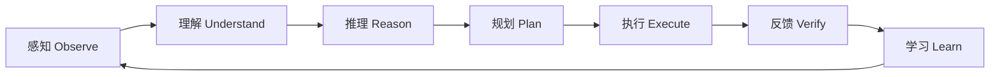

1. **感知**：接收视频、图像、传感器、文本、语音和结构化数据。
2. **理解**：识别对象、场景、事件、病害和业务语义。
3. **推理**：结合规范、历史、模型结果和工程逻辑形成判断。
4. **规划**：将复杂任务拆解为可执行步骤。
5. **执行**：调用模型、数据库、GIS、无人机、消息系统和文档工具。
6. **反馈**：检查执行结果，识别异常、遗漏和低置信度输出。
7. **学习**：将人工复核、处置结果和工程经验转化为可复用知识。

这一闭环决定了 BridgeAI-Agent 不是简单的问答机器人，而是能够参与工程生产过程的智能系统。

---

### 7.1.3 五层工程应用架构

BridgeAI-Agent 采用五层架构：

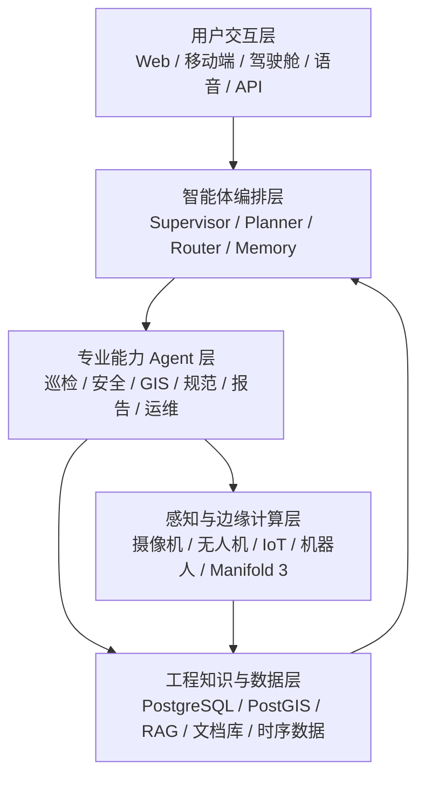

#### 1. 用户交互层

用户交互层面向不同角色提供不同入口：

- 管理人员使用驾驶舱和自然语言查询；
- 工程师使用专业工作台完成复核、标注和报告编辑；
- 现场人员通过移动端接收任务并上传整改结果；
- 外部系统通过 API 接入 Agent 服务；
- 领导层通过日报、周报、专题简报获取关键结论。

#### 2. 智能体编排层

编排层负责接收用户目标，并完成：

- 意图识别；
- 任务拆解；
- Agent 路由；
- 工具选择；
- 上下文管理；
- 权限检查；
- 结果聚合；
- 异常恢复。

#### 3. 专业能力 Agent 层

专业 Agent 可按领域拆分：

- 智慧工地安全 Agent；
- 桥梁巡检 Agent；
- 病害量化 Agent；
- GIS Agent；
- 工程规范 Agent；
- 养护决策 Agent；
- 报告生成 Agent；
- 设备运维 Agent；
- 数据质量 Agent。

#### 4. 工程知识与数据层

数据层建议采用 PostgreSQL 作为核心数据库，并结合 PostGIS、对象存储、向量检索和时序数据库能力。主要存储：

- 项目、标段、构件、设备和人员基础数据；
- 巡检任务、飞行任务和检测记录；
- 病害位置、类别、尺寸和严重程度；
- 图像、视频、点云和报告索引；
- 规范、标准、手册、历史案例；
- Agent 执行记录、提示词版本、模型版本和审计日志。

#### 5. 感知与边缘计算层

感知层连接真实物理世界，包括：

- 固定摄像机；
- 无人机；
- 桥检车多相机系统；
- 机器人；
- 环境监测设备；
- 应变、位移、振动等结构监测传感器；
- DJI Manifold 3 等边缘计算设备。

---

## 7.2 智慧工地 AI Agent 应用体系

### 7.2.1 智慧工地的核心问题

传统智慧工地平台常见问题是“系统建成了，但日常仍依赖人工盯屏、人工填报和人工协调”。视频 AI 可能发现了未戴安全帽，但系统未必知道该人员是谁、属于哪个班组、是否处于高风险区域、是否为重复违规，也无法自动生成整改闭环。

BridgeAI-Agent 的目标是将单点识别升级为业务闭环：

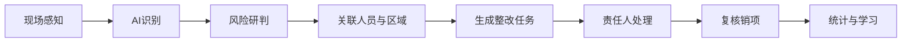

---

### 7.2.2 多源感知接入

智慧工地 Agent 可接入以下数据：

| 数据来源 | 典型内容 | Agent 用途 |
|---|---|---|
| 视频监控 | 人员、车辆、机械、烟火、临边 | 行为识别、风险发现 |
| GIS | 区域、围栏、路线、设备位置 | 空间关联、越界判断 |
| BIM | 构件、楼层、施工阶段 | 施工语义理解 |
| IoT | 扬尘、噪声、温湿度、风速 | 环境合规与预警 |
| 人员定位 | 姓名、班组、轨迹 | 责任关联、风险追溯 |
| 车辆管理 | 车牌、进出记录、运输路线 | 调度与违规分析 |
| 进度计划 | 工序、节点、完成比例 | 偏差分析 |
| 质量检测 | 检验批、实测实量、试验数据 | 质量风险识别 |

---

### 7.2.3 安全生产 Agent

安全生产 Agent 的任务不是简单识别安全帽，而是完成风险事件的全生命周期管理。

典型事件包括：

- 未佩戴安全帽；
- 未穿反光背心；
- 高处作业未使用安全带；
- 人员进入吊装半径；
- 人员闯入危险区域；
- 临边防护缺失；
- 明火、烟雾和可燃物堆积；
- 车辆逆行、超速和违规停放；
- 起重设备周边人员聚集；
- 夜间照明不足；
- 大风条件下继续高风险作业。

风险评分可综合以下因素：

\[
Risk = P \times S \times E \times C
\]

其中：

- \(P\)：事件发生概率；
- \(S\)：后果严重度；
- \(E\)：暴露频率；
- \(C\)：模型与证据置信度修正系数。

实际工程中不应机械套用单一公式，而应结合企业风险分级管控体系、专项施工方案和属地监管要求进行配置。

安全 Agent 工作流如下：

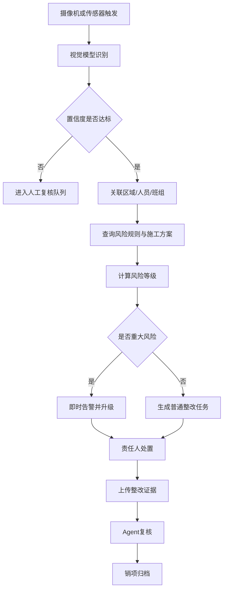

---

### 7.2.4 质量管理 Agent

质量管理 Agent 可围绕施工工序、检验批、影像资料、试验报告和实测实量数据进行协同分析。

典型能力包括：

- 识别钢筋间距、模板缺陷、混凝土外观问题；
- 对比设计要求、施工方案和验收标准；
- 检查检验批资料完整性；
- 发现同一构件多次出现质量问题；
- 自动生成旁站记录和质量问题单；
- 对整改前后照片进行一致性复核；
- 根据质量问题分布识别高风险班组或工序。

质量 Agent 需要特别强调证据链。任何质量结论都应能够追溯到原始图像、检测数据、规范条款、人员操作和复核记录。

---

### 7.2.5 进度与资源调度 Agent

进度 Agent 可关联施工计划、现场视频、设备状态和人员投入，完成：

- 工序状态识别；
- 实际进度与计划进度对比；
- 关键线路风险提示；
- 资源冲突识别；
- 机械闲置分析；
- 材料供应延误预警；
- 自动生成日计划与周计划建议。

其价值不在于替代项目经理，而在于减少信息收集时间，使项目经理能够把精力集中在协调和决策上。

---

### 7.2.6 环保与文明施工 Agent

环保 Agent 可持续监测：

- 扬尘；
- 噪声；
- 污水；
- 泥浆外运；
- 裸土覆盖；
- 车辆冲洗；
- 夜间施工；
- 渣土运输。

Agent 不仅发现超标，还能够关联天气、施工活动、设备状态和历史记录，判断超标原因并生成处置建议。

---

## 7.3 AI 桥梁智能巡检 Agent

### 7.3.1 桥梁巡检业务链重构

传统桥梁检测通常由人工完成任务规划、现场采集、照片筛选、病害识别、尺寸测量、构件定位、等级评定和报告编制。该流程高度依赖工程师经验，周期长，数据一致性不足。

BridgeAI-Agent 将巡检流程重构为：

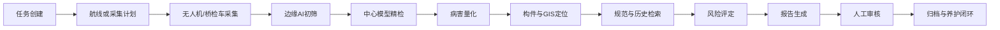

---

### 7.3.2 多平台采集体系

BridgeAI-Agent 支持多种采集设备：

#### 无人机

适合高墩、大跨桥梁、桥塔、索体系、桥面附属结构和难以接近区域。

#### 桥梁检测车

适合梁底、腹板、支座和横隔板等区域，可结合多相机同步采集，提高图像覆盖率。

#### 固定摄像机

适合长期监测伸缩缝、支座、桥面交通和重点构件状态。

#### 移动终端

适合人工巡检补充、近距离复核和养护处置记录。

#### 机器人

适合箱梁内部、狭窄空间、长距离重复巡检场景。

---

### 7.3.3 病害识别与多模型协同

BridgeAI-Agent 可采用“检测模型 + 分割模型 + 几何量化 + 规则推理”的多模型组合。

病害类别可包括：

**混凝土结构：**

- 裂缝；
- 蜂窝麻面；
- 露筋；
- 剥落；
- 渗水；
- 风化；
- 碳化痕迹；
- 修补失效。

**钢结构：**

- 锈蚀；
- 涂层起皮；
- 涂层鼓包；
- 涂层脱落；
- 螺栓缺失；
- 连接部位异常。

**桥面及附属设施：**

- 坑槽；
- 裂缝；
- 伸缩缝破损；
- 护栏损伤；
- 排水设施堵塞；
- 标志标线异常。

模型协同流程：

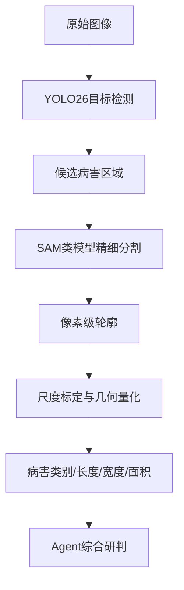

YOLO26 负责快速定位病害区域，分割模型负责获得精细轮廓，几何模块负责尺寸计算，Agent 则负责结合构件位置、历史记录和规范要求形成工程语义。

---

### 7.3.4 病害量化

病害量化是从“看见病害”走向“可用于评定”的关键。

裂缝量化通常包括：

- 长度；
- 最大宽度；
- 平均宽度；
- 走向；
- 分叉数量；
- 裂缝密度；
- 与构件边界的空间关系。

为提高量化精度，应建立尺度基准。常见方式包括：

- 标尺或标定板；
- 已知尺寸构件；
- 双目视觉；
- 激光测距；
- 相机内外参数；
- 点云重建；
- 飞行距离与姿态数据联合估计。

未经标定的普通图像只能用于相对量化，不应直接作为高精度尺寸结论。

---

### 7.3.5 构件定位与数字化归档

病害结果必须关联到“哪座桥、哪个跨、哪个构件、哪个表面、哪个位置”。

建议采用分级编码：

```text
项目—桥梁—桥跨—结构体系—构件—构件面—病害
```

例如：

```text
G1523-台州湾大桥-K12跨-箱梁-腹板W03-外侧面-裂缝CRK-2026-0012
```

通过 PostgreSQL 与 PostGIS，可保存：

- 经纬度；
- 局部工程坐标；
- 构件编码；
- 图像坐标；
- 三维模型位置；
- 飞行轨迹；
- 相机姿态；
- 病害轮廓。

这一机制使后续复检能够准确比较同一病害的变化趋势。

---

### 7.3.6 GPS 拒止环境下的桥底自主巡检

桥底、隧道、箱梁内部等区域常存在 GNSS 信号弱或完全失效的问题。无人机进入此类区域后，若仍使用经纬度航线控制，容易出现坐标失真、位置漂移和飞行轨迹异常。

BridgeAI-UAV 的 GPS 拒止控制应采用局部坐标系，而不是继续依赖全球经纬度坐标。

推荐的坐标体系包括：

- 起飞点 ENU 坐标；
- 桥梁构件局部坐标；
- 视觉里程计坐标；
- 激光雷达 SLAM 坐标；
- 飞控机体系；
- 相机坐标系。

坐标转换链如下：


在 GPS 拒止区域，系统应重点处理：

1. 坐标原点是否一致；
2. ENU、NED 与机体系方向是否混淆；
3. 米、厘米和毫米单位是否统一；
4. 航向角符号和旋转顺序是否一致；
5. 视觉定位是否存在累计漂移；
6. 控制指令是位置控制还是速度控制；
7. 飞控是否在正确的控制模式；
8. 坐标转换是否重复执行；
9. 高度来源是气压计、视觉还是激光；
10. 控制接管后遥控器、飞控与妙算 3 的权限边界。

建议先采用短距离、低速度、单轴运动进行验证：

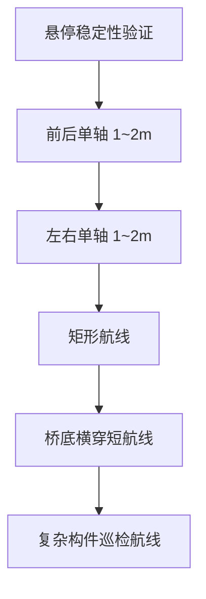

任何阶段出现轨迹异常，都应停止扩展航线，优先检查坐标系、定位源、控制模式和时间同步。

---

### 7.3.7 DJI Manifold 3 边缘部署

BridgeAI-UAV 的边缘推理链路可采用：

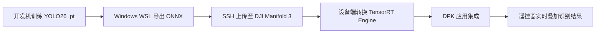

将 ONNX 在目标设备上转换为 TensorRT Engine，能够避免不同 TensorRT 版本、GPU 架构和算子实现造成的兼容问题。

边缘部署应重点关注：

- 输入分辨率；
- FP16 或 INT8 精度；
- 推理延迟；
- 视频解码延迟；
- 结果叠加延迟；
- 内存占用；
- 温度与功耗；
- 模型版本管理；
- 异常回退机制；
- 网络中断时的本地自治能力。

边缘模型负责实时发现和提示，中心端模型负责高精度复核，二者不应被设计成互斥关系。

---

## 7.4 桥梁养护决策 Agent

### 7.4.1 从病害识别到工程决策

仅识别出“裂缝”并不能直接形成养护决策。工程判断还需要回答：

- 裂缝位于什么构件；
- 是否属于受力裂缝；
- 是否贯穿；
- 是否持续发展；
- 是否伴随渗水、锈蚀或剥落；
- 是否影响耐久性或承载能力；
- 是否需要立即处置；
- 处置方案和优先级是什么。

养护决策 Agent 的任务是将多个证据组织成可审核的判断链。

---

### 7.4.2 决策证据体系

决策证据包括：

1. 当前检测结果；
2. 历史病害记录；
3. 结构设计信息；
4. 构件重要性；
5. 交通荷载；
6. 环境条件；
7. 监测数据；
8. 维修历史；
9. 规范条款；
10. 专家经验。

Agent 输出必须区分：

- **事实**：图像中检测到裂缝；
- **测量结果**：最大宽度约 0.3 mm；
- **推断**：可能与收缩或受力有关；
- **建议**：建议现场复核并布设裂缝观测点；
- **结论**：需由专业工程师审核。

---

### 7.4.3 维修优先级排序

维修优先级可综合：

- 病害严重程度；
- 构件重要性；
- 发展速度；
- 交通影响；
- 施工可达性；
- 维修成本；
- 安全后果；
- 资金计划。

可建立多指标评分模型，但应保留人工校准和项目级参数配置能力。

示例：

\[
Priority = w_1S + w_2I + w_3G + w_4T + w_5C
\]

其中：

- \(S\)：病害严重度；
- \(I\)：构件重要性；
- \(G\)：发展趋势；
- \(T\)：交通与运营影响；
- \(C\)：处置紧迫性。

---

### 7.4.4 养护方案生成

养护 Agent 可生成候选方案，包括：

- 表面封闭；
- 裂缝灌浆；
- 混凝土修补；
- 钢筋除锈与防护；
- 涂层修复；
- 构件更换；
- 局部加固；
- 持续监测；
- 交通限制；
- 专项检测。

方案输出应包含：

- 适用条件；
- 不适用条件；
- 施工要点；
- 风险提示；
- 预计工程量；
- 需要补充的检测；
- 规范依据；
- 人工审核项。

---

### 7.4.5 病害趋势分析

通过同一病害的多期数据，可以建立趋势：

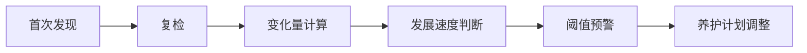

趋势分析依赖准确的构件匹配和空间配准。若不同批次图像无法确认对应同一病害，Agent 应明确标注不确定性，不得强行形成趋势结论。

---

## 7.5 多 Agent 协同体系

### 7.5.1 为什么需要多 Agent

交通基础设施任务通常跨越多个专业领域。单一大模型同时承担视觉识别、规范检索、GIS 分析、设备控制和报告生成，会导致职责边界模糊、错误难以追踪。

多 Agent 架构通过专业分工提升可控性。

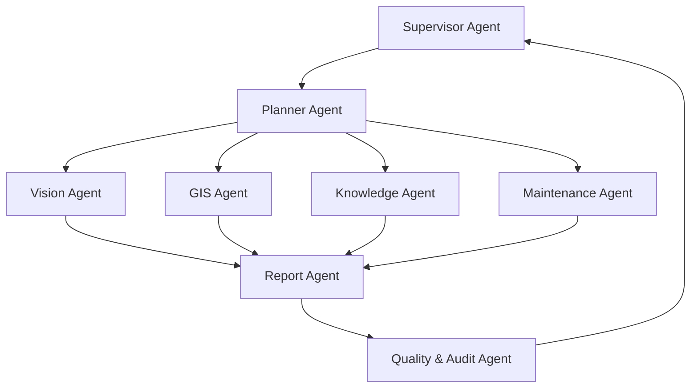

---

### 7.5.2 核心 Agent 角色

#### Supervisor Agent

负责全局目标、权限、预算、超时和异常处理。

#### Planner Agent

将复杂任务拆解为步骤，并决定调用顺序。

#### Vision Agent

负责图像、视频、点云和模型推理。

#### GIS Agent

负责空间查询、构件定位、轨迹分析和地图展示。

#### Knowledge Agent

负责检索规范、标准、案例和企业知识。

#### Maintenance Agent

负责风险分级、养护建议和优先级分析。

#### Report Agent

负责生成结构化报告、图表、Word、PDF 和台账。

#### Quality & Audit Agent

负责检查证据完整性、模型版本、引用来源和结果一致性。

---

### 7.5.3 Agent 通信协议

Agent 之间不应仅传递自然语言，建议使用结构化消息：

```json
{
  "task_id": "inspection-2026-001",
  "agent": "vision_agent",
  "action": "detect_defect",
  "input": {
    "image_id": "IMG_000128",
    "component_id": "W03",
    "model_version": "yolo26-bridge-v1.4"
  },
  "output": {
    "defect_type": "crack",
    "confidence": 0.91,
    "bbox": [812, 466, 1180, 792]
  },
  "evidence": [
    "s3://bridgeai/images/IMG_000128.jpg"
  ],
  "status": "completed"
}
```

结构化消息有利于审计、重放、错误恢复和跨语言开发。

---

### 7.5.4 工具调用与 MCP

BridgeAI-Agent 可通过 MCP 或统一工具接口连接：

- PostgreSQL；
- PostGIS；
- 文件系统；
- 对象存储；
- GIS 服务；
- 无人机任务系统；
- 视频平台；
- 消息推送；
- Word/PDF 生成；
- 企业知识库；
- 工单系统。

工具调用必须采用最小权限原则。涉及删除、下发控制指令、发布报告和外部通知的操作，应设置审批或二次确认。

---

### 7.5.5 记忆体系

BridgeAI-Agent 的记忆分为：

- **会话记忆**：当前任务上下文；
- **项目记忆**：某项目的长期状态；
- **设备记忆**：设备故障、标定和维护记录；
- **病害记忆**：病害历史和演变；
- **组织记忆**：企业制度、模板和经验；
- **用户偏好**：报告风格、常用规范和工作方式。

记忆必须区分事实、推断和用户偏好，并支持更新、纠错和删除。

---

## 7.6 企业级部署架构

### 7.6.1 私有化优先原则

交通基础设施数据常包含：

- 关键设施影像；
- 工程图纸；
- 结构信息；
- 设备位置；
- 施工组织；
- 安全隐患；
- 政府和企业内部资料。

因此，BridgeAI-Agent 应优先支持私有化部署，核心数据和推理服务可运行于企业内网。

---

### 7.6.2 基于 Mac Studio 的本地 AI 中心

对于研发、知识库和中小规模企业应用，可采用：

- Mac Studio M3 Ultra；
- 512GB 统一内存；
- MLX；
- Ollama 或其他本地推理框架；
- PostgreSQL；
- PostGIS；
- 向量检索；
- Python/FastAPI；
- Vue 或 React 前端。

架构如下：

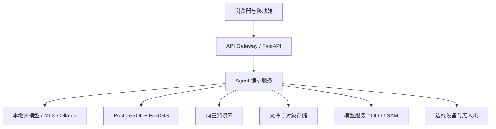

M3 Ultra 的大容量统一内存适合运行多种本地模型、向量检索服务和工程数据库，但生产系统仍应进行并发测试、资源隔离和容灾设计。

---

### 7.6.3 云边端协同

云边端协同建议分工：

| 层级 | 主要职责 |
|---|---|
| 端 | 数据采集、基础控制、现场交互 |
| 边 | 实时推理、低时延告警、离线自治 |
| 中心 | 高精度分析、知识推理、报告生成 |
| 云 | 跨项目汇总、模型管理、集团级分析 |

当网络中断时，边缘端应能够继续执行关键任务，并在恢复连接后进行数据同步。

---

### 7.6.4 PostgreSQL 数据模型建议

核心表可包括：

- `projects`
- `assets`
- `bridges`
- `components`
- `inspection_tasks`
- `flight_missions`
- `media_files`
- `defects`
- `defect_measurements`
- `model_inference_runs`
- `maintenance_actions`
- `knowledge_documents`
- `agent_runs`
- `audit_logs`

关键关系：

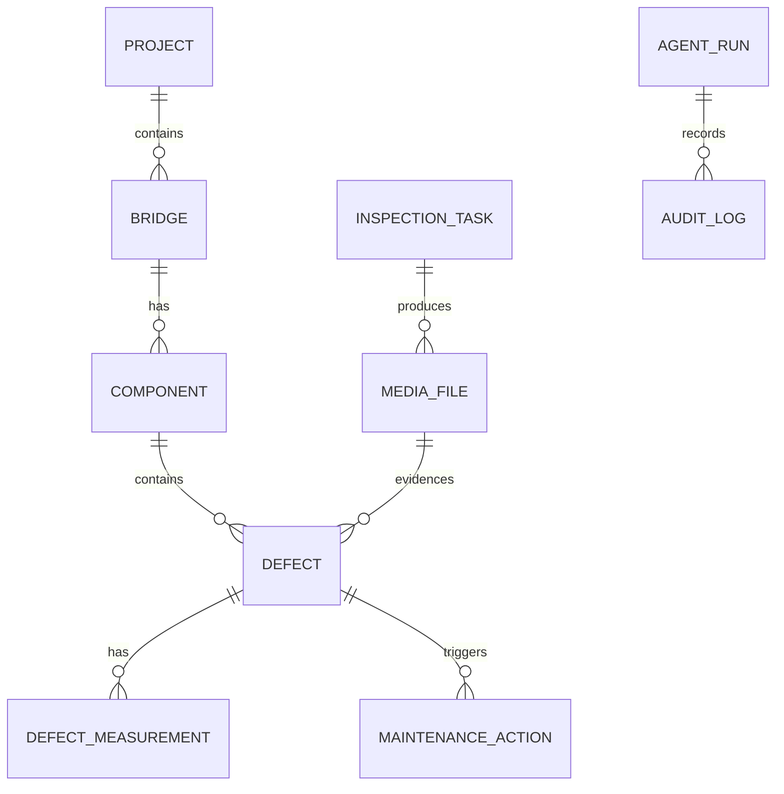

---

### 7.6.5 安全、权限与审计

企业级系统必须具备：

- 用户和角色权限；
- 项目级数据隔离；
- 工具调用权限；
- 模型版本记录；
- 操作日志；
- 报告审批；
- 数据脱敏；
- 备份与恢复；
- 网络隔离；
- 密钥管理；
- 高风险操作二次确认。

Agent 的每一次关键结论都应可追溯到：

- 输入数据；
- 使用模型；
- 提示词版本；
- 检索文档；
- 工具调用；
- 人工修改；
- 最终审批人。

---

## 7.7 典型项目实施路线

### 7.7.1 第一阶段：AI 辅助

目标是解决单点高价值问题，例如：

- 裂缝识别；
- 未戴安全帽检测；
- 自动生成巡检记录；
- 规范问答；
- 图片自动分类。

第一阶段强调快速验证价值，不宜一开始追求覆盖全部业务。

---

### 7.7.2 第二阶段：业务闭环

将识别结果接入业务流程：

- 自动创建任务；
- 关联责任人；
- 生成整改要求；
- 上传整改证据；
- 自动复核；
- 形成统计台账。

这一阶段是 AI 从“演示功能”变成“生产工具”的关键。

---

### 7.7.3 第三阶段：多 Agent 协同

在数据和流程稳定后，逐步引入：

- Planner；
- Supervisor；
- 专业 Agent；
- 工具调用；
- 自动报告；
- 养护建议；
- 跨系统协同。

---

### 7.7.4 第四阶段：自主巡检

最终实现：

- 无人机自主任务规划；
- GPS 拒止环境导航；
- 边缘实时识别；
- 自动补拍；
- 自动复检；
- 任务完成度判断；
- 自动生成报告。

自主巡检必须建立在可靠定位、稳定控制、数据质量和安全机制之上。

---

## 7.8 典型应用案例

### 7.8.1 案例一：高速公路桥梁病害巡检

#### 项目目标

对高速公路桥梁开展无人机和人工协同巡检，自动识别病害并形成结构化报告。

#### 系统流程

1. 导入桥梁与构件信息；
2. 创建巡检任务；
3. 生成飞行计划；
4. 无人机采集图像；
5. Manifold 3 边缘实时识别；
6. 中心端高精度复核；
7. 病害关联构件；
8. 查询历史与规范；
9. 生成报告；
10. 工程师审核并归档。

#### 预期收益

- 缩短照片筛选时间；
- 提高病害台账一致性；
- 提升复检可追溯性；
- 降低高空作业风险；
- 为养护计划提供数据基础。

---

### 7.8.2 案例二：智慧工地视频安全管理

系统接入工地摄像机和 GIS，识别安全帽、反光背心、烟火、危险区域闯入等事件。

Agent 自动完成：

- 事件识别；
- 人员与班组关联；
- 风险等级判断；
- 整改任务下发；
- 复核销项；
- 班组风险统计。

相较传统视频 AI，该方案真正形成了“识别—处置—复核—分析”闭环。

---

### 7.8.3 案例三：灾后应急巡检

在台风、洪水、地震或船撞后，无人机快速采集桥梁关键部位。

Agent 可完成：

- 自动识别明显损伤；
- 对比灾前影像；
- 标记高风险区域；
- 生成应急检查清单；
- 提供人工复核优先级；
- 输出应急简报。

应急场景中，Agent 输出应明确标注“初步研判”，不得替代法定检测和结构安全鉴定。

---

### 7.8.4 案例四：桥梁养护年度计划

系统汇总全线路桥梁病害、历年处置记录、交通量和预算。

养护 Agent 对项目进行分类：

- 立即处置；
- 本年度计划；
- 持续监测；
- 专项检测；
- 暂缓处理。

最终输出年度养护建议、项目优先级和预算分配参考。

---

### 7.8.5 案例五：企业工程知识助手

将企业规范、项目资料、检测报告、施工方案和历史案例纳入知识库。

工程师可以提问：

- 某类裂缝应补充哪些检测；
- 某项施工工序需要哪些验收资料；
- 类似病害过去如何处置；
- 某项目是否存在未闭环问题；
- 某份报告引用了哪些依据。

知识助手必须提供来源引用，不应仅输出无依据结论。

---

## 7.9 商业价值与组织影响

### 7.9.1 效率价值

BridgeAI-Agent 可减少：

- 人工筛选照片；
- 重复录入；
- 跨系统查询；
- 报告整理；
- 规范检索；
- 台账更新。

### 7.9.2 安全价值

通过无人机、机器人和远程感知，可减少高空、桥底、临水和交通环境下的人员暴露。

### 7.9.3 数据价值

系统将分散在图片、表格和报告中的信息转化为可查询、可比较、可追踪的结构化资产。

### 7.9.4 管理价值

管理者能够从“看报表”升级到“问系统”：

- 当前风险最高的项目是什么；
- 哪些隐患超过整改期限；
- 哪些病害发展最快；
- 哪些设备故障最频繁；
- 下月养护预算应优先投向哪里。

### 7.9.5 品牌与技术资产价值

对于系统集成企业和检测机构，BridgeAI-Agent 可形成：

- 自有数据资产；
- 行业知识库；
- 模型资产；
- 软件著作权；
- 专利与课题成果；
- 标准化解决方案；
- 可复制的产品体系。

---

## 7.10 工程落地中的关键风险

### 7.10.1 模型误检与漏检

任何视觉模型都可能发生误检和漏检。应建立：

- 置信度阈值；
- 人工复核；
- 难例库；
- 负样本库；
- 模型回归测试；
- 分场景评估。

### 7.10.2 大模型幻觉

大模型可能生成不存在的规范条款或错误结论。必须采用：

- RAG；
- 来源引用；
- 规则校验；
- 结构化输出；
- 审核机制；
- 禁止无依据的强结论。

### 7.10.3 数据质量

低清晰度、强反光、遮挡、抖动和缺少尺度信息会直接影响结果。Agent 应先评估数据质量，再决定是否进入识别与量化流程。

### 7.10.4 设备控制安全

无人机和机器人控制属于高风险工具调用。应设置：

- 地理围栏；
- 速度限制；
- 高度限制；
- 急停；
- 控制权切换；
- 通信超时保护；
- 人工接管；
- 日志记录。

### 7.10.5 合规与责任边界

系统应明确：

- AI 输出是辅助建议；
- 关键结论由有资质人员审核；
- 检测、评定和鉴定遵循现行法规与标准；
- 数据采集和使用符合隐私与安全要求。

---

## 7.11 未来演进方向

### 7.11.1 从单任务模型走向通用工程智能体

未来模型将同时理解图像、视频、点云、图纸、规范和传感器数据，减少多系统之间的信息割裂。

### 7.11.2 从人工规划走向自主任务规划

Agent 将能够根据桥型、构件、历史病害和环境条件自动生成巡检任务，并动态调整采集策略。

### 7.11.3 从二维识别走向三维时空理解

病害将不再只是图像中的框，而是三维构件上的时空对象，具备位置、尺寸、变化和处置历史。

### 7.11.4 从报告生成走向持续运营

系统将持续跟踪病害、工单、设备和预算，使报告不再是任务终点，而成为下一轮决策的输入。

### 7.11.5 从软件工具走向数字工程团队

未来 BridgeAI-Agent 可形成由多个专业 Agent 组成的数字工程团队，分别承担：

- 数据工程；
- 巡检分析；
- 规范检索；
- 风险评估；
- 报告编制；
- 设备运维；
- 计划管理。

人类工程师负责目标、边界、审核和最终决策。

---

## 7.12 本章总结

BridgeAI-Agent 的本质不是在传统平台中增加一个聊天窗口，也不是将多个 AI 模型简单堆叠，而是重新组织交通基础设施工程的生产流程。

它通过多模态感知获取现场信息，通过专业模型识别病害和风险，通过 RAG 与工程知识库获得规范依据，通过多 Agent 协同完成任务规划和工具调用，再通过人工审核、处置反馈和持续学习形成工程闭环。

在智慧工地场景中，BridgeAI-Agent 能够将视频识别升级为安全、质量、进度和环保协同管理；在桥梁巡检场景中，它能够连接无人机、桥检车、YOLO26、SAM、GIS、PostgreSQL 和报告生成；在养护阶段，它能够将病害数据转化为风险排序、维修建议和年度计划。

BridgeAI-Agent 的最终目标，是构建一个面向交通基础设施全生命周期的智能生产力平台，使工程组织从“人寻找数据、人操作系统、人整理报告”逐步转向“人提出目标、Agent 组织资源、人审核决策”。

这种转变不会一蹴而就。真正可落地的路径，应从高价值单点场景开始，逐步建立数据标准、模型能力、业务闭环、多 Agent 协同和自主设备控制体系。只有同时重视工程真实性、系统安全、证据追溯和责任边界，AI Agent 才能真正进入交通基础设施生产环境，并成为行业数字化转型的下一阶段核心能力。

---

## 附：第七章建议配图清单

1. BridgeAI-Agent 七阶段闭环能力模型；
2. BridgeAI-Agent 五层工程应用架构；
3. 智慧工地安全事件闭环流程；
4. 多源感知数据接入架构；
5. 桥梁巡检全流程；
6. YOLO26 + SAM 多模型协同图；
7. 病害构件编码体系；
8. GPS 拒止坐标转换链；
9. GPS 拒止分阶段试飞路线；
10. Manifold 3 TensorRT 部署流程；
11. 养护决策证据链；
12. 多 Agent 协同架构；
13. Agent 工具调用架构；
14. Mac Studio 私有化部署架构；
15. PostgreSQL 核心数据关系图；
16. 云边端协同架构；
17. 项目四阶段实施路线图；
18. 五类典型案例业务流程图。
