# 第八章 智慧工地 AI Agent：BridgeAI-Site 的系统设计与现场落地

> 版本：v1.0（正式版）  
> 所属著作：《BridgeAI-Agent：交通基础设施全生命周期智能体系统》  
> 编制日期：2026年7月  
> 文档属性：出版级章节正式稿

---

## 本章导读

交通基础设施建设现场具有人员密集、作业面动态变化、危险源多、专业协同复杂和管理链条长等特点。传统智慧工地平台通过视频监控、人员实名制、环境监测、机械管理和数据驾驶舱改善了现场信息获取能力，但大量系统仍停留在“看见数据”和“展示数据”的阶段。管理人员需要持续查看屏幕、人工判断风险、电话通知责任人、跟踪整改进度，再将结果整理成日报或台账。系统采集了大量数据，却没有真正形成从感知到处置的闭环。

BridgeAI-Site 面向这一现实矛盾，将视频 AI、GIS、物联网、工程知识库、业务工作流和多智能体编排统一为智慧工地 AI Agent 平台。它不把“识别到一个目标”视为任务终点，而是把现场异常转化为具有时间、空间、对象、证据、风险等级和责任关系的工程事件，再通过智能体完成核查、研判、派单、整改、复核、报告和知识沉淀。

本章以 BridgeAI-Site 的产品设计与工程落地为主线，系统说明智慧工地从信息化、数字化走向智能体化的演进路径，重点讨论以下问题：

1. 智慧工地为什么需要 AI Agent，而不仅是更多算法和更多屏幕；
2. 如何建立视频、GIS、业务、知识和智能体协同的总体架构；
3. 如何把检测框转化为可信、可解释、可处置的安全事件；
4. 如何以工单驱动整改闭环，并确保智能体写操作安全可控；
5. 如何在中心平台、工地边缘节点和无人机之间实现边云协同；
6. 如何通过测试、试运行、验收和持续学习形成可复制的项目交付体系。

本章不是一份页面清单、接口手册或数据库字典，而是对 BridgeAI-Site 完整研发体系的提炼与方法论总结。相关产品需求、UI/UX、系统架构、数据库、API、算法、Agent、部署运维、测试验收及现场实施细节，应由配套研发文档继续承载。

---

## 8.1 智慧工地的智能体化转型

### 8.1.1 传统智慧工地的建设成果

智慧工地并不是一个全新的概念。过去十余年，交通建设项目已经逐步部署视频监控、实名制门禁、扬尘噪声监测、塔吊和升降机监测、车辆冲洗、电子围栏、BIM、GIS 以及项目管理平台。这些系统显著提升了施工现场的数据采集能力和远程监管能力，也推动现场管理从纸质台账向数字化台账转变。

从管理效果看，传统智慧工地主要解决了四类问题：

- 将分散在现场的设备、人员和业务信息接入统一平台；
- 通过驾驶舱和报表提高项目态势的可见性；
- 通过视频回放和数据留痕增强事后追溯能力；
- 通过规则告警和移动通知缩短部分异常的响应时间。

这些成果构成了智慧工地智能体化的必要基础。没有稳定的视频、可信的项目数据、明确的组织权限和可执行的业务流程，AI Agent 就缺少可观察的环境、可调用的工具和可验证的行动对象。

### 8.1.2 传统平台的能力边界

传统平台的主要局限不是“缺少功能”，而是缺少跨系统理解和持续执行能力。一个典型现场可能同时运行视频平台、人员平台、机械监测平台、环境监测平台和项目管理系统，但不同系统之间只有数据汇总，没有任务级协同。

例如，摄像头发现一名人员未佩戴安全帽时，普通视频 AI 系统通常只输出类别、置信度、位置和截图。真正的工程管理还需要回答：

- 该人员位于哪个施工区域，当前区域正在进行何种作业；
- 违规是否持续存在，是否只是摘帽整理或瞬时遮挡；
- 该区域是否属于高风险区域，当前是否处于夜间或特殊施工时段；
- 事件应由哪个标段、班组和责任人处理；
- 应依据哪一项制度或专项施工方案提出整改要求；
- 是否存在同类事件反复发生，需要提升风险等级；
- 整改证据是否有效，能否复核销项；
- 事件如何进入日报、周报和项目风险趋势分析。

这些问题横跨视觉、空间、组织、规则、知识和业务流程，无法由单一检测模型解决。如果仍由管理人员在多个系统之间人工查询和传递，AI 只是提高了异常发现速度，并没有重构管理流程。

### 8.1.3 从“人找信息”到“任务找能力”

AI Agent 带来的核心变化，是把系统的组织方式从页面和功能菜单转向任务和目标。用户不必准确知道数据位于哪个模块，也不必逐步执行每一项操作。系统根据任务目标识别意图，查找所需数据，调用专业工具，组合多个能力，并在权限和审批约束下推进业务流程。

这种转变可以概括为三个阶段：

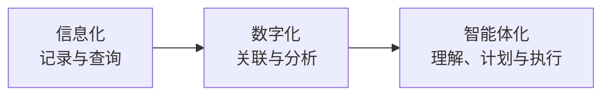

信息化阶段回答“发生了什么”；数字化阶段进一步回答“在哪里发生、与什么相关”；智能体化阶段则尝试回答“为什么重要、下一步做什么、由谁处理、是否完成”。

智能体化并不意味着完全取消人工决策。施工安全关系生命财产安全，很多处置必须由授权人员确认。BridgeAI-Site 的目标是让机器承担高频、重复、跨系统的认知和协作工作，让人工聚焦风险判断、责任确认和重大决策。

### 8.1.4 智慧工地 AI Agent 的定义

本书将智慧工地 AI Agent 定义为：

> 以施工项目目标和安全质量规则为约束，持续感知现场状态，理解人员、设备、区域和作业之间的关系，能够调用数字工具完成分析、协同和受控执行，并通过反馈持续改进的工程智能系统。

这一概念包含六项基本能力：

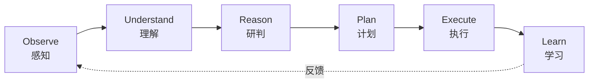

- 感知：接收视频、传感器、GIS、业务系统和人工上报数据；
- 理解：识别对象、事件、空间位置、组织关系和施工语境；
- 研判：结合规则、历史和知识评估风险与影响；
- 计划：将目标分解为查询、分析、通知、派单和报告等步骤；
- 执行：调用受控工具推进业务，并记录全部操作证据；
- 学习：利用误报、漏报、处置结果和用户反馈优化规则与模型。

---

## 8.2 BridgeAI-Site 的产品定位与建设目标

### 8.2.1 产品定位

BridgeAI-Site 是 BridgeAI-Agent 在交通基础设施施工阶段的产品形态。它以固定摄像头和现场物联网设备为连续感知基础，以 GIS 为现场空间底座，以 BridgeAI Vision Engine 为视觉事件引擎，以工单为管理闭环，以知识库和多 Agent 为智能编排中枢。

产品首期不追求覆盖施工管理的全部领域，而是聚焦可快速形成价值闭环的“视频安全管理”：

- 摄像头和流媒体统一接入；
- 视频墙和 GIS 一张图；
- 安全帽、反光衣、区域入侵、烟火、人员聚集和车辆违规停留等 AI 能力；
- 告警确认、派单、整改、复核和销项；
- 安全日报、周报和风险趋势；
- 面向查询、分析和报告的 Agent 助手。

在首期能力稳定后，平台再逐步扩展到质量、进度、环保、机械、物料和应急管理。这种“先闭环、后扩展”的路线可以避免项目一开始堆叠大量弱关联功能，也有利于尽早通过真实现场数据验证价值。

### 8.2.2 产品价值主张

BridgeAI-Site 的价值不是简单减少人工看视频的时间，而是推动现场管理方式发生结构性变化。

第一，扩大有效观察范围。AI 可以对多路视频进行持续分析，弥补人工注意力无法长期覆盖全部画面的局限。

第二，提高事件发现的及时性。视频异常进入事件流水线后，可在较短时间内完成证据固化、位置关联和责任匹配。

第三，缩短管理链路。系统把发现、确认、派单、整改和复核串联起来，避免消息停留在聊天群或口头通知中。

第四，形成可信数据资产。每个事件保留原始证据、模型版本、规则版本、操作日志和处置结果，为复盘、培训和模型改进提供依据。

第五，增强组织学习。系统能够识别高发区域、高发班组、重复问题和处置瓶颈，把单次整改转化为管理改进线索。

### 8.2.3 服务对象与角色关系

平台面向建设单位、施工单位、监理单位、项目管理机构、安全管理人员、现场班组和平台运维团队。不同角色关注的目标不同：

| 角色 | 主要关注点 | 典型操作 |
|---|---|---|
| 建设单位管理者 | 多项目风险、整改率、重大事件 | 查看驾驶舱、督办、报告审批 |
| 项目经理 | 项目总体状态、资源与责任 | 风险研判、跨部门协调、销项确认 |
| 安全负责人 | 事件处置、规则执行、复盘 | 确认告警、派单、复核、统计 |
| 监理人员 | 现场合规、整改证据 | 核查事件、提出要求、复核 |
| 班组负责人 | 本班组待办和整改时限 | 接单、整改、上传证据 |
| 平台管理员 | 用户、权限、项目配置 | 账号、角色、范围和审计管理 |
| 算法运维人员 | 模型效果、误报、节点性能 | 模型灰度、阈值调整、样本回流 |

权限设计必须同时考虑组织角色、项目范围、标段范围、资源归属和操作风险。用户“能够看到什么”与“能够执行什么”应分开控制；跨项目查询、批量导出、模型发布和高风险写操作需要更严格的授权与审计。

### 8.2.4 与 BridgeAI 产品体系的关系

BridgeAI-Site 与 BridgeAI-UAV 是 BridgeAI 体系中的两类感知和执行入口：前者擅长固定点位连续监测，后者擅长移动巡检和盲区补充。两者共享项目、GIS、媒体、事件、知识、Agent、权限和审计底座。

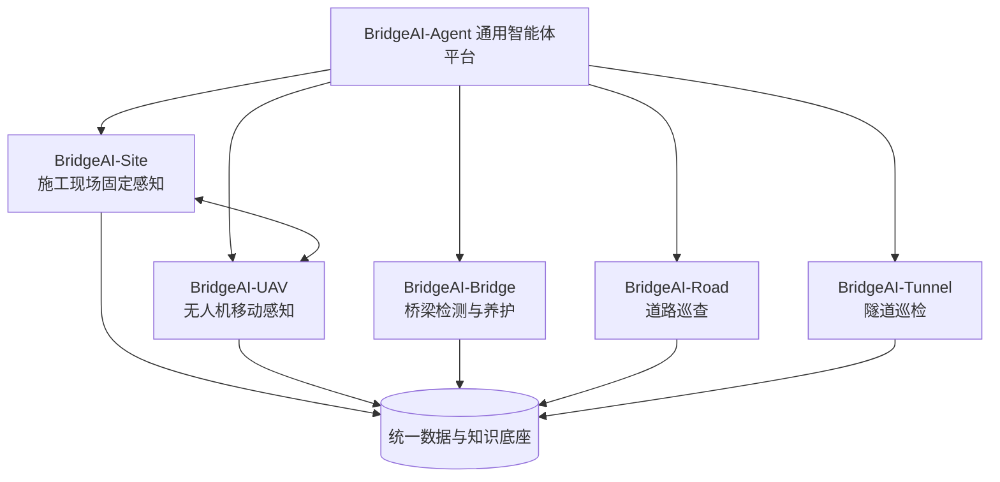

这种产品关系避免为每个场景重复建设账号、地图、模型、事件、报告和知识库，也为施工期数据向运营养护阶段延续创造条件。

---

## 8.3 业务闭环与总体方法

### 8.3.1 从检测结果到工程事件

视觉模型输出的检测框只描述某一帧中“可能存在某个对象”。工程管理需要的是稳定、可追溯、可处置的事件。两者之间至少需要完成时间一致性、空间过滤、对象关联、规则判断、风险评分、证据固化和业务去重。

BridgeAI-Site 将完整链路定义为：

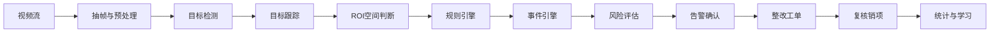

每个环节解决不同问题。目标跟踪减少逐帧重复；ROI 将目标与危险区域关联；规则引擎判断持续时间、数量、方向和时段；事件引擎负责聚合与冷却；风险引擎将类别、场景和历史组合为处置优先级；业务系统则把事件转化为责任明确的整改任务。

### 8.3.2 事件的最小可信结构

一个可用于工程管理的安全事件至少应包含：

- 事件标识和发生时间；
- 所属项目、标段、区域与摄像头；
- 事件类型、风险等级和置信信息；
- 涉及目标、持续时长和空间关系；
- 原始截图、事件前后录像片段和媒体校验信息；
- 使用的模型版本、规则版本和配置版本；
- 生成方式、确认状态、处置状态和责任关系；
- 人工修改、误报反馈、复核意见和完整审计链。

模型置信度不是事件可信度的全部。一个高置信度检测可能因场景规则不成立而不应产生告警；一个中等置信度结果可能因连续出现、处于重大危险区域且被多个信号支持而值得优先处理。因此，事件可信度应由模型、时间、空间、规则和业务语境共同决定。

### 8.3.3 闭环管理而不是告警堆积

告警数量多不等于管理效果好。缺少去重、分级和责任闭环的系统会迅速形成告警疲劳。BridgeAI-Site 在设计上坚持四项原则：

1. 同一对象、同一区域、同一规则在冷却期内优先聚合，而不是重复刷屏；
2. 事件必须有明确状态，任何变化都应有操作者、时间和理由；
3. 高风险事件优先获得人工注意力，低风险事件可聚合进入清单或报告；
4. 处置结果必须返回系统，成为规则优化和模型学习的数据。

推荐的事件与工单状态关系如下：

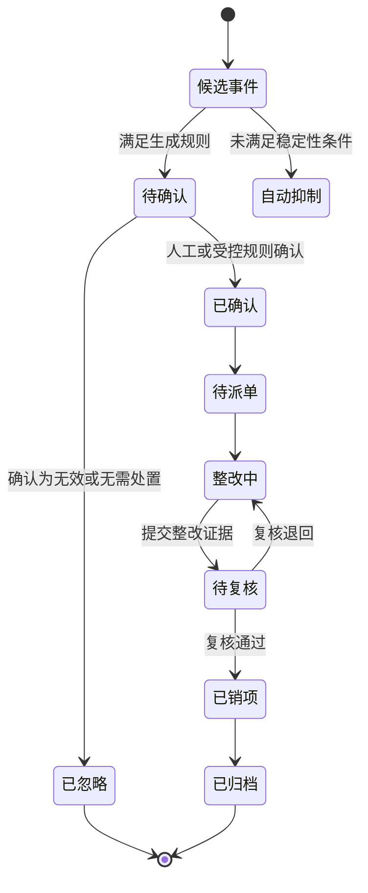

### 8.3.4 确定性流程与智能推理分离

智慧工地既需要 AI 的灵活理解，也需要工程管理的确定性。BridgeAI-Site 将两者分层：

- 状态流转、权限校验、时限计算、证据要求和审计记录由确定性业务系统负责；
- 意图理解、跨数据分析、知识检索、风险解释和报告生成由 Agent 负责；
- 对派单、关闭、批量通知等写操作，由工具层提供结构化接口和幂等控制；
- 对重大风险、跨组织影响或不可逆操作，必须进入人工确认节点。

这能够避免大模型直接修改数据库或凭自然语言“猜测”业务状态，也使每次行动都可以重放、解释和审计。

---

## 8.4 总体架构设计

### 8.4.1 七层逻辑架构

BridgeAI-Site 采用七层架构，将现场感知、智能识别、业务管理和智能体编排分离，同时通过统一的数据与事件模型协同。

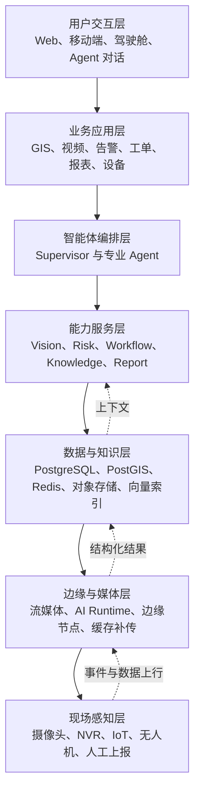

分层的目的不是增加系统复杂度，而是明确责任边界：视频解码不承担工单流转，模型不决定用户权限，Agent 不绕过业务接口，数据库不承载大体量视频文件。

### 8.4.2 核心服务边界

平台在首期可以采用模块化单体与独立高负载服务结合的方式。项目、用户、权限、摄像头、事件和工单等核心业务由统一 API 服务承载；视频、AI Runtime、Agent 和异步报表根据资源特征独立部署。

| 服务 | 核心职责 | 主要边界 |
|---|---|---|
| Web 应用 | 页面呈现、交互和本地状态 | 不直接访问数据库和设备密码 |
| API 服务 | 业务规则、权限、状态机、审计 | 不执行重型模型推理 |
| 流媒体服务 | 拉流、转码、分发、录像 | 不判断工程风险 |
| AI Runtime | 解码调度、模型推理、跟踪与规则 | 通过事件接口写入业务结果 |
| Agent 服务 | 意图、规划、工具编排、解释 | 只通过受控工具访问业务系统 |
| Worker | 报表、通知、媒体处理等异步任务 | 保证重试、幂等和死信处理 |
| 数据服务 | 事务、空间、缓存、对象和知识存储 | 按数据类型明确存储职责 |

### 8.4.3 数据与控制双通道

平台同时存在高吞吐的数据通道和低频但高价值的控制通道。

数据通道包括视频帧、检测结果、设备状态、媒体文件和运行指标，强调吞吐、延迟和断网恢复。控制通道包括模型发布、规则调整、工单流转、设备配置和 Agent 工具调用，强调授权、幂等、审计和回滚。

如果二者混在一起，视频高峰可能阻塞管理操作，或者未经控制的推理结果直接触发高风险动作。通过双通道设计，平台可以分别制定性能与安全策略。

### 8.4.4 事件驱动协同

除同步 REST API 外，平台使用事件驱动机制传播告警、设备状态、任务进度和 Agent 流式结果。典型主题包括：

- 摄像头上线、离线和码流异常；
- AI 候选事件生成、确认、升级和结束；
- 工单创建、接单、超时、提交和复核；
- 报表生成进度和完成状态；
- Agent 运行状态、工具确认请求和输出片段；
- 边缘节点心跳、资源占用和补传进度。

事件消息只表达已发生的事实，不替代业务数据库中的权威状态。消费者需要具备幂等能力，避免重复消息导致重复派单或重复通知。

---

## 8.5 用户体验与页面体系

### 8.5.1 设计目标

智慧工地系统常被设计成高饱和、强发光和信息密度过高的“科技大屏”。这种风格适合短时展示，却不一定适合安全员长时间工作。BridgeAI-Site 的交互设计强调清晰、克制和任务导向：重要风险必须醒目，但普通信息不应与高风险竞争注意力；图表必须服务判断，而不是作为装饰。

页面体系围绕“态势、定位、核查、处置、复盘”组织：

- 驾驶舱用于掌握整体态势；
- GIS 用于定位空间关系和周边资源；
- 视频墙用于实时核查和现场回看；
- 告警中心用于筛选、确认和研判；
- 整改中心用于跟踪责任与时限；
- 报表中心用于复盘趋势和管理成效；
- Agent 助手用于跨模块查询、分析和生成草稿。

### 8.5.2 驾驶舱

驾驶舱不是所有数据的集合，而是管理者的异常入口。首屏应优先呈现：

- 今日新增、待确认、整改中和超时事件；
- 高风险事件及其空间分布；
- 摄像头和边缘节点在线状态；
- 事件趋势、类型分布和高发区域；
- 近期处置效率、整改率和复核退回率；
- 最新重大事件与一键进入处置入口。

所有统计卡片应支持点击下钻，确保数字能够追溯到事件清单。统计口径、时间范围和数据更新时间应明确显示，避免驾驶舱与业务列表数字不一致。

### 8.5.3 GIS 一张图

GIS 负责将抽象事件还原到真实施工空间。地图对象包括项目边界、标段、施工区域、危险区域、摄像头、边缘节点、人员车辆、事件和无人机任务。

空间查询应支持从事件定位摄像头、从摄像头查看所属区域、从区域查看责任组织，也支持按风险等级和在线状态筛选。区域绘制与编辑属于高影响配置，需要版本记录、权限控制和生效确认。危险区域变化后，相关 AI 规则应获得通知并进行配置一致性检查。

### 8.5.4 视频监控与视频墙

视频页面提供单画面、2×2、4×4 等布局，支持播放、暂停、全屏、截图、事件回看、码流选择和权限受控的云台操作。AI 结果叠加应允许开关，避免遮挡现场细节。

对不支持浏览器直接播放的 RTSP 流，平台通过流媒体服务转换为 HLS 或 WebRTC。实时核查优先采用低延迟协议，历史回放则优先保证稳定性和时间轴准确。播放授权使用短时有效凭证，前端不暴露摄像头原始密码和长期流地址。

### 8.5.5 告警详情

告警详情是人工确认的核心页面，应把证据、位置、规则和处置动作放在同一上下文中。推荐布局包括：

- 事件截图和前后录像；
- 事件类型、风险等级、持续时间和目标数量；
- 项目、区域、摄像头和责任单位；
- 模型、规则与生成原因的可解释信息；
- 历史相似事件和该区域近期风险；
- 确认、忽略、调整风险、创建工单等操作；
- 完整的状态时间线和审计记录。

“忽略”必须要求选择原因，例如误报、测试画面、已在处置、非作业人员或无需处理。原因数据将用于算法评测和规则优化。

### 8.5.6 移动整改端

现场整改人员使用移动端时，操作环境可能存在强光、手套、网络不稳定等情况。页面应减少输入，使用大尺寸操作区、明确时限和离线草稿。整改提交至少包含结果说明和证据；对关键事件可要求整改前后对比、定位和时间校验。

复核人员应能够快速查看原始事件、整改说明和证据，并执行通过或退回。退回必须说明原因，且保留每一轮整改记录，不能覆盖旧证据。

### 8.5.7 Agent 交互

Agent 助手不应伪装成无所不能的聊天机器人。界面需要明确展示它正在查询哪些数据、计划调用哪些工具、哪些结论来自知识库，以及哪些动作需要用户确认。

典型快捷任务包括：

- “汇总今天所有高风险事件，并按标段排序”；
- “分析近七天安全帽事件反复发生的区域”；
- “生成本周安全管理报告草稿”；
- “找到超过整改时限且未复核的工单”；
- “依据已入库制度解释此事件的整改要求”。

当用户提出“把这些事件全部派给某负责人”时，系统应生成结构化确认卡片，显示对象数量、责任人、时限和通知范围，用户确认后才执行。

---

## 8.6 BridgeAI Vision Engine：从视觉识别到事件理解

### 8.6.1 BVE 的平台定位

BridgeAI Vision Engine（BVE）是 BridgeAI 产品体系的统一视觉智能底座，可服务智慧工地、无人机巡检、桥梁检测、道路巡查和隧道巡检。它不是单一模型，而是一条可配置、可观测、可部署的工程流水线。

各组件可按场景组合。安全帽识别需要人员与防护用品关联；区域入侵需要跟踪和多边形判断；烟火识别需要时间确认和二次复核；人员聚集需要计数、空间密度和持续时间。统一流水线使算法能力能够复用，也让模型替换不会破坏上层事件和工单逻辑。

### 8.6.2 视频解码与帧调度

施工现场摄像头存在分辨率、编码、帧率和网络质量差异。视频解码模块负责连接管理、硬件解码、时间戳处理和断流恢复；帧调度模块根据场景风险、模型负载和资源状态选择推理帧。

固定场景并不需要对每一帧执行完整推理。安全帽识别通常可采用较低推理帧率并结合跟踪；烟火等快速变化事件需要更高采样频率；在夜间无人作业时可降低调度权重。自适应帧率能够在保证事件时效性的同时提高单节点可承载视频路数。

### 8.6.3 目标检测与模型体系

第一阶段以 YOLO26 系列模型作为实时检测基线，并保持 PyTorch、ONNX Runtime、TensorRT 和 MLX 等运行时适配能力。模型类别可覆盖人员、安全帽、反光衣、烟火、车辆和常见机械等对象。

模型选择必须以现场事件效果为依据，不能只比较公开数据集上的 mAP。输入分辨率、目标尺寸、摄像头角度、夜间照明、粉尘和遮挡都会显著影响实际效果。对于小目标场景，可采用区域裁剪、提高输入分辨率、分块推理或优化摄像头视角，而不是单纯更换更大的模型。

### 8.6.4 PPE 关联判断

未佩戴安全帽和未穿反光衣并不是简单的类别缺失判断。系统需要先检测人员与防护用品，再根据几何位置、人体区域、跟踪身份和多帧一致性建立关联。

以安全帽为例，判断过程可包括：

1. 获取人员框并估计头部候选区域；
2. 判断安全帽框与头部区域的相交和中心关系；
3. 对同一 Track ID 在连续帧中累计判断结果；
4. 排除画面边缘、严重遮挡和尺寸过小的低质量目标；
5. 满足持续时间与置信规则后生成候选事件。

这样可以减少背景中的安全帽、邻近人员安全帽或瞬时漏检造成的误报。

### 8.6.5 多目标跟踪

ByteTrack 或 BoT-SORT 等跟踪器为目标分配短期身份，使系统能够理解“同一个人持续未戴安全帽”或“同一辆车在区域内停留超过阈值”。跟踪不是为了永久识别人，而是为了在单路视频的有限时间窗口内建立事件连续性。

跟踪指标需要关注 ID 稳定性、遮挡恢复和跨帧丢失。对于摄像头抖动、施工机械遮挡和人员密集场景，系统应允许短时轨迹补偿，并在不确定时降低自动事件等级。

### 8.6.6 ROI 与空间规则

ROI Engine 支持多边形区域、屏蔽区、越线、方向和区域交集判断。每条 AI 规则应明确作用区域、目标锚点和坐标版本。

人员进入危险区域时，应使用脚部或目标底边中心作为地面锚点，而不是简单判断整个检测框是否与多边形相交；吊装区域可能按时间段启用；摄像头上的永久遮挡物应配置屏蔽区；出入口可使用方向越线规则区分进入与离开。

ROI 配置必须与 GIS 中的工程区域概念建立映射。视频画面二维区域用于像素级判断，GIS 区域用于工程位置和责任关联，两者不能混为同一坐标系统。

### 8.6.7 规则引擎

规则引擎将检测、跟踪、区域、时间和业务配置组合为事件条件。规则可表达：

- AND、OR、NOT 等逻辑关系；
- 目标类别、置信度和数量；
- 进入、离开、停留和越线；
- 连续时间、累计时间和时间窗口；
- 工作日、班次、夜间或特殊施工时段；
- 摄像头、区域、项目和作业类型；
- 冷却时间、重复阈值和升级条件。

例如，一条高风险 PPE 规则可以表示为：人员位于吊装危险区域，连续五秒未检测到安全帽，并且当前处于吊装作业时段。模型负责提供对象事实，规则负责表达工程语义。

规则应具备版本号、适用范围、启停状态、发布人和生效时间。历史事件必须能够追溯到当时使用的规则版本。

### 8.6.8 事件生成、去重与升级

Event Engine 根据候选轨迹生成事件，并执行以下处理：

- 稳定性确认：过滤瞬时出现和低质量目标；
- 去重：避免同一轨迹每帧产生一个事件；
- 聚合：把短时间内同一区域的同类结果合并；
- 冷却：事件结束后设定最短再次触发间隔；
- 延续：持续违规更新同一事件的时长和证据；
- 升级：风险持续、数量增加或多次复发时提升等级；
- 结束：目标离开或规则条件连续不成立后关闭检测阶段。

事件录像通常保留触发前若干秒和触发后若干秒，以展示完整语境。截图应优先选择目标清晰、遮挡较少且规则证据充分的帧，而不是机械使用第一帧。

### 8.6.9 风险评估

风险评分可由事件基础风险、区域危险度、作业时段、暴露人数、持续时长、历史频次和不确定性等因素组成。可采用可解释的加权模型作为第一阶段基础：

\[
R = w_1B + w_2Z + w_3T + w_4N + w_5D + w_6H - w_7U
\]

其中，\(B\) 为事件基础风险，\(Z\) 为区域风险，\(T\) 为时段或作业风险，\(N\) 为涉及人数，\(D\) 为持续时间，\(H\) 为历史复发程度，\(U\) 为不确定性惩罚。

评分结果映射为低、一般、较高和重大等等级。映射阈值应按项目制度配置，且风险引擎需要输出各因素贡献，便于安全人员理解和修正。

### 8.6.10 首期算法场景

首期算法优先选择规则清晰、证据可见、业务价值高且现场可验证的六类场景：

1. 未佩戴安全帽；
2. 未穿反光衣；
3. 人员进入危险区域；
4. 烟雾与明火；
5. 人员聚集；
6. 车辆违规停留。

后续可扩展高处作业未系安全带、临边防护缺失、吊装区域入侵、车辆未冲洗、裸土未覆盖、积水、吸烟、打电话和机械盲区人员检测等能力。扩展时应评估摄像头条件和事件可验证性，避免只因算法“可演示”就承诺工程可用。

### 8.6.11 VLM 二次复核

视觉语言模型可以对候选截图或短视频提供语义复核，例如判断画面是否属于真实施工场景、烟雾是否更可能来自施工扬尘、人员是否正在进行特定作业。VLM 适合作为低频候选事件的二次解释层，但不能替代稳定的实时检测流水线。

在涉及重大风险或证据不充分时，VLM 输出应标注不确定性，并保留原始视觉证据。任何模型生成的描述都不能伪装成人工确认结论。

---

## 8.7 GIS、视频与现场空间数字化

### 8.7.1 GIS 作为工程语境底座

智慧工地的事件只有落到具体空间，才能与责任、作业和资源建立关系。PostGIS 用于存储项目边界、标段范围、施工区域、危险区域和设备点位，并提供包含、相交、邻近和范围查询。

当一个事件由摄像头产生时，系统通过摄像头所属区域和空间关系补全工程语境；当管理人员在地图上选择一个区域时，可反向查询该区域的摄像头、事件、工单、责任单位和近期风险趋势。

### 8.7.2 摄像头空间标定

摄像头接入不能只记录名称和流地址，还应记录经纬度、安装高度、朝向、覆盖区域、接入协议、所属标段、网络位置和 AI 适用性。现场变更镜头方向后，应重新核查 ROI 与覆盖区域。

摄像头 AI 视角评估至少关注：

- 目标典型像素尺寸是否满足识别要求；
- 是否存在强逆光、夜间过曝或频繁抖动；
- 危险区域是否被遮挡；
- 摄像头是否经常转动，导致固定 ROI 失效；
- 网络带宽和码流稳定性是否满足推理与录像；
- 画面用途是否符合隐私和合规要求。

视角不合格时，应优先调整安装和补光，而不是无限降低算法阈值。

### 8.7.3 视频接入体系

平台兼容 RTSP、GB28181、ONVIF、厂商云平台和 NVR 等常见接入方式。流媒体层负责统一拉流、协议转换、鉴权和播放分发。对于萤石云等第三方平台，应隔离应用密钥，控制 Token 生命周期，并记录接口调用和播放授权。

视频数据分为实时流、常规录像和事件证据三类。常规录像可按存储容量实施循环覆盖；事件证据与业务记录绑定，按照更长生命周期保存，并通过对象校验值防止无意替换。

### 8.7.4 固定感知与移动感知

固定摄像头适合持续监测重点区域，但存在视角盲区和项目阶段变化。无人机可按任务补充临时作业面、线性工程和高处结构的观察。

BridgeAI-Site 与 BridgeAI-UAV 协同后，可形成以下流程：固定摄像头发现异常趋势，GIS Agent 分析盲区和周边点位，用户授权后创建无人机复核任务，无人机采集数据进入统一媒体和事件中心，最终由同一工单闭环处理。

---

## 8.8 告警与整改闭环

### 8.8.1 风险分级

风险分级需要同时考虑事件性质和现场语境。系统可建立四级风险体系，并为每级配置响应时限、通知范围、是否自动升级和是否需要管理层确认。

| 风险等级 | 典型含义 | 处置原则 |
|---|---|---|
| 低风险 | 影响有限、可批量处理 | 纳入清单，班组自查 |
| 一般风险 | 需要及时纠正 | 指定责任人并限时整改 |
| 较高风险 | 可能造成明显安全后果 | 快速通知，安全负责人跟踪 |
| 重大风险 | 可能危及生命或造成重大损失 | 立即核查，必要时停工并升级报告 |

自动风险等级只是建议。授权人员可以调整，但必须记录原等级、调整后等级和理由。

### 8.8.2 人工确认

AI 候选事件在进入正式工单前通常需要人工确认。对于经过充分现场验证、规则稳定且风险较低的场景，可配置自动确认；重大风险仍应快速推送人工核查。

人工确认不是算法失败的补丁，而是人机协同的制度节点。系统应尽量降低确认成本，通过清晰证据、事件解释和历史上下文帮助人员快速判断。

### 8.8.3 工单生成与派发

工单包含事件来源、责任组织、责任人、整改要求、完成时限、证据要求、抄送范围和升级规则。系统可根据区域与组织关系推荐责任人，但不能在映射不确定时强行自动派单。

批量派单需要先展示影响范围。若同类事件属于同一根因，可合并为专项整改任务；若事件涉及不同作业面和责任班组，则应分别处理，避免一张工单掩盖多个责任对象。

### 8.8.4 整改与复核

责任人接单后执行现场整改，上传说明、照片或视频。系统记录接单、处理、提交和超时节点。复核人员对照原始事件与整改证据决定通过或退回。

复核通过后事件可销项，但数据仍保留用于统计。反复退回、超时或同一区域重复发生同类事件，应触发管理复盘，而不仅是继续生成更多工单。

### 8.8.5 超时与升级

工单时限由风险等级、事件类型和项目制度决定。临近超时可提醒责任人；超时后按组织层级升级通知；重大风险未响应时可触发应急流程建议。

所有自动升级动作都应可配置，避免夜间无意义通知或跨层级滥发。通知成功不等于完成处置，系统必须以工单状态和复核结果作为闭环依据。

### 8.8.6 报告与管理复盘

日报、周报和专项报告不只是事件数量汇总，应包括：

- 新增、已确认、已整改和超时事件；
- 按类型、区域、标段和责任单位分布；
- 高风险事件摘要与处置过程；
- 重复发生问题及可能根因；
- 平均确认时间、整改时间和复核退回率；
- 设备在线率与算法运行状态；
- 下阶段重点关注区域和建议。

报告中的事实数据由业务系统计算，Agent 负责组织语言、总结趋势和生成建议。任何数字都应能回到明细来源。

---

## 8.9 多 Agent 智能编排体系

### 8.9.1 总体结构

BridgeAI-Site 采用 Supervisor Agent 统一接收任务，并根据意图和上下文调用专业 Agent。专业 Agent 不是相互自由对话的虚拟角色，而是具备明确职责、输入输出和工具权限的能力模块。

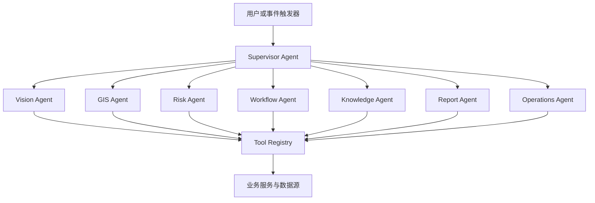

### 8.9.2 Supervisor Agent

Supervisor 负责识别用户意图、抽取项目和时间等实体、检查上下文是否充分、制定任务计划、选择专业 Agent、汇总结果并决定是否需要人工确认。

它不直接访问数据库，也不拥有无限工具权限。对于简单查询，可调用一个专业 Agent 完成；对于“分析本周高风险事件并形成整改建议”，则可能并行调用 Vision、GIS、Risk 和 Knowledge Agent，再由 Report Agent 形成输出。

### 8.9.3 专业 Agent 职责

Vision Agent 负责查询模型结果、事件证据、算法状态和误报反馈，不直接发布模型。

GIS Agent 负责空间查询、区域关系、点位覆盖和地图表达，不擅自修改项目边界。

Risk Agent 负责基于规则、历史和知识解释风险，输出评分依据与不确定性。

Workflow Agent 负责工单草拟、状态查询、责任匹配和受控流转。实际写操作必须经过权限与确认。

Knowledge Agent 负责检索规范、制度、专项方案和历史案例，并返回可追溯引用。

Report Agent 负责把结构化数据和知识依据组织成报告草稿，不自行编造统计数字。

Operations Agent 负责查询服务健康、设备在线、任务队列和节点资源，不执行破坏性系统操作。

### 8.9.4 工具注册与风险分级

Tool Registry 为每个工具定义名称、版本、参数模式、调用者权限、项目范围、超时、重试、幂等和审计规则。工具可分为四级：

- 查询类：读取事件、工单、GIS 和设备状态；
- 草稿类：生成报告草稿、派单建议或配置建议；
- 高风险写操作：创建或批量派发工单、调整风险、发布配置；
- 禁止类：绕过权限访问、直接执行任意命令、删除审计记录等。

高风险工具应默认要求人工确认；禁止类工具不向 Agent 暴露。

### 8.9.5 计划、执行与检查

一次可靠的 Agent 运行可以分为五步：

1. 解析任务和上下文；
2. 生成结构化计划；
3. 调用工具并收集证据；
4. 检查结果是否完整、相互一致和符合权限；
5. 输出结论或提交确认请求。

如果工具失败，系统应区分可重试错误、参数错误、权限拒绝和外部服务不可用。Agent 不应通过反复改写参数绕过权限，也不应在数据不足时把推测写成事实。

### 8.9.6 人工确认机制

确认卡片应清晰展示：即将执行的动作、目标对象、影响范围、关键参数、风险说明和可撤销性。用户确认时再次验证身份、权限和数据版本，防止确认前对象已经变化。

典型需要确认的操作包括：

- 批量创建或派发工单；
- 关闭较高或重大风险事件；
- 修改区域规则、模型阈值或通知策略；
- 发布模型或知识索引；
- 导出包含敏感信息的数据。

### 8.9.7 会话与记忆

短期记忆保存当前对话中的项目、时间范围、筛选条件和中间结果；长期记忆只保存经授权且具有持续价值的偏好、常用视图或已确认事实。业务权威状态仍由数据库提供，不能依赖大模型记忆。

上下文过长时，系统对历史对话进行结构化压缩，并保留关键实体、已确认结论和引用来源。敏感内容按项目和权限隔离，用户撤销访问权限后，后续 Agent 运行不得继续使用旧上下文访问相关数据。

### 8.9.8 Agent 安全边界

智慧工地知识库可能包含不可信文档，用户输入也可能诱导模型绕过规则。系统应防范 Prompt Injection、工具参数注入、越权检索、敏感数据泄露和恶意循环调用。

安全控制包括：

- 系统策略与外部文档内容分离；
- 工具参数按结构化模式校验；
- 检索前执行项目和文档权限过滤；
- 模型输出不得直接成为 SQL 或系统命令；
- 设置运行步数、时间、Token 和成本上限；
- 对高风险输出执行策略检查与人工确认；
- 保存 Agent Run、Tool Call、输入摘要和结果摘要。

---

## 8.10 工程知识库与 RAG

### 8.10.1 知识范围

BridgeAI-Site 的知识来源包括国家和行业规范、地方规定、企业安全制度、项目管理办法、专项施工方案、技术交底、应急预案、设备说明、历史事件和整改案例。

不同知识具有不同权威等级和适用范围。国家规范与项目内部通知不能混为一类；已废止版本不能与现行版本同时无差别返回；项目专项方案只对授权项目可见。

### 8.10.2 文档治理

文档入库前需要记录名称、来源、发布单位、版本、发布日期、生效时间、失效时间、适用区域、项目权限和审核状态。扫描 PDF 需要 OCR 和版面恢复，表格与条款编号应尽量保留。

知识库不是文件网盘。只有完成解析、切片、元数据标注、索引和抽样核验的文档，才可进入生产检索范围。

### 8.10.3 混合检索

工程条款常包含精确编号、专业术语和语义相近表达，因此采用关键词检索与向量检索结合的混合策略。典型流程为：

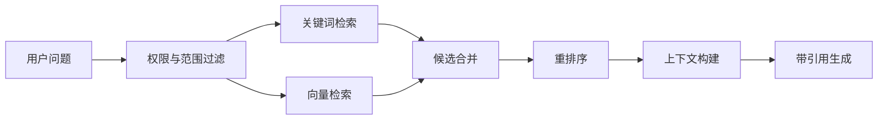

权限过滤应尽量在检索阶段完成，而不是生成后再删除敏感片段。重排序综合文本相关度、权威等级、版本有效性和项目适用性。

### 8.10.4 引用与可信表达

Agent 回答规范或制度问题时，应给出文档名称、版本、条款位置和可访问链接。检索不到充分依据时，应明确说明资料不足，并建议人工核实。

生成的整改建议属于辅助意见，不能自动替代注册安全工程师、监理或项目负责人的法定职责。对于需要专业签字或法律效力的文件，必须由授权人员审核确认。

### 8.10.5 知识更新与评测

知识索引应支持灰度更新和回滚。新增文档后，通过一组标准问题验证召回、权限和引用；正式发布前对旧版本冲突进行检查。评测指标不仅包括答案相似度，还包括正确引用率、越权率、拒答合理性和版本有效性。

---

## 8.11 数据架构与治理

### 8.11.1 数据存储分工

PostgreSQL 存储企业、项目、用户、摄像头、AI 任务、事件、工单、Agent 运行和审计等事务数据；PostGIS 存储空间对象和空间索引；Redis 承担缓存、会话、短期状态、队列协调和实时发布订阅；对象存储保存截图、录像、模型、报告和文档原件；pgvector 或独立向量能力保存知识切片向量。

大体量视频不应直接存入关系数据库。数据库保存对象地址、校验值、大小、类型、生命周期和业务引用关系。

### 8.11.2 核心实体关系

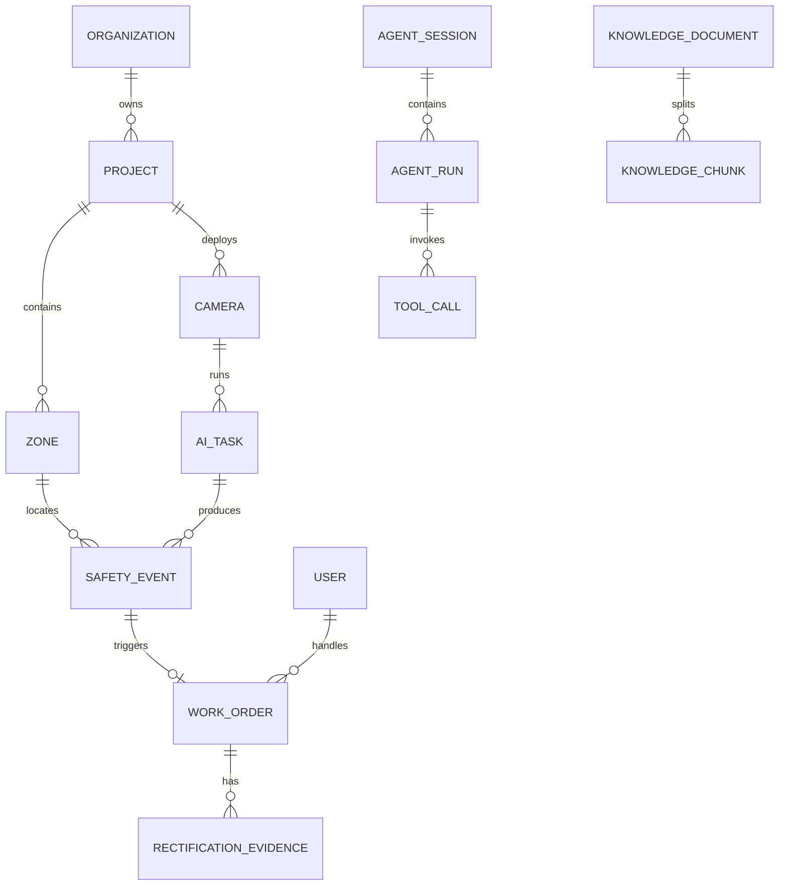

模型、规则、Prompt 和工具都应版本化。事件必须引用实际生效版本，以支持质量追踪和问题重放。

### 8.11.3 多租户与项目隔离

数据访问以企业和项目为基本隔离边界。服务层在每次请求中验证用户身份、项目授权和资源归属；重要查询可叠加数据库行级策略。对象存储路径、缓存键和消息主题也应包含租户与项目范围，防止只在页面层做隔离。

### 8.11.4 数据质量

数据质量直接影响 Agent 输出。平台需要持续检查：

- 摄像头与区域、标段和责任组织是否完整关联；
- 事件时间是否一致，边缘节点时钟是否同步；
- 工单状态是否符合状态机；
- 媒体对象是否存在且校验一致；
- 模型和规则版本引用是否有效；
- GIS 几何是否正确、是否存在自相交或坐标系错误；
- 知识文档版本和权限元数据是否完整。

### 8.11.5 数据保留与隐私

常规视频、事件证据、审计日志、运行指标和报告具有不同保留周期。保留策略应由合同、项目制度、存储成本和法律要求共同确定。

涉及人员图像、手机号、账号和位置的数据应最小化采集、分级访问和脱敏展示。算法开发导出样本前，应完成授权和去标识化。生产数据不能被默认用于外部模型训练。

---

## 8.12 系统接口与实时通信

### 8.12.1 API 设计原则

平台采用版本化 REST API 提供项目、GIS、摄像头、AI、事件、工单、报表和 Agent 能力。接口遵循统一认证、响应格式、分页、错误码和审计规则。

写操作需要处理幂等性。网络重试不能造成重复工单、重复通知或重复确认。批量接口应限制规模，并返回逐项结果。

### 8.12.2 身份与授权

用户登录获得短时访问令牌和受控刷新机制。服务端基于角色、项目和资源归属执行授权。涉及视频播放时，API 返回短时播放凭证，而不是原始设备密码。

Agent 使用代表用户的受限授权上下文调用工具。工具执行时再次校验权限，不能因为 Agent 已经通过身份认证就跳过资源级检查。

### 8.12.3 WebSocket 与流式输出

WebSocket 用于实时告警、设备状态、工单变化和 Agent 流式响应。客户端断线重连后，应根据事件序号补齐必要状态，而不是假设所有消息都已收到。

Agent 流式输出可以展示任务阶段和文字片段，但最终结果需要持久化，并标记是否完整、是否被取消以及使用了哪些工具。

### 8.12.4 内外部接口隔离

对外业务 API 与内部工具 API 分离。内部 AI 回调、Agent 工具、媒体处理和边缘同步接口采用服务身份、网络隔离和更严格的签名机制。任何来自边缘节点的事件都需要校验节点身份、项目绑定和消息完整性。

---

## 8.13 边云协同与部署架构

### 8.13.1 部署模式

BridgeAI-Site 支持本地研发、项目私有化、中心云平台和边云混合部署。

本地研发环境适合在 Mac Studio 上运行 API、数据库、对象存储、Agent、知识库和 MLX 推理，便于快速迭代与数据安全验证。

项目私有化部署将核心数据和服务放置在项目机房或企业数据中心，适合对视频和工程数据有严格控制要求的客户。

边云混合模式在工地部署 GPU 边缘节点进行视频解码和实时推理，中心平台负责跨项目管理、知识、报告和模型治理。断网时边缘继续执行关键规则，网络恢复后补传事件与证据。

### 8.13.2 典型物理架构

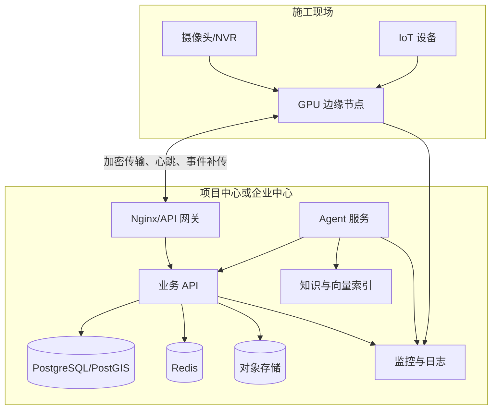

### 8.13.3 容器化基线

首期生产可使用 Docker Compose 管理 Web、API、Agent、Worker、PostgreSQL、Redis、MinIO、流媒体、监控和日志组件。AI Runtime 根据 GPU 驱动和硬件环境独立部署。

容器配置需要包含健康检查、重启策略、资源限制、持久化卷、独立网络和只读配置。数据库和对象存储的持久化目录不能随容器删除。Secrets 不写入镜像和版本库。

当项目数量、并发、团队和可用性要求提升后，再评估 Kubernetes。迁移的驱动因素应是实际运维需求，而不是技术展示。

### 8.13.4 Mac Studio 研发与中心服务

Mac Studio 的统一内存和 MLX 生态适合本地大模型、RAG、Agent 和算法验证。研发环境可运行 PostgreSQL、PostGIS、Redis、MinIO、Ollama 或 MLX 服务，以及前后端开发服务。

Apple Silicon 与 NVIDIA 生产节点存在运行时差异。模型从 PyTorch 导出 ONNX 后，需要在目标 TensorRT 环境重新构建 Engine，并进行数值一致性和性能验证；不能把某台机器生成的 Engine 作为跨硬件通用文件。

### 8.13.5 边缘 AI 节点

边缘节点接收视频流，执行解码、抽帧、推理、跟踪、规则和事件证据生成。上传中心的数据以结构化事件和必要媒体为主，避免持续回传所有原始视频造成带宽压力。

节点需要具备：

- 设备身份和安全启动配置；
- 本地规则与模型版本管理；
- 事件队列和媒体缓存；
- 磁盘水位与淘汰策略；
- 断网继续运行与恢复补传；
- 远程健康检查、日志和受控升级；
- GPU 温度、显存、利用率和推理延迟监控。

### 8.13.6 DJI Manifold 3 协同

DJI Manifold 3 可作为无人机侧边缘计算节点，为 BridgeAI-UAV 提供 TensorRT 推理和任务协同。其部署链路包括模型导出、Engine 构建、性能验证、应用打包、设备安装、任务联调和日志回传。

GPS 拒止、飞控接管等高风险能力不属于普通智慧工地视频 AI 的默认功能。涉及无人机自主控制时，必须遵循独立的飞行安全设计、分级验证和人工接管机制。BridgeAI-Site 主要接收任务状态、位置、媒体和识别事件，不直接以大模型输出控制飞行器。

---

## 8.14 安全、可靠性与可观测性

### 8.14.1 安全架构

平台安全覆盖身份、网络、应用、数据、模型、Agent 和供应链。生产环境使用 HTTPS，内部关键接口采用服务身份；数据库和对象存储不直接暴露公网；运维入口受网络策略和多因素认证保护。

密码、云平台密钥、设备凭证和模型服务密钥由 Secrets 管理，不进入源代码、镜像或普通日志。日志对 Token、手机号、视频地址和敏感参数进行脱敏。

### 8.14.2 审计

登录、权限变更、视频访问、事件调整、工单流转、配置发布、模型发布、知识更新和 Agent 工具调用都应进入审计日志。审计记录包含主体、动作、对象、结果、时间、来源和关联 Trace ID。

审计日志应防止普通管理员修改或删除，并按照项目要求长期保留。

### 8.14.3 可观测性

平台采用指标、日志和链路追踪三类手段建立可观测性。

Prometheus 采集 API 请求量、延迟和错误率，数据库连接、锁与慢查询，Redis 内存与命中率，流媒体在线路数，AI FPS、队列、显存和推理延迟，Agent Run、工具成功率、Token 和耗时等指标。

Grafana 提供系统总览、AI Runtime、Agent、数据库、视频与业务闭环等驾驶舱。Loki 汇聚 API、Agent、AI、Worker、Nginx 和边缘日志。OpenTelemetry 以 Trace ID 关联浏览器请求、API、Agent、工具、数据库和异步任务。

### 8.14.4 告警治理

运维告警按严重程度分级，并实施聚合、抑制和恢复通知。摄像头短时抖动不应造成持续消息风暴；同一边缘节点断网时，可抑制其下全部摄像头的派生离线告警，优先处理根因。

业务安全事件与系统运维告警应分开管理。前者由安全管理流程处置，后者由技术运维流程处置，但两者可通过统一 Trace 和项目视图关联。

### 8.14.5 备份与恢复

平台采用 3-2-1 思路保护关键数据：至少三份副本、两种介质、一份异地或隔离副本。PostgreSQL 结合逻辑备份、物理备份和 WAL 实现按时间点恢复；对象存储按重要性执行版本、复制和生命周期策略；配置、模型元数据和知识索引纳入备份清单。

备份成功日志不等于可恢复。项目必须定期进行恢复演练，记录恢复点目标（RPO）、恢复时间目标（RTO）、数据一致性和业务验证结果。

---

## 8.15 测试、评测与验收

### 8.15.1 分层测试体系

BridgeAI-Site 的测试覆盖单元、组件、接口、集成、系统、性能、安全、算法、Agent、边缘和现场试运行。不同测试层解决不同风险，不能只靠最终现场演示代替研发阶段验证。

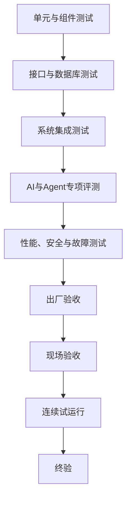

### 8.15.2 功能与接口测试

功能测试覆盖登录、权限、项目、GIS、视频、AI 配置、事件、工单、报表和 Agent。每条核心业务状态必须测试正常路径、退回路径、越权路径、重复提交和并发冲突。

接口测试验证认证、参数、分页、错误码、幂等、限流和审计。数据库测试关注约束、索引、迁移、空间查询、分区和恢复一致性。

### 8.15.3 视频与弱网测试

视频测试覆盖 RTSP、HLS、WebRTC、GB28181、厂商云和 NVR 接入，验证首次播放、延迟、长时间稳定性、断流重连、时间戳、截图和事件录像。

弱网测试模拟带宽下降、抖动、丢包和短时断网。系统需要明确降级策略，例如降低码流、减少推理帧率、仅上传事件证据或启用本地缓存。

### 8.15.4 AI 评测

算法评测分为目标级和事件级。目标级使用 Precision、Recall、mAP、跟踪稳定性和推理性能；事件级关注事件检出率、误报率、重复事件率、发现延迟和证据完整率。

现场测试矩阵应覆盖白天、夜间、逆光、雨雾、粉尘、施工灯、遮挡、不同距离和不同人员密度。每个场景记录摄像头条件、模型版本、规则版本和阈值，确保结果可复现。

事件级指标比单帧 mAP 更接近业务价值。一个模型即使单帧指标较高，如果持续产生重复告警或错过关键区域，仍不适合生产上线。

### 8.15.5 Agent 评测

Agent 评测包括意图识别、实体抽取、工具选择、参数正确性、多轮上下文、知识引用、拒答、安全和人工确认。

评测集应包含真实任务、模糊表达、越权请求、恶意指令、数据不足和外部服务失败。重点指标包括任务成功率、工具调用成功率、事实一致性、正确引用率、越权率、平均耗时和高风险动作确认率。

### 8.15.6 性能与稳定性

性能测试基于项目规模定义并发用户、摄像头路数、事件峰值、Agent 并发和报表任务量。测试不仅关注平均延迟，还要关注 P95、P99、队列积压和资源水位。

稳定性测试通过长时间运行观察内存增长、连接泄漏、磁盘占用、日志轮转和异常恢复。边缘节点需验证断网运行、缓存上限、顺序补传和重复消息幂等。

### 8.15.7 安全测试

安全测试覆盖弱口令、越权访问、对象枚举、Token 生命周期、文件上传、接口注入、敏感信息泄露、依赖漏洞和审计完整性。Agent 还需单独测试 Prompt Injection、知识越权、工具注入和无限循环。

### 8.15.8 现场试运行

正式终验前建议连续试运行不少于十四天。试运行期间每日记录：

- 摄像头在线率和断流次数；
- AI 事件数量、有效率、误报和漏报；
- 告警确认、派单、整改和复核时效；
- 边缘节点资源和补传情况；
- Agent 任务成功率和人工确认记录；
- 用户反馈、配置变更和未解决问题。

试运行不是等待时间届满，而是验证系统在真实管理节奏中持续发挥作用。

### 8.15.9 验收原则

验收分为出厂验收、现场初验、试运行和终验。每项结论都应有测试记录、截图、日志、报告或签字材料作为证据。

系统能够打开页面或演示一次算法，不代表满足验收。最终验收需要同时满足功能、性能、安全、算法、Agent、文档、培训和运维移交要求。

---

## 8.16 项目实施与现场交付

### 8.16.1 项目启动

项目启动阶段确认建设目标、实施范围、组织职责、数据边界、验收口径和计划。建设单位、施工单位、监理单位、设备供应商和 BridgeAI 实施团队通过 RACI 矩阵明确负责、批准、协作和知会关系。

未明确责任单位、网络条件、摄像头清单和验收指标前，不宜直接进入部署。

### 8.16.2 现场勘察

勘察包括项目区域、施工阶段、网络、机房、电源、摄像头、NVR、第三方平台、边缘节点安装和安全条件。摄像头清单需要现场核对实际画面，不能只依赖采购表。

勘察输出包括现场勘察报告、设备与接口清单、网络拓扑、GIS 点位、AI 视角评估、风险问题和前置条件确认。

### 8.16.3 基础部署与初始化

实施团队按顺序完成服务器与网络检查、数据库和对象存储部署、API 与 Agent 服务部署、网关和证书配置、监控接入、账号与权限初始化、项目和区域数据导入。

每一步通过检查表确认后再进入下一阶段。生产 Secrets 由客户指定的授权人员保管，交付材料中不包含明文密码。

### 8.16.4 视频和 GIS 建图

完成摄像头协议接入、播放验证、点位标定、所属区域关联和视频墙配置。危险区域由业务人员与实施人员共同绘制，安全负责人确认其业务含义。

摄像头视角不满足 AI 条件时，形成整改清单，包括调整角度、补光、清洁镜头、提高码流或新增点位。

### 8.16.5 AI 场景标定与灰度

针对每路摄像头选择适用算法，配置 ROI、屏蔽区、持续时间、置信阈值和冷却策略。先在少量点位灰度运行，人工标注有效、误报和漏报，再逐步扩大范围。

阈值调整必须基于样本和统计，而不是为了减少告警随意提高阈值。任何模型或规则变更都记录版本、原因和效果对比。

### 8.16.6 业务闭环联调

选择代表性场景完成事件生成、人工确认、工单派发、移动整改、复核销项、通知和报表全链路联调。同时验证超时、退回、重复提交、责任人缺失和网络异常。

### 8.16.7 Agent 与知识上线

Agent 上线前配置工具注册、权限、Prompt、确认策略、模型路由和运行限额。知识文档完成授权、解析、索引和标准问答测试。

首期优先开放查询、分析和报告草稿；写操作在积累稳定运行数据后逐项开放，并始终保留确认与审计。

### 8.16.8 培训与运营

培训按角色设计：管理员学习用户、权限和配置；安全员学习事件与工单；班组负责人学习移动整改；管理者学习驾驶舱和报告；运维人员学习监控、备份和故障处理。

培训应结合真实项目任务和现场演练，并保留签到、教材、考核和问题记录。平台上线后的运营负责人必须明确，否则系统容易在试点结束后失去维护。

### 8.16.9 交付与移交

交付物包括软件包、部署配置、数据库迁移、模型与规则、项目数据、接口资料、用户手册、运维手册、测试报告、验收记录和培训材料。源码、训练数据、预训练权重、定制模型和第三方组件的知识产权边界在合同中明确。

运维移交包含账号、监控、备份、证书、续期、设备清单、SLA、联系人和未关闭问题。所有凭证采用安全方式单独移交。

---

## 8.17 典型场景一：人员防护用品管理

### 8.17.1 场景背景

人员未佩戴安全帽或反光衣是施工现场高频问题。单纯依靠安全员巡查存在覆盖有限和记录不连续的问题，但简单 AI 检测又容易受到遮挡、距离和误关联影响。

### 8.17.2 系统流程

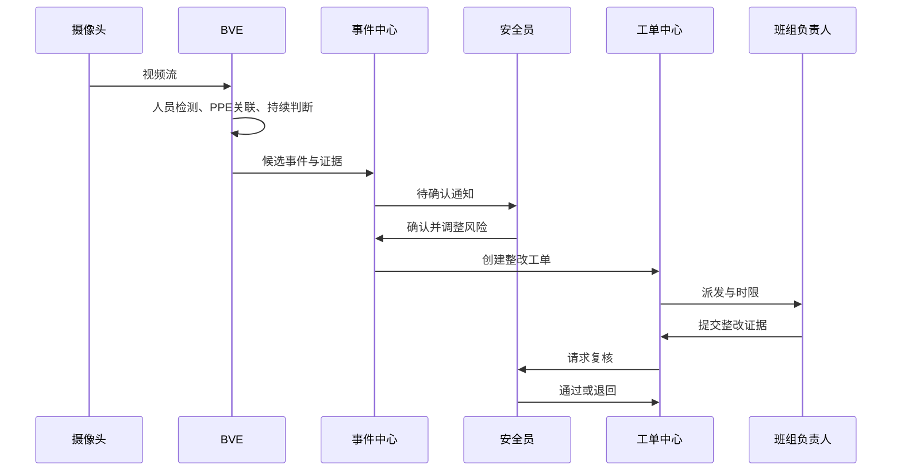

### 8.17.3 设计要点

系统需要按 Track ID 判断持续违规，排除画面边缘和目标过小情况；危险区域内的同类事件可以提高风险等级；同一班组短期重复发生时，Agent 在周报中提示管理问题。

成功标准不只是识别率，还包括有效事件比例、从发生到确认的时间、整改闭环率和复发趋势。

---

## 8.18 典型场景二：危险区域入侵

### 8.18.1 场景背景

基坑边缘、吊装区、机械回转区和临时封闭区具有明显空间边界。传统视频监控需要人员持续观察，普通运动检测无法区分人员、车辆和允许对象。

### 8.18.2 规则设计

危险区域入侵规则由目标类别、画面 ROI、作业时段、停留时间和例外对象组成。可按不同区域设置不同等级：人员进入机械回转区立即产生高风险候选；车辆进入临时通道只有在停留超过阈值时才产生事件。

### 8.18.3 处置协同

事件生成后，GIS Agent 查询区域名称、所属标段和周边摄像头；Risk Agent 结合当前作业类型评估风险；Workflow Agent 推荐责任人和时限；安全员确认后派单。若现场摄像头视角不足，可申请无人机或人工复核任务。

---

## 8.19 典型场景三：烟火与应急响应

### 8.19.1 场景挑战

烟火识别具有高风险和高误报并存的特点。粉尘、焊接光、蒸汽、阳光反射和施工照明都可能产生相似视觉特征，因此不能仅凭单帧模型结果直接触发重大应急行动。

### 8.19.2 多级确认

系统首先使用实时检测发现候选，再结合连续时间、区域、像素变化和作业计划进行规则判断；必要时调用 VLM 二次描述，并立即推送人工核查。重大区域可联动邻近摄像头或传感器数据。

### 8.19.3 安全边界

平台可以提供报警、通知、应急预案检索和处置建议，但是否停工、疏散或启动应急响应必须由授权人员确认，除非项目已建立独立、经过认证的自动联动系统。

---

## 8.20 典型场景四：自动安全日报

### 8.20.1 传统痛点

安全日报往往需要从视频平台、微信群、工单和巡查记录中人工汇总，耗时且容易遗漏。不同人员的统计口径也可能不一致。

### 8.20.2 Agent 工作流

Report Agent 根据用户指定的项目和日期，调用事件统计、工单统计、设备状态和知识工具，生成结构化草稿。Risk Agent 补充高风险摘要，GIS Agent 提供高发区域，Knowledge Agent 检索相关制度依据。

生成前先锁定统计口径；生成后报告中的每个关键数字保留数据查询引用。用户可编辑结论和建议，确认后导出 Word 或 PDF 并归档。

### 8.20.3 价值

自动日报把管理人员从重复整理中释放出来，同时促进数据质量改进：如果责任组织或区域映射缺失，报告生成会暴露这些问题，推动基础数据治理。

---

## 8.21 BridgeAI-Site 与 BridgeAI-UAV 协同

### 8.21.1 两类感知能力互补

固定摄像头具有连续、稳定和成本可控的优势，但受安装位置限制；无人机具有机动、灵活和视角丰富的优势，但受航时、天气、飞行安全和任务计划限制。

二者协同可形成“固定监测发现趋势、移动巡检补充证据、统一平台完成闭环”的模式。

### 8.21.2 统一任务和事件模型

无人机巡检结果与固定摄像头事件使用统一项目、区域、媒体、风险和工单模型。这样管理人员无需在两个孤立系统中重复处置，Agent 也能在同一上下文中分析多源证据。

### 8.21.3 协同示例

当固定摄像头连续发现某施工区域人员聚集，但视角被机械遮挡时，系统提示可安排无人机复核。经授权后生成飞行任务，UAV 采集的照片和视频回传，视觉引擎识别作业情况，Agent 汇总两类证据并形成处置建议。

在任何情况下，Agent 都不应越过空域、气象、设备状态和人工审批直接启动高风险飞行任务。

---

## 8.22 商业化交付与产品演进

### 8.22.1 交付模式

BridgeAI-Site 可按项目私有化、企业中心平台、标准软件订阅和算法增值服务等方式交付。商业模式应与数据边界、部署位置、摄像头数量、算法路数、Agent 调用量、运维 SLA 和定制范围相匹配。

项目制交付强调现场勘察、集成和验收；标准版强调快速部署和有限配置；企业版强调多项目管理、统一身份、模型治理和跨项目分析。

### 8.22.2 价值评估

产品价值可以从四个维度衡量：

- 效率：有效观察路数、事件发现时间、报告编制时间；
- 管理：整改闭环率、超时率、复核退回率和重复事件率；
- 技术：设备在线率、有效事件率、Agent 任务成功率；
- 资产：可复用规则、有效样本、知识文档和历史案例数量。

安全管理效果不能简单折算为“减少多少安全员”。更合理的目标是提高覆盖、缩短响应、减少遗漏，并让安全人员投入更高价值的现场判断和组织改进。

### 8.22.3 演进路线

BridgeAI-Site 可分三个阶段演进：

第一阶段建立视频 AI 安全闭环，打通摄像头、事件、工单、报表和查询型 Agent。

第二阶段扩展质量、环保、机械和进度场景，引入更多 IoT、BIM 和无人机数据，提升跨系统协同。

第三阶段形成跨项目智能运营，通过数据飞轮、知识积累和多智能体协同实现风险预测、资源优化和主动管理。

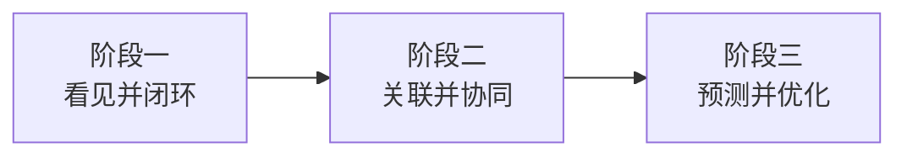

---

## 8.23 关键工程原则与风险控制

### 8.23.1 先解决业务闭环，再追求模型数量

一个能够稳定发现并闭环处理的场景，比十个只在演示中工作的算法更有价值。每增加一种算法，都要同步定义事件规则、证据、风险、责任、处置和验收。

### 8.23.2 现场条件是算法的一部分

摄像头高度、角度、照明、码流和网络共同决定算法上限。项目预算应包含摄像头调整、补光、网络和边缘计算，而不是把全部责任交给模型。

### 8.23.3 人工确认是安全设计

对于重大风险、批量写操作、配置发布和无人机任务，人工确认不是降低自动化程度，而是建立责任与安全边界。

### 8.23.4 所有智能结论必须可追溯

事件要追溯到视频、模型和规则；知识回答要追溯到文档和条款；报告数字要追溯到查询；Agent 动作要追溯到工具调用和确认记录。

### 8.23.5 不以大模型替代确定性系统

权限、状态机、事务、时限、审计和计量必须由确定性系统负责。大模型用于理解和编排，而不是成为不可验证的业务数据库。

### 8.23.6 持续评测而非一次验收

施工阶段、光照、人员服装和设备视角不断变化。模型与规则需要持续监控，现场反馈进入样本回流，版本发布采用测试、灰度和回滚机制。

### 8.23.7 保持技术选型可替换

模型、推理运行时、Agent 框架和大模型服务均处于快速演进中。通过标准事件、工具协议、接口和版本治理降低耦合，使产品价值不依赖某一个短期技术热点。

---

## 8.24 本章小结

BridgeAI-Site 代表的不是传统智慧工地平台增加一个聊天窗口，也不是视频平台叠加若干识别算法，而是施工现场管理方式从“数据展示”向“目标驱动、事件驱动和人机协同”转变。

其核心逻辑可以概括为：

> 以视频和物联网持续观察现场，以 GIS 建立空间语境，以 BridgeAI Vision Engine 将视觉结果转化为工程事件，以确定性工作流保证整改闭环，以知识库提供依据，以多 Agent 协调跨系统任务，并通过边云协同、审计、评测和数据飞轮保障工程可用性。

从产品角度看，BridgeAI-Site 首先聚焦视频安全管理，在有限范围内建立完整闭环，再逐步扩展到质量、进度、环保、机械和应急。从技术角度看，它通过模块化架构分离感知、识别、事件、业务和智能体职责，并使模型、规则、Prompt、工具与知识全部可版本化、可观测和可回滚。从管理角度看，它不削弱人的责任，而是把人的注意力集中到需要专业判断和组织协调的关键节点。

BridgeAI-Site 也为 BridgeAI-Agent 的全生命周期体系建立了施工阶段的数据入口。施工现场形成的区域、设备、事件、整改和知识资产，可以在项目交付后继续服务桥梁、道路和隧道的运营养护。固定摄像头与 BridgeAI-UAV 的移动感知协同，则进一步扩展了系统对复杂空间的观察能力。

因此，BridgeAI-Site 的最终目标不是建设一个“更智能的监控平台”，而是形成一套可感知、可理解、可协同、可执行、可审计和可持续学习的施工现场智能生产力系统。它既是 BridgeAI-Agent 在智慧工地领域的产品实践，也是交通基础设施走向全生命周期智能体化的重要起点。

---

## 本章配套研发文档

本章的工程细节由以下 BridgeAI-Site 产品研发文档承载：

1. 《BridgeAI-Site 智慧工地 AI Agent 平台总体设计方案 v1.0》；
2. 《BridgeAI-Site 第一阶段产品需求文档（PRD）v1.0》；
3. 《BridgeAI-Site UI/UX 页面规范 v1.0》；
4. 《BridgeAI-Site 系统架构设计 v1.0》；
5. 《BridgeAI-Site PostgreSQL 数据库设计 v1.0》；
6. 《BridgeAI-Site REST API 设计 v1.0》；
7. 《BridgeAI-Site AI 算法设计 v1.0》；
8. 《BridgeAI-Site Agent 详细设计 v1.0》；
9. 《BridgeAI-Site 部署与运维设计 v1.0》；
10. 《BridgeAI-Site 测试与验收方案 v1.0》；
11. 《BridgeAI-Site 项目实施与现场交付方案 v1.0》。

这些文档与本章具有不同定位：本章侧重方法论、架构思想和工程实践，配套研发文档侧重可执行的产品、开发、测试和交付规范。两者共同构成 BridgeAI-Site 从理论体系到工程落地的完整知识资产。

---

**第八章完**
