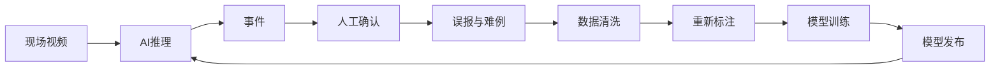

# BridgeAI-Site AI 算法设计 v1.0

> **产品名称：** BridgeAI-Site 智慧工地 AI Agent 平台  
> **核心引擎：** BridgeAI Vision Engine（BVE）  
> **文档类型：** AI 算法设计  
> **适用阶段：** 第一阶段 MVP 及后续平台化演进  
> **编制单位：** 浙江悟联信息科技有限公司  
> **编制人：** 周仙通  
> **版本：** v1.0  
> **算法基线：** YOLO26 + 多目标跟踪 + ROI 引擎 + 规则引擎 + 事件引擎 + 风险引擎 + Agent Adapter  
> **部署基线：** PyTorch / ONNX Runtime / TensorRT / MLX  
> **设计目标：** 从“目标检测”升级为“工程安全事件智能”

---

# 1. 文档目的

本文件用于定义 BridgeAI-Site 第一阶段及后续演进阶段的 AI 算法体系，包括：

1. BridgeAI Vision Engine 总体架构；
2. 视频解码与抽帧策略；
3. YOLO26 检测模型体系；
4. 多目标跟踪；
5. ROI、屏蔽区和越线分析；
6. 规则引擎；
7. 事件生成、聚合与去重；
8. 风险评分；
9. 模型管理与发布；
10. 中心与边缘推理；
11. Agent 融合；
12. 误报回流与数据飞轮；
13. 算法测试和现场验收；
14. 后续 VLM、SAM、OCR、姿态识别和无人机算法扩展。

本文件是 AI 推理服务开发、模型训练与导出、AI 任务配置、告警事件逻辑、边缘部署、Agent 工具设计和现场试点的上游依据。

---

# 2. 核心定位

## 2.1 AI 输出不是检测框

BridgeAI-Site 不把目标检测结果直接等同于安全事件。

传统链路：

```text
图像
→ 模型
→ Bounding Box
```

BridgeAI-Site 链路：

```text
视频
→ 解码
→ 抽帧
→ 检测
→ 跟踪
→ 空间关系
→ 时序关系
→ 规则判断
→ 事件生成
→ 风险评分
→ 证据生成
→ Agent 分析
→ 整改闭环
```

模型输出只是中间结果。系统真正输出的是：

> **结构化、可追踪、可处置的工程安全事件。**

## 2.2 BridgeAI Vision Engine

BridgeAI Vision Engine，简称 BVE，是 BridgeAI 系列产品的统一视觉智能底座。

未来适用范围：

- BridgeAI-Site：智慧工地；
- BridgeAI-UAV：无人机巡检；
- BridgeAI-Road：道路病害；
- BridgeAI-Bridge：桥梁病害；
- BridgeAI-Tunnel：隧道巡检。

BVE 核心能力：

```text
视频理解
目标检测
目标跟踪
空间计算
时序规则
事件生成
风险评估
证据管理
模型运行时
Agent 适配
```

---

# 3. 设计原则

## 3.1 检测与事件分离

模型负责识别目标，规则引擎负责判断是否构成事件。

例如：

```text
检测到未戴安全帽
≠
立即生成告警
```

还必须判断：

- 是否在施工区域；
- 是否持续超过阈值；
- 是否是同一人员；
- 是否处于工作时段；
- 是否已经生成同类事件；
- 是否为屏蔽目标；
- 风险等级是否达到阈值。

## 3.2 空间与时间联合判断

单帧检测容易误报，BVE 必须联合使用：

- 空间信息；
- 时间信息；
- 目标轨迹；
- 目标持续时间；
- 目标数量；
- 目标间关系。

## 3.3 中心与边缘统一

同一套算法逻辑应支持：

- Mac Studio 本地开发；
- 中心服务器推理；
- NVIDIA 边缘节点；
- DJI Manifold 3；
- 后续国产算力平台。

## 3.4 规则可配置

不同工地、不同区域、不同时间段可以配置不同规则，不得把告警逻辑全部写死在代码中。

## 3.5 人工可纠正

任何 AI 事件都应支持确认、忽略、误报标记、风险调整、类别修正和训练数据回流。

---

# 4. BVE 总体架构

```mermaid
flowchart LR
    A[视频源] --> B[Video Decoder]
    B --> C[Frame Scheduler]
    C --> D[Preprocessor]
    D --> E[AI Runtime]
    E --> F[Tracker]
    F --> G[ROI Engine]
    G --> H[Rule Engine]
    H --> I[Event Engine]
    I --> J[Risk Engine]
    J --> K[Evidence Generator]
    K --> L[Business Adapter]
    L --> M[Agent Adapter]
```



## 4.1 模块职责

### Video Decoder

负责 RTSP/HLS/WebRTC 输入、视频解码、分辨率转换、帧时间戳、断流恢复和解码性能统计。

### Frame Scheduler

负责抽帧、动态帧率、多路视频调度、推理队列、负载均衡和丢帧策略。

### Preprocessor

负责 Resize、Letterbox、归一化、颜色空间转换、ROI 裁剪和图像增强。

### AI Runtime

负责模型加载、批量推理、多后端适配、GPU/CPU 调度、结果解析和性能指标。

### Tracker

负责 Track ID、轨迹、目标生命周期、目标丢失恢复和跨帧关联。

### ROI Engine

负责多边形区域、屏蔽区、越线、方向、进入与离开、区域占用。

### Rule Engine

负责逻辑条件、持续时间、数量、时段、冷却和复合事件。

### Event Engine

负责事件创建、去重、聚合、升级、状态流转和原始结果保存。

### Risk Engine

负责风险评分、风险等级、规则加权、场景修正和历史风险修正。

### Evidence Generator

负责事件截图、事件前后录像、检测框叠加、原图保存、证据水印和文件索引。

### Agent Adapter

负责将事件转换为 Agent 可理解结构，并关联项目、区域、班组、历史事件和处置建议。

---

# 5. 第一阶段算法范围

| 算法 | 优先级 | 类型 |
|---|---:|---|
| 未戴安全帽 | P0 | 检测 + 跟踪 + 规则 |
| 未穿反光衣 | P0 | 检测 + 跟踪 + 规则 |
| 人员进入危险区域 | P0 | 人员检测 + ROI |
| 烟火识别 | P0 | 检测 + 时序规则 |
| 人员聚集 | P1 | 检测 + 计数 |
| 车辆违停 | P1 | 检测 + 跟踪 + 持续时间 |
| 吸烟 | P1 | 小目标检测 / 行为识别 |
| 打电话 | P2 | 行为识别 |
| 越线 | P1 | 跟踪 + Line Crossing |
| 人员滞留 | P1 | 跟踪 + 停留时间 |

---

# 6. 视频处理设计

## 6.1 视频输入

支持 RTSP、HLS、本地视频、图片、萤石云视频地址、GB28181 转流和 WebRTC 转流。

## 6.2 解码方式

软件解码适合开发和少量视频。硬件解码适合多路视频、边缘节点和低延迟场景。

建议：

```text
NVIDIA：FFmpeg + NVDEC
Mac：FFmpeg + VideoToolbox
```

## 6.3 抽帧策略

抽帧参数：

- source_fps；
- inference_fps；
- frame_interval；
- keyframe_only；
- dynamic_sampling；
- queue_size。

示例：

```text
源视频：25 FPS
推理：5 FPS
```

## 6.4 自适应帧率

```text
无目标 → 2 FPS
检测到人员 → 5 FPS
疑似违规 → 10 FPS
事件确认 → 保持高帧率一段时间
```

## 6.5 多路视频调度

支持轮询、优先级队列、GPU 批处理、动态负载、高风险区域优先和在线摄像头优先。

## 6.6 帧丢弃

当队列拥堵时，优先丢弃旧帧而不是积压。

```text
实时性优先于完整性
```

---

# 7. 图像预处理

流程：

```text
原始帧
→ ROI 裁剪
→ Resize
→ Letterbox
→ BGR/RGB 转换
→ Normalize
→ Tensor
```

夜间可按摄像头配置 Gamma、CLAHE、去噪、白平衡和亮度增强，不建议全局强制启用。

---

# 8. YOLO26 模型体系

## 8.1 模型定位

YOLO26 作为第一阶段主要检测模型，覆盖：

- 人员；
- 安全帽；
- 反光衣；
- 火焰；
- 烟雾；
- 车辆；
- 手机；
- 香烟；
- 工程机械；
- 其他危险目标。

## 8.2 模型组织方式

第一阶段采用场景模型：

```text
PPE 模型
烟火模型
车辆模型
```

第二阶段演进为统一多类别综合模型。

## 8.3 类别建议

```yaml
names:
  0: person
  1: helmet
  2: no_helmet
  3: reflective_vest
  4: no_reflective_vest
  5: fire
  6: smoke
  7: vehicle
  8: mobile_phone
  9: cigarette
  10: excavator
  11: crane
```

## 8.4 PPE 识别策略

短期可直接检测 `helmet/no_helmet`，长期建议检测 `person/helmet/reflective_vest` 后进行目标关系判断。

## 8.5 类别独立阈值

```json
{
  "person": 0.45,
  "helmet": 0.35,
  "fire": 0.55,
  "smoke": 0.60
}
```

## 8.6 后处理

包括类别过滤、置信度过滤、NMS、区域过滤、尺寸过滤、边缘框过滤和目标关系匹配。

---

# 9. 模型训练设计

## 9.1 数据集结构

```text
dataset/
├── images/train
├── images/val
├── images/test
├── labels/train
├── labels/val
├── labels/test
└── data.yaml
```

## 9.2 数据来源

- 真实工地摄像头；
- 手机拍摄；
- 无人机；
- 公开视频；
- 合成数据；
- 难例回流；
- 误报样本；
- 夜间、雨雾、遮挡和远距离样本。

## 9.3 数据划分

建议训练集 70%、验证集 20%、测试集 10%。

同一摄像头连续视频帧不能随机跨集合分配，应按摄像头、日期、场景和项目分组，避免数据泄漏。

## 9.4 数据增强

Mosaic、MixUp、HSV、Blur、Motion Blur、Noise、Random Perspective、Cutout、Low Light、Fog 和 Rain。

## 9.5 负样本

必须包含施工灯、蒸汽、云雾、反光材料、戴帽人员、普通白色物体和非施工区域人员等难例。

---

# 10. 多目标跟踪

## 10.1 目标

跟踪用于：

- 跨帧识别；
- 持续时间；
- 停留；
- 轨迹；
- 去重；
- 越线；
- 人员计数。

## 10.2 推荐算法

第一阶段优先 ByteTrack，也可评估 BoT-SORT。

## 10.3 Track 状态

```text
new
active
lost
removed
```

## 10.4 轨迹结构

```json
{
  "track_id": "12",
  "class_id": 0,
  "confidence": 0.92,
  "bbox": [100, 120, 200, 350],
  "center": [150, 235],
  "first_seen_at": "...",
  "last_seen_at": "...",
  "duration_ms": 5000
}
```

---

# 11. PPE 关联算法

人员与 PPE 的关联可基于包含关系、IoU、中心点、头部区域、上半身区域、距离和轨迹连续性。

未戴安全帽判定：

```text
person track 存在
AND
头部区域无 helmet
AND
持续时间 > 2 秒
AND
位于施工区域
```

未穿反光衣判定：

```text
person track 存在
AND
上半身区域无 reflective_vest
AND
持续时间 > 3 秒
```

---

# 12. ROI 引擎

## 12.1 ROI 类型

- include_zone；
- exclude_zone；
- danger_zone；
- restricted_zone；
- line；
- direction_line；
- mask_zone。

## 12.2 空间判定

人员区域判断通常使用目标框底部中心点，越线使用目标中心轨迹跨越有向线段判断。

## 12.3 区域状态

```text
outside
entering
inside
leaving
```

## 12.4 配置示例

```json
{
  "type": "polygon",
  "coordinate_type": "normalized",
  "points": [
    [0.1, 0.2],
    [0.8, 0.2],
    [0.9, 0.9],
    [0.1, 0.8]
  ]
}
```

---

# 13. 规则引擎

规则引擎将模型结果转换为业务事件。

```json
{
  "rule_id": "no_helmet_in_danger_zone",
  "conditions": [
    {
      "field": "person.ppe.helmet",
      "operator": "eq",
      "value": false
    },
    {
      "field": "track.duration_seconds",
      "operator": "gte",
      "value": 2
    },
    {
      "field": "roi.zone_type",
      "operator": "eq",
      "value": "danger"
    }
  ],
  "logic": "AND",
  "event_type": "no_helmet",
  "risk_level": "level_2"
}
```

支持操作符：

```text
eq neq gt gte lt lte in not_in contains
inside outside cross duration_gte count_gte
```

规则还应支持工作时段、夜间、持续时间、连续出现、计数条件、冷却时间和复合条件。

---

# 14. 事件引擎

## 14.1 生命周期

```text
candidate
→ confirmed_by_rule
→ created
→ acknowledged
→ assigned
→ processing
→ closed
```

## 14.2 去重键

```text
camera_id + rule_id + track_id + time_window
```

## 14.3 聚合

同一人员、同一摄像头、同一违规在指定时间窗口内合并为一个事件。

## 14.4 风险升级

```text
未戴安全帽持续 2 秒 → level_3
持续 30 秒 → level_2
进入高风险区域 → level_1
```

---

# 15. 证据生成

事件证据包括：

- 原始截图；
- 叠加检测框截图；
- 时间戳；
- 摄像头名称；
- 事件编号；
- 风险等级；
- 事件前后录像；
- 推理 JSON；
- Track 数据；
- ROI 和规则版本；
- 模型版本。

默认事件录像建议：

```text
事件前 10 秒 + 事件后 20 秒
```

---

# 16. 风险引擎

风险评分范围为 0～100。

| 因素 | 示例权重 |
|---|---:|
| 事件基础风险 | 40 |
| 区域风险 | 20 |
| 持续时间 | 10 |
| 目标数量 | 10 |
| 时间段 | 5 |
| 历史重复 | 10 |
| 环境因素 | 5 |

等级建议：

```text
0～29   level_4
30～49  level_3
50～74  level_2
75～100 level_1
```

---

# 17. 烟火识别

火焰识别需排除施工灯、反光、太阳光和合法电焊火花。

烟雾是典型时序目标，应结合多帧持续、区域扩散、透明度变化、运动方向和模型置信度。

电焊场景需结合动火许可、作业时间、区域和人员防护，由业务规则与 Agent 进一步研判。

---

# 18. 人员聚集

判定示例：

```text
指定区域
AND
person count >= N
AND
持续时间 >= T
```

人员聚集事件按区域生成，不按每个人分别生成。

---

# 19. 车辆违停与滞留

规则示例：

```text
车辆位于禁停区域
AND
速度近似为 0
AND
持续时间 > 60 秒
```

---

# 20. 行为识别

吸烟可结合香烟小目标、手嘴关系、多帧行为和烟雾辅助。

打电话可结合手机检测、手部靠近头部、人体姿态和持续时间。

行为类算法应默认提高人工确认比例，避免直接自动派单。

---

# 21. 多模型协同

支持：

```text
YOLO 检测
→ Tracker
→ Pose
→ VLM 复核
```

例如，YOLO 检测疑似吸烟后，裁剪人员区域交由 VLM 复核，再融合置信度生成事件。

---

# 22. 模型运行时

## 22.1 PyTorch

适合训练、调试、精度验证和开发环境。

## 22.2 ONNX Runtime

适合跨平台中心推理。

## 22.3 TensorRT

适合 NVIDIA GPU 和边缘节点。

## 22.4 MLX

适合 Mac Studio 和 Apple Silicon 本地推理。

统一运行时接口：

```python
class InferenceBackend:
    def load(self, model_path: str) -> None:
        ...

    def infer(self, frames: list) -> list:
        ...

    def warmup(self) -> None:
        ...

    def metrics(self) -> dict:
        ...
```

---

# 23. 模型导出与部署

标准流程：

```text
训练 .pt
→ 精度验证
→ 导出 ONNX
→ ONNX 验证
→ 转 TensorRT Engine
→ 端侧验证
→ 注册平台
→ 灰度发布
```

TensorRT Engine 应在目标设备或相同架构环境生成，并记录 TensorRT、CUDA、GPU 架构、输入尺寸、精度模式和模型校验值。

第一阶段优先 FP16，INT8 必须配置校准集。

---

# 24. 模型注册与版本管理

模型状态：

```text
draft
testing
approved
gray
production
deprecated
archived
```

元数据必须包括：

- 名称；
- 版本；
- 类别；
- 训练数据版本；
- 指标；
- 输入尺寸；
- 推理后端；
- 文件 checksum；
- 创建人；
- 发布时间；
- 适用场景。

模型发布应支持指定摄像头或项目灰度，并支持回滚。

---

# 25. 推理服务设计

推理服务负责模型加载、AI 任务管理、视频订阅、推理、跟踪、规则、事件回调和指标上报。

每个 AI 任务绑定：

- camera_id；
- model_id；
- rule_config；
- roi_config；
- schedule；
- frame_interval；
- ai_node_id。

阈值、ROI、冷却时间、时段、模型版本和规则参数应支持热更新。

---

# 26. 边缘推理

边缘节点职责：

- 视频解码；
- 本地推理；
- 本地事件生成；
- 截图；
- 短视频；
- 本地缓存；
- 断网续传。

断网模式：

```text
继续推理
→ 本地生成事件
→ 本地存储
→ 标记 pending_sync
→ 网络恢复
→ 批量补传
```

---

# 27. 中心推理

中心推理适合统一 GPU、多模型、多项目、集中运维、VLM 复核和报表分析。

---

# 28. Agent 融合

BVE 向 Agent 提供：

```json
{
  "event_id": "uuid",
  "event_type": "no_helmet",
  "risk_level": "level_2",
  "camera": {},
  "zone": {},
  "track": {},
  "evidence": {},
  "history": {},
  "model": {},
  "rule": {}
}
```

Agent 可查询区域、班组、历史违规和安全规范，并生成处置建议、工单草稿和日报。

低置信度复杂事件可通过 VLM 二次复核。

Agent 不得自动销项、删除事件、修改模型或无确认发布高风险工单。

---

# 29. 数据飞轮



回流类型：

- 误报；
- 漏报；
- 低置信度；
- 高风险事件；
- 夜间；
- 雨雾；
- 遮挡；
- 新场景；
- 新 PPE；
- 新机械。

---

# 30. 算法指标

## 30.1 检测指标

Precision、Recall、mAP50、mAP50-95、F1、混淆矩阵和每类 AP。

## 30.2 跟踪指标

MOTA、IDF1、HOTA、ID Switch 和 Track Fragmentation。

## 30.3 事件指标

BridgeAI-Site 更关注：

- 事件 Precision；
- 事件 Recall；
- 每小时误报数；
- 每路每日误报数；
- 平均事件延迟；
- 事件去重率；
- 漏报率；
- 人工确认率；
- 自动派单准确率。

## 30.4 性能指标

解码 FPS、推理 FPS、端到端延迟、GPU 利用率、显存、CPU、内存、每路资源占用和最大并发视频数。

---

# 31. 第一阶段验收指标建议

## 未戴安全帽

- 事件 Precision ≥ 90%；
- 事件 Recall ≥ 85%；
- 单路日误报 ≤ 3 次；
- 事件延迟 ≤ 5 秒。

## 未穿反光衣

- 事件 Precision ≥ 88%；
- 事件 Recall ≥ 82%；
- 单路日误报 ≤ 5 次。

## 危险区域入侵

- 事件 Precision ≥ 95%；
- 事件 Recall ≥ 90%；
- 延迟 ≤ 3 秒。

## 烟火识别

- 火焰 Precision ≥ 90%；
- 烟雾 Precision ≥ 85%；
- 高风险漏报应接近 0；
- 延迟 ≤ 5 秒。

---

# 32. 场景测试矩阵

必须覆盖白天、夜间、逆光、强光、雨天、雾天、粉尘、遮挡、远距离、小目标、人员密集、摄像头抖动、网络抖动和低码率。

---

# 33. 现场验收流程

```text
摄像头选点
→ 采集基线视频
→ 配置 ROI
→ 配置规则
→ 连续运行 7 天
→ 统计事件
→ 人工复核
→ 调整阈值
→ 再运行 7 天
→ 形成验收报告
```

---

# 34. 算法可观测性

每个 AI 任务必须输出：

- 当前模型；
- 当前版本；
- FPS；
- 延迟；
- 最近推理时间；
- 最近事件；
- 队列长度；
- 错误数；
- 重启次数；
- GPU/CPU；
- 视频状态。

---

# 35. 日志设计

日志事件：

```text
model_loaded
stream_connected
stream_disconnected
inference_error
rule_triggered
event_created
event_suppressed
event_merged
model_switched
node_offline
```

---

# 36. 错误处理与降级

常见错误：

- 视频断流；
- 模型加载失败；
- TensorRT Engine 不兼容；
- CUDA 内存不足；
- 推理超时；
- 回调失败；
- MinIO 上传失败；
- 规则配置错误。

降级策略：

- 模型异常时保持视频播放并标记 AI 异常；
- GPU 不可用时切 CPU、降低 FPS、减少任务或切备用节点；
- VLM 不可用时退化为规则结果加人工确认。

---

# 37. 算法安全与隐私

需防止未授权模型替换、模型文件篡改、推理接口滥用、敏感画面泄露和提示注入影响 VLM。

模型文件必须校验 checksum。

隐私要求：

- 非必要不做人脸识别；
- 人员画面最小化保存；
- 录像访问受控；
- 下载带水印；
- 数据保留周期可配置；
- 敏感区域可打码；
- 操作可审计。

---

# 38. 研发代码结构建议

```text
bridgeai_vision/
├── decoder/
├── scheduler/
├── preprocessing/
├── runtime/
│   ├── pytorch_backend.py
│   ├── onnx_backend.py
│   ├── tensorrt_backend.py
│   └── mlx_backend.py
├── detectors/
├── trackers/
├── roi/
├── rules/
├── events/
├── risk/
├── evidence/
├── adapters/
├── metrics/
├── configs/
└── tests/
```

---

# 39. 配置示例

```yaml
task:
  name: gate_no_helmet
  camera_id: CAM-001
  model: ppe_yolo26_v1
  inference_fps: 5

model:
  confidence:
    person: 0.45
    helmet: 0.35

tracker:
  type: bytetrack
  track_buffer: 30

rule:
  type: no_helmet
  min_duration_seconds: 2
  cooldown_seconds: 60

roi:
  include:
    - danger_zone_01

event:
  pre_record_seconds: 10
  post_record_seconds: 20
```

---

# 40. 测试设计

单元测试覆盖 bbox、PPE 关联、点在多边形、越线、持续时间、冷却、去重和风险评分。

集成测试覆盖视频到事件、事件到截图、事件到数据库、事件到工单、事件到 Agent 和边缘断网补传。

每次模型或规则更新必须回放固定测试集。

---

# 41. 算法版本管理

需同时版本化：

- 模型；
- 数据集；
- 标签；
- 类别定义；
- 规则；
- ROI；
- 运行时；
- 推理节点；
- Agent Prompt；
- VLM 模型。

---

# 42. 后续扩展方向

## 分割模型

SAM、YOLO Seg、烟雾区域和危险物质泄漏。

## 姿态识别

摔倒、攀爬、危险动作和未系安全带。

## OCR

车牌、设备编号、证件、施工牌和仪表读数。

## VLM

复杂场景复核、安全文本描述、作业状态理解和报告生成。

## 3D 感知

深度估计、人车距离、危险接近、机械盲区和空间测距。

## 无人机协同

BVE 与 BridgeAI-UAV 共用模型注册、TensorRT Runtime、事件引擎、风险引擎、Agent Adapter 和数据飞轮。

---

# 43. 研发阶段划分

## Phase 1

未戴安全帽、未穿反光衣、危险区域入侵、烟火、事件去重、截图录像和 Agent 查询。

## Phase 2

人员聚集、车辆违停、越线、滞留、VLM 复核和多模型协同。

## Phase 3

行为识别、姿态、ReID、3D、多摄像头融合和无人机协同。

---

# 44. 验收标准

## 架构验收

- BVE 模块边界清晰；
- 视频与推理解耦；
- 检测与事件分离；
- 规则可配置；
- 多后端统一；
- 中心与边缘一致。

## 功能验收

- 视频可推理；
- Track ID 稳定；
- ROI 生效；
- 规则可触发；
- 事件可去重；
- 截图录像完整；
- 风险分级正确；
- Agent 可读取事件。

## 工程验收

- 模型可热更新；
- 节点可监控；
- 异常可恢复；
- 断网可缓存；
- 版本可回滚；
- 日志可追踪；
- 指标可查询。

---

# 45. 与后续文档关系

```text
AI 算法设计
    ↓
AI 推理服务详细设计
    ↓
Agent 详细设计
    ↓
边缘部署设计
    ↓
算法测试方案
    ↓
现场试点验收方案
```

---

# 46. 总结

BridgeAI-Site 的 AI 核心不是单一 YOLO 模型，而是一套完整的视觉事件智能系统。

BridgeAI Vision Engine 通过视频解码、动态抽帧、YOLO26 检测、多目标跟踪、ROI 空间判断、规则引擎、事件去重与聚合、风险评分、截图录像证据、Agent 分析和数据回流，将原始视频转换为可解释、可追踪、可处置的工程安全事件。

这套体系既服务于 BridgeAI-Site，也将成为 BridgeAI-UAV、BridgeAI-Road、BridgeAI-Bridge 和 BridgeAI-Tunnel 的统一视觉智能底座。
