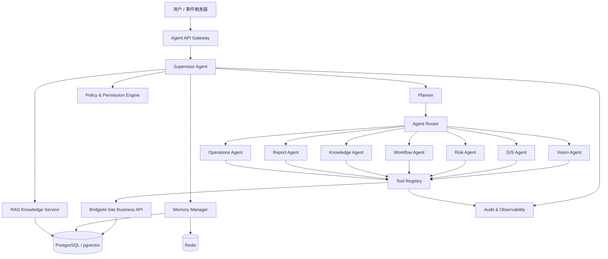
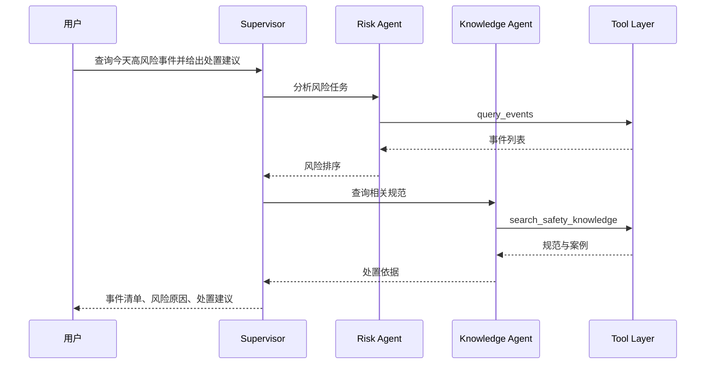

# BridgeAI-Site Agent 详细设计 v1.0

> **产品名称：** BridgeAI-Site 智慧工地 AI Agent 平台  
> **文档类型：** Agent 核心智能编排层详细设计  
> **适用阶段：** 第一阶段 MVP 及后续平台化演进  
> **编制单位：** 浙江悟联信息科技有限公司  
> **编制人：** 周仙通  
> **版本：** v1.0  
> **技术基线：** Python + FastAPI + LangGraph / Google ADK + PostgreSQL + pgvector + Redis  
> **模型基线：** 本地大模型优先，可兼容云端模型  
> **部署原则：** 私有化优先、本地运行优先、工具调用受控、关键操作人工确认、全链路可审计  
> **上游依赖：** 总体设计、PRD、UI/UX、系统架构、PostgreSQL、REST API、AI 算法设计  
> **核心目标：** 将 AI 识别结果、GIS、知识库、工单和报表能力编排成可执行、可追踪、可治理的工程智能闭环

---

# 1. 文档目的

本文件用于定义 BridgeAI-Site Agent 核心智能编排层的详细设计，包括：

1. Agent 总体架构；
2. Supervisor Agent 与专业 Agent 分工；
3. 意图识别与任务规划；
4. 工具注册、发现、调用与治理；
5. 会话、上下文与记忆；
6. RAG 知识检索；
7. 事件触发型 Agent；
8. 人工确认与审批；
9. 权限与安全；
10. 多 Agent 协同；
11. 失败回退与恢复；
12. Agent 审计与可观测性；
13. Prompt 与版本管理；
14. Agent 评测体系；
15. 部署与扩展策略。

本文件是 Agent 服务实现、工具 API 开发、前端对话界面、权限审批、审计日志、知识库建设和测试验收的直接依据。

---

# 2. Agent 层定位

## 2.1 Agent 不是聊天机器人

BridgeAI-Site Agent 的定位不是普通问答，而是：

> **面向智慧工地业务的任务理解、信息检索、工具调用、风险分析和流程协同中枢。**

Agent 需要能够：

- 理解用户问题；
- 判断业务意图；
- 选择数据源；
- 调用受控工具；
- 汇总多来源结果；
- 给出工程结论；
- 生成整改建议；
- 创建业务草稿；
- 在人工确认后执行写操作；
- 保留全过程审计记录。

---

## 2.2 Agent 处理对象

Agent 主要处理以下对象：

- 项目；
- 标段；
- 施工区域；
- 摄像头；
- AI 任务；
- 安全事件；
- 整改工单；
- 报表；
- 规范制度；
- 历史案例；
- 设备状态；
- 风险趋势；
- 用户和班组；
- BVE 推理结果。

---

## 2.3 Agent 输出类型

Agent 输出分为：

1. 解释性回答；
2. 查询结果；
3. 风险分析；
4. 处置建议；
5. 工单草稿；
6. 报告草稿；
7. 图表数据；
8. 文件导出任务；
9. 需要用户确认的操作；
10. 失败说明与替代路径。

---

# 3. 设计原则

## 3.1 工具优先

涉及实时业务数据时，Agent 必须通过工具获取，不得仅凭语言模型记忆回答。

---

## 3.2 读写分离

查询类工具可以自动执行。

写操作必须根据风险等级进入确认或审批流程。

---

## 3.3 事实与推理分离

Agent 输出应区分：

- 已查询事实；
- 系统规则；
- 模型推断；
- Agent 建议；
- 尚未确认的信息。

---

## 3.4 最小权限

Agent 只能调用当前用户有权限使用的工具和数据。

---

## 3.5 全链路审计

必须记录：

- 用户输入；
- 会话上下文；
- 规划结果；
- 工具调用；
- 工具参数；
- 工具结果；
- 人工确认；
- 最终输出；
- 失败和重试；
- 模型与 Prompt 版本。

---

## 3.6 可降级

大模型、知识库或某个专业 Agent 不可用时，系统应保留基础查询与业务操作能力。

---

# 4. Agent 总体架构



---

# 5. 核心组件

## 5.1 Agent API Gateway

职责：

- 会话创建；
- 消息接收；
- Token 校验；
- 项目上下文注入；
- 流式输出；
- 限流；
- 请求追踪；
- 错误统一处理。

接口与《REST API 设计》保持一致：

```text
POST /agent/sessions
POST /agent/sessions/{session_id}/messages
GET  /agent/runs/{run_id}
POST /agent/tool-calls/{tool_call_id}/confirm
POST /agent/tool-calls/{tool_call_id}/reject
```

---

## 5.2 Supervisor Agent

Supervisor Agent 是总控 Agent。

职责：

- 理解用户意图；
- 判断是否需要工具；
- 生成任务计划；
- 分派专业 Agent；
- 控制执行顺序；
- 合并中间结果；
- 触发人工确认；
- 生成最终回答；
- 处理失败和降级。

Supervisor 不直接操作数据库。

---

## 5.3 Planner

Planner 将自然语言请求转换为结构化执行计划。

计划示例：

```json
{
  "goal": "查询今天高风险事件并生成处置建议",
  "steps": [
    {
      "step_id": "s1",
      "agent": "risk_agent",
      "tool": "query_events",
      "depends_on": []
    },
    {
      "step_id": "s2",
      "agent": "knowledge_agent",
      "tool": "search_safety_knowledge",
      "depends_on": ["s1"]
    },
    {
      "step_id": "s3",
      "agent": "report_agent",
      "action": "compose_recommendation",
      "depends_on": ["s1", "s2"]
    }
  ],
  "requires_confirmation": false
}
```

---

## 5.4 Agent Router

根据：

- 意图；
- 任务类型；
- 当前上下文；
- 工具能力；
- 专业 Agent 状态；
- 成本与时延；

选择合适的专业 Agent。

---

## 5.5 Policy & Permission Engine

负责：

- 用户权限；
- 项目权限；
- Agent 工具权限；
- 数据范围；
- 写操作风险；
- 人工确认；
- 审批人；
- 禁止操作；
- 敏感字段脱敏。

---

## 5.6 Tool Registry

负责：

- 工具注册；
- 工具元数据；
- 参数 Schema；
- 返回 Schema；
- 风险等级；
- 超时；
- 重试；
- 权限；
- 版本；
- 健康状态；
- 工具发现。

---

## 5.7 Memory Manager

负责：

- 会话短期记忆；
- 项目上下文；
- 用户偏好；
- Agent 执行状态；
- 长期业务记忆；
- 记忆压缩；
- 记忆过期；
- 敏感信息过滤。

---

## 5.8 RAG Knowledge Service

负责：

- 文档解析；
- 分块；
- 向量化；
- 混合检索；
- 权限过滤；
- 引用返回；
- 重排序；
- 知识版本管理。

---

# 6. 专业 Agent 设计

## 6.1 Vision Agent

负责处理与视觉识别和 BVE 相关的问题。

能力：

- 查询 AI 事件；
- 查询模型和任务状态；
- 获取事件截图和录像；
- 解释检测结果；
- 查询模型版本；
- 分析误报；
- 汇总摄像头 AI 运行情况；
- 请求 VLM 二次复核。

典型问题：

```text
今天1号门有哪些未戴安全帽事件？
为什么这个事件被判定为高风险？
这个告警是不是误报？
当前安全帽模型运行是否正常？
```

可调用工具：

```text
query_events
get_event_detail
get_event_evidence
query_ai_task_status
query_model_version
request_vlm_review
submit_false_positive_feedback
```

---

## 6.2 GIS Agent

负责空间信息和区域关系分析。

能力：

- 查询摄像头位置；
- 查询施工区域；
- 查询危险区域；
- 判断事件是否在区域内；
- 按空间范围筛选事件；
- 统计区域风险；
- 返回 GeoJSON；
- 计算邻近摄像头或设施。

典型问题：

```text
高风险事件主要集中在哪些区域？
列出距离2号塔吊50米内的摄像头。
这个人员是否进入了禁入区？
```

可调用工具：

```text
query_project_zones
query_camera_locations
query_events_within_geometry
query_zone_risk
find_nearby_resources
```

---

## 6.3 Risk Agent

负责风险分析和风险优先级排序。

能力：

- 计算风险分；
- 分析风险趋势；
- 识别重复问题；
- 判断事件升级；
- 分析班组风险；
- 生成风险摘要；
- 识别异常波动；
- 提供处置优先级。

典型问题：

```text
今天最需要优先处理的五个风险是什么？
哪个班组重复违规最多？
本周风险为什么上升？
```

可调用工具：

```text
query_events
query_event_statistics
query_work_order_statistics
query_team_risk
calculate_risk_score
query_historical_events
```

---

## 6.4 Workflow Agent

负责整改闭环和工单流程。

能力：

- 创建工单草稿；
- 查询待办；
- 查询逾期；
- 推荐责任人；
- 汇总整改证据；
- 检查工单状态；
- 提交工单操作建议；
- 发起通知草稿。

典型问题：

```text
为这个高风险事件创建整改工单。
列出今天逾期未整改的工单。
谁适合负责处理这个事件？
```

可调用工具：

```text
query_work_orders
get_work_order_detail
create_work_order_draft
recommend_responsible_user
query_overdue_work_orders
prepare_work_order_notification
```

正式发布、复核通过、销项等操作必须人工确认。

---

## 6.5 Knowledge Agent

负责工程规范、企业制度、历史案例和知识问答。

能力：

- 检索安全规范；
- 查询企业制度；
- 查找同类案例；
- 返回出处；
- 生成规范化处置建议；
- 判断建议是否有依据；
- 支持多文档综合。

典型问题：

```text
高处作业未系安全带应如何处置？
动火作业需要哪些审批？
类似事件以前怎么处理？
```

可调用工具：

```text
search_safety_knowledge
search_project_documents
search_historical_cases
get_document_excerpt
```

---

## 6.6 Report Agent

负责日报、周报、月报和专项报告。

能力：

- 汇总事件；
- 汇总工单；
- 生成风险趋势；
- 生成文字结论；
- 组织报告结构；
- 生成图表数据；
- 创建报表任务；
- 导出文件草稿。

典型问题：

```text
生成今天的安全日报。
写一份本周高风险事件分析。
导出未整改事件清单。
```

可调用工具：

```text
query_event_statistics
query_work_order_statistics
query_camera_status
generate_report_draft
create_report_task
get_report_status
```

---

## 6.7 Operations Agent

负责系统运行和设备状态。

能力：

- 查询摄像头在线率；
- 查询 AI 节点；
- 查询服务状态；
- 定位异常；
- 建议恢复措施；
- 统计失败任务；
- 查询日志摘要。

典型问题：

```text
为什么3号摄像头没有告警？
哪个 AI 节点负载最高？
今天有哪些推理任务失败？
```

可调用工具：

```text
query_camera_status
query_ai_node_status
query_ai_task_metrics
query_service_health
query_recent_errors
```

---

# 7. 意图体系

## 7.1 一级意图

建议定义：

```text
query
analyze
explain
recommend
create_draft
execute_action
generate_report
troubleshoot
search_knowledge
```

---

## 7.2 二级业务意图

```text
event_query
event_explanation
risk_analysis
camera_status
ai_task_status
work_order_query
work_order_draft
report_generation
gis_query
knowledge_search
system_diagnosis
```

---

## 7.3 意图结果结构

```json
{
  "intent": "risk_analysis",
  "confidence": 0.94,
  "entities": {
    "project_id": "uuid",
    "date_range": "today",
    "risk_level": ["level_1", "level_2"]
  },
  "requires_tools": true,
  "requires_confirmation": false
}
```

---

# 8. 实体抽取

Agent 需要识别：

- 项目名称；
- 标段；
- 区域；
- 摄像头；
- 时间范围；
- 事件类型；
- 风险等级；
- 工单状态；
- 班组；
- 用户；
- 模型；
- 报表类型。

时间表达应标准化：

```text
今天
昨天
本周
上周
最近7天
本月
```

转换为明确时间范围。

---

# 9. 上下文注入

每次 Agent 运行建议注入：

```json
{
  "user": {
    "id": "uuid",
    "roles": [],
    "permissions": []
  },
  "organization": {
    "id": "uuid"
  },
  "project": {
    "id": "uuid",
    "name": "某项目",
    "timezone": "Asia/Shanghai"
  },
  "session": {
    "id": "uuid"
  },
  "request": {
    "request_id": "req_xxx",
    "trace_id": "trace_xxx"
  }
}
```

---

# 10. 会话设计

## 10.1 会话生命周期

```text
active
idle
closed
expired
```

---

## 10.2 会话内容

包含：

- 用户消息；
- Agent 回复；
- 工具调用；
- 中间结果；
- 当前项目；
- 临时筛选条件；
- 待确认操作；
- 摘要记忆。

---

## 10.3 会话切换

用户切换项目时，应：

1. 清空项目级临时上下文；
2. 保留通用偏好；
3. 重新校验权限；
4. 提示当前项目已切换。

---

# 11. 记忆设计

## 11.1 短期记忆

存储于 Redis 或会话表：

- 最近消息；
- 当前任务；
- 工具结果摘要；
- 待确认操作；
- 临时实体。

---

## 11.2 长期记忆

只保存长期有价值的信息：

- 用户常用项目；
- 报表偏好；
- 常用时间范围；
- 常用输出格式；
- 经批准的业务习惯。

不得保存：

- 密码；
- Token；
- 摄像头密钥；
- 未授权敏感数据；
- 无价值临时内容。

---

## 11.3 记忆摘要

当会话过长时，生成结构化摘要：

```json
{
  "current_goal": "...",
  "resolved_entities": {},
  "completed_steps": [],
  "pending_actions": [],
  "important_results": []
}
```

---

# 12. 工具设计规范

## 12.1 工具元数据

每个工具定义：

```json
{
  "name": "query_events",
  "version": "1.0",
  "description": "查询项目安全事件",
  "input_schema": {},
  "output_schema": {},
  "risk_level": "low",
  "requires_confirmation": false,
  "required_permissions": ["event:read"],
  "timeout_seconds": 15,
  "max_retries": 2
}
```

---

## 12.2 工具风险等级

| 等级 | 说明 | 示例 |
|---|---|---|
| low | 只读 | 查询事件 |
| medium | 创建草稿 | 创建工单草稿 |
| high | 正式业务变更 | 发布工单 |
| forbidden | Agent 禁止执行 | 删除审计日志 |

---

## 12.3 工具输入校验

所有工具输入必须经过：

- JSON Schema；
- Pydantic；
- 权限校验；
- 项目归属校验；
- 状态校验；
- 参数白名单；
- 长度限制。

---

## 12.4 工具输出

工具返回统一结构：

```json
{
  "success": true,
  "data": {},
  "source": {
    "tool": "query_events",
    "version": "1.0",
    "timestamp": "..."
  },
  "warnings": []
}
```

---

## 12.5 工具超时与重试

查询类工具：

- 超时 10～20 秒；
- 可重试 1～2 次。

写操作工具：

- 默认不自动重复；
- 必须使用幂等键；
- 失败后返回明确状态。

---

# 13. 核心工具清单

## 13.1 事件工具

```text
query_events
get_event_detail
get_event_evidence
query_event_statistics
query_historical_events
submit_false_positive_feedback
```

## 13.2 工单工具

```text
query_work_orders
get_work_order_detail
query_overdue_work_orders
create_work_order_draft
recommend_responsible_user
prepare_work_order_notification
```

## 13.3 摄像头与 AI 工具

```text
query_camera_status
query_camera_status_history
query_ai_task_status
query_ai_task_metrics
query_ai_node_status
query_model_version
request_vlm_review
```

## 13.4 GIS 工具

```text
query_project_zones
query_camera_locations
query_events_within_geometry
query_zone_risk
find_nearby_resources
```

## 13.5 知识工具

```text
search_safety_knowledge
search_project_documents
search_historical_cases
get_document_excerpt
```

## 13.6 报表工具

```text
generate_report_draft
create_report_task
get_report_status
create_export_task
```

---

# 14. 多 Agent 协同模式

## 14.1 串行模式

适合有依赖关系的任务。

```text
Risk Agent
→ Knowledge Agent
→ Workflow Agent
→ Report Agent
```

---

## 14.2 并行模式

适合独立查询。

```text
事件统计
摄像头状态
工单统计
```

并行执行后由 Supervisor 汇总。

---

## 14.3 条件分支

```text
若事件置信度低
→ Vision Agent 请求 VLM 复核

若事件已确认
→ Workflow Agent 创建工单草稿
```

---

## 14.4 循环限制

Agent 循环必须设置：

- 最大步骤数；
- 最大工具调用次数；
- 最大运行时间；
- 最大 Token；
- 重复调用检测。

---

# 15. 典型执行流程

## 15.1 查询高风险事件并给出处置建议



---

## 15.2 创建整改工单草稿

```text
用户提出创建工单
→ Supervisor 判断为中风险写操作
→ Workflow Agent 查询事件详情
→ 查询责任班组
→ 生成工单草稿
→ 返回预览
→ 用户确认
→ 调用正式发布接口
→ 写入审计日志
```

---

## 15.3 系统异常诊断

```text
用户询问摄像头无告警
→ Operations Agent 查询视频状态
→ 查询 AI 任务状态
→ 查询推理指标
→ 查询近期错误
→ 输出故障定位与建议
```

---

# 16. 人工确认机制

## 16.1 需要确认的操作

- 发布整改工单；
- 修改责任人；
- 复核通过；
- 驳回整改；
- 关闭工单；
- 批量导出敏感数据；
- 修改 AI 任务；
- 切换生产模型；
- 删除媒体文件。

---

## 16.2 确认卡片

前端显示：

- 操作名称；
- 影响对象；
- 参数；
- 风险等级；
- 数据来源；
- 预计结果；
- 确认与拒绝按钮。

---

## 16.3 确认时效

确认请求应有过期时间。

过期后必须重新生成操作草稿，避免上下文变化导致误操作。

---

# 17. RAG 知识库设计

## 17.1 知识来源

- 国家和行业规范；
- 企业制度；
- 项目专项方案；
- 安全技术交底；
- 应急预案；
- 历史案例；
- 整改记录；
- 设备说明书；
- 施工组织设计。

---

## 17.2 文档处理

```text
文件上传
→ 解析
→ 清洗
→ 结构识别
→ 分块
→ Embedding
→ 入库
→ 权限绑定
```

---

## 17.3 分块策略

建议：

- 300～800 中文字符；
- 保留标题层级；
- 表格独立处理；
- 规范条款保留编号；
- 相邻块适度重叠。

---

## 17.4 检索策略

采用：

```text
关键词检索
+
向量检索
+
权限过滤
+
重排序
```

---

## 17.5 返回引用

RAG 结果必须返回：

- 文档名称；
- 条款；
- 页码或章节；
- 内容摘要；
- 版本；
- 生效日期；
- 权限范围。

---

## 17.6 冲突处理

多个规范冲突时：

1. 提示存在冲突；
2. 展示来源；
3. 优先使用当前项目适用文件；
4. 不替用户做法律或安全责任判断；
5. 必要时提示人工复核。

---

# 18. Prompt 设计

## 18.1 System Prompt

包含：

- Agent 身份；
- 业务范围；
- 工具使用原则；
- 权限约束；
- 输出格式；
- 风险要求；
- 禁止事项；
- 引用要求。

---

## 18.2 专业 Agent Prompt

每个专业 Agent 独立定义：

- 专业职责；
- 可调用工具；
- 输入要求；
- 判断规则；
- 输出结构；
- 失败处理。

---

## 18.3 Prompt 版本管理

必须记录：

- prompt_id；
- version；
- status；
- content_hash；
- created_by；
- created_at；
- published_at；
- rollback_version。

---

# 19. 输出规范

## 19.1 查询结果

应优先输出：

- 结论；
- 关键数量；
- 风险排序；
- 数据时间范围；
- 数据来源；
- 异常或缺失。

---

## 19.2 风险建议

建议结构：

```text
风险结论
影响范围
判断依据
建议措施
优先级
是否需要人工确认
```

---

## 19.3 不确定性

当数据不足时必须明确：

```text
当前无法确认
依据不足
需要补充视频或人工复核
```

不得伪造确定结论。

---

# 20. 事件触发型 Agent

除用户主动对话外，Agent 还可由系统事件触发。

## 20.1 触发事件

```text
event.created
event.escalated
work_order.overdue
camera.offline
ai_task.failed
report.schedule_due
```

---

## 20.2 触发处理

示例：

```text
高风险事件生成
→ Risk Agent 分析
→ Knowledge Agent 查询规范
→ Workflow Agent 生成工单草稿
→ 推送责任人
```

---

## 20.3 自动化边界

事件触发 Agent 可以：

- 分析；
- 汇总；
- 创建草稿；
- 发送提醒。

不得在无人工确认情况下执行高风险业务变更。

---

# 21. Agent 状态机

```text
created
→ planning
→ executing
→ waiting_confirmation
→ completed
→ failed
→ cancelled
→ expired
```

---

# 22. 失败处理

## 22.1 工具失败

处理顺序：

1. 判断是否可重试；
2. 重试；
3. 使用备用工具；
4. 降级为部分结果；
5. 明确告知失败项；
6. 记录审计。

---

## 22.2 Agent 失败

常见原因：

- 意图不清；
- 工具超时；
- 权限不足；
- 数据为空；
- 模型不可用；
- Prompt 异常；
- 循环超限；
- 输出解析失败。

---

## 22.3 输出解析失败

优先使用结构化输出和 JSON Schema。

解析失败时：

- 自动修复一次；
- 再失败则返回安全错误；
- 不执行写操作。

---

# 23. 幂等与防重复

写操作工具必须使用：

```text
Idempotency-Key
```

Supervisor 应检测：

- 相同会话；
- 相同目标；
- 相同工具；
- 相同参数；
- 短时间重复请求。

---

# 24. 权限与安全

## 24.1 权限维度

- 企业；
- 项目；
- 资源；
- 操作；
- 工具；
- 数据字段；
- Agent 类型。

---

## 24.2 敏感字段

Agent 默认不得展示：

- 摄像头密码；
- RTSP 完整地址；
- Token；
- 密钥；
- 用户密码；
- 完整个人敏感信息。

---

## 24.3 Prompt Injection 防护

知识库文档和外部内容不得改变系统权限。

应采用：

- 内容隔离；
- 指令与数据分离；
- 工具白名单；
- 参数校验；
- 输出过滤；
- 高风险操作人工确认。

---

## 24.4 数据外泄防护

- 项目级隔离；
- 最小返回；
- 导出审批；
- 下载 Token；
- 日志脱敏；
- 文件水印；
- 模型调用范围限制。

---

# 25. Agent 审计

需记录到：

- `agent.agent_sessions`；
- `agent.agent_messages`；
- `agent.agent_runs`；
- `agent.agent_tool_calls`；
- `audit.audit_logs`。

---

## 25.1 Agent Run 记录

```json
{
  "run_id": "uuid",
  "session_id": "uuid",
  "status": "completed",
  "intent": "risk_analysis",
  "plan": {},
  "model": "local-llm",
  "prompt_version": "1.0",
  "tool_call_count": 3,
  "duration_ms": 4200,
  "trace_id": "trace_xxx"
}
```

---

# 26. 可观测性

## 26.1 指标

- Agent 请求数；
- 成功率；
- P50/P95 延迟；
- 平均工具调用数；
- 工具成功率；
- 人工确认率；
- 用户拒绝率；
- Token 使用；
- RAG 命中率；
- 无答案率；
- 失败原因分布；
- 循环超限次数。

---

## 26.2 日志

```text
agent_run_started
intent_detected
plan_created
agent_routed
tool_called
tool_succeeded
tool_failed
confirmation_requested
confirmation_approved
confirmation_rejected
agent_run_completed
agent_run_failed
```

---

## 26.3 Trace

统一使用 `trace_id` 关联：

```text
用户请求
→ Agent Run
→ 专业 Agent
→ Tool Call
→ REST API
→ 数据库查询
→ 最终回答
```

---

# 27. 模型选择策略

## 27.1 本地模型优先

默认优先本地模型，适合：

- 私有数据；
- 低成本；
- 离线场景；
- 可控部署。

---

## 27.2 云端模型

可作为：

- 复杂推理；
- VLM 复核；
- 高质量报告；
- 本地模型失败后的可选增强。

必须满足数据安全策略。

---

## 27.3 模型路由

根据任务选择：

| 任务 | 模型建议 |
|---|---|
| 意图识别 | 小模型 |
| 工具参数生成 | 中小模型 |
| 复杂分析 | 大模型 |
| 图像复核 | VLM |
| 报表生成 | 大模型 |
| 摘要压缩 | 小模型 |

---

# 28. LangGraph / Google ADK 实现建议

## 28.1 LangGraph 适用点

- 状态机；
- 条件路由；
- 多 Agent；
- 人工确认；
- 检查点；
- 可恢复执行；
- 循环限制。

---

## 28.2 Google ADK 适用点

- Agent 组织；
- Tool 定义；
- Session；
- 多 Agent 协作；
- 模型适配；
- 评测。

---

## 28.3 推荐策略

第一阶段可优先采用 LangGraph 作为执行编排核心，同时保留 ADK 适配层。

---

# 29. Agent 服务代码结构

```text
bridgeai_agent/
├── api/
├── supervisor/
├── planner/
├── router/
├── policies/
├── agents/
│   ├── vision_agent.py
│   ├── gis_agent.py
│   ├── risk_agent.py
│   ├── workflow_agent.py
│   ├── knowledge_agent.py
│   ├── report_agent.py
│   └── operations_agent.py
├── tools/
│   ├── registry.py
│   ├── event_tools.py
│   ├── work_order_tools.py
│   ├── gis_tools.py
│   ├── knowledge_tools.py
│   └── report_tools.py
├── memory/
├── rag/
├── prompts/
├── schemas/
├── observability/
├── security/
├── evaluations/
└── tests/
```

---

# 30. Agent 配置示例

```yaml
agent:
  name: bridgeai_site_supervisor
  max_steps: 12
  max_tool_calls: 10
  timeout_seconds: 120
  require_citations: true

models:
  planner: local-small-model
  reasoning: local-large-model
  vlm: optional-vlm

memory:
  short_term_backend: redis
  long_term_backend: postgresql
  max_recent_messages: 20

policy:
  auto_execute:
    - low
  require_confirmation:
    - medium
    - high
  forbidden:
    - delete_audit_log
    - expose_secret
```

---

# 31. 工具调用示例

## 31.1 查询事件

```json
{
  "tool": "query_events",
  "arguments": {
    "project_id": "uuid",
    "date_from": "2026-07-23T00:00:00+08:00",
    "date_to": "2026-07-23T23:59:59+08:00",
    "risk_level": ["level_1", "level_2"],
    "page_size": 50
  }
}
```

---

## 31.2 创建工单草稿

```json
{
  "tool": "create_work_order_draft",
  "arguments": {
    "event_id": "uuid",
    "title": "高风险安全帽违规整改",
    "priority": "high",
    "due_at": "2026-07-24T12:00:00+08:00"
  }
}
```

返回：

```json
{
  "success": true,
  "requires_confirmation": true,
  "draft": {}
}
```

---

# 32. 前端交互设计

## 32.1 对话区

显示：

- 用户消息；
- Agent 回答；
- 工具调用状态；
- 数据来源；
- 风险提示；
- 确认卡片；
- 文件下载；
- 重试按钮。

---

## 32.2 工具调用可视化

示例：

```text
正在查询高风险事件
已查询 12 条事件
正在检索安全规范
已生成处置建议
```

不展示敏感参数。

---

## 32.3 快捷指令

建议：

- 今日高风险事件；
- 待整改工单；
- 摄像头离线情况；
- 生成安全日报；
- 查询某区域风险；
- 分析本周风险趋势。

---

# 33. Agent 评测体系

## 33.1 评测维度

- 意图识别准确率；
- 工具选择准确率；
- 参数生成准确率；
- 工具调用成功率；
- 事实准确率；
- RAG 引用准确率；
- 权限合规率；
- 写操作安全率；
- 输出完整性；
- 用户满意度；
- 时延；
- 成本。

---

## 33.2 测试集

应建立：

- 标准问题集；
- 模糊问题集；
- 越权问题集；
- 多轮会话集；
- 工具失败集；
- 空数据集；
- Prompt Injection 集；
- 高风险写操作集。

---

## 33.3 关键验收指标

建议第一阶段：

- 意图识别准确率 ≥ 90%；
- 工具选择准确率 ≥ 90%；
- 只读工具调用成功率 ≥ 95%；
- 越权阻断率 = 100%；
- 高风险写操作无确认执行次数 = 0；
- RAG 引用准确率 ≥ 90%；
- Agent 查询类 P95 响应时间 ≤ 10 秒；
- 复杂分析类 P95 ≤ 30 秒。

---

# 34. 测试设计

## 34.1 单元测试

- 意图识别；
- 实体抽取；
- 权限判断；
- 工具 Schema；
- 风险分级；
- Prompt 解析；
- 记忆摘要。

---

## 34.2 集成测试

- Agent 到 REST API；
- Agent 到 PostgreSQL；
- Agent 到 pgvector；
- Agent 到 Redis；
- Agent 到 BVE；
- Agent 到报表服务；
- 人工确认流程。

---

## 34.3 安全测试

- 越权；
- Prompt Injection；
- 敏感数据泄露；
- 工具参数注入；
- 重放攻击；
- 幂等性；
- 批量导出滥用。

---

# 35. 部署设计

## 35.1 开发环境

Mac Studio 本地：

```text
bridgeai-site-agent
PostgreSQL
Redis
pgvector
本地大模型
FastAPI
LangGraph
```

---

## 35.2 生产环境

Agent 服务独立部署：

```text
Nginx
→ Agent API
→ Supervisor / Agents
→ Tool Layer
→ Business API
```

---

## 35.3 扩展方式

- 多实例；
- Redis 会话；
- PostgreSQL 持久化；
- 无状态 API；
- Worker 异步任务；
- 模型服务独立扩展。

---

# 36. 高可用与恢复

## 36.1 检查点

长任务应保存：

- 当前步骤；
- 已完成工具；
- 中间结果；
- 待确认操作；
- 错误信息。

---

## 36.2 恢复

服务重启后可从检查点恢复，避免重复调用写操作。

---

# 37. 数据保留

| 数据 | 建议 |
|---|---|
| Agent 会话 | 180 天或项目配置 |
| 工具调用 | 至少 1 年 |
| 高风险写操作 | 长期 |
| Prompt 版本 | 长期 |
| 评测记录 | 长期 |
| 临时上下文 | 24 小时至 7 天 |

---

# 38. 版本管理

需要版本化：

- Agent；
- Prompt；
- Tool；
- Planner；
- Policy；
- RAG 索引；
- Embedding 模型；
- 大语言模型；
- VLM；
- 输出模板。

---

# 39. 第一阶段实施范围

第一阶段优先实现：

1. Supervisor Agent；
2. Vision Agent；
3. Risk Agent；
4. Workflow Agent；
5. Knowledge Agent；
6. Report Agent；
7. 事件、工单、摄像头、知识和报表工具；
8. 人工确认；
9. 会话与审计；
10. 基础 RAG；
11. 流式输出；
12. Agent 评测基线。

GIS Agent 和 Operations Agent 可同步实现基础能力，并在第二阶段增强。

---

# 40. 第二阶段扩展

- 多 Agent 并行执行；
- VLM 复核；
- 自动风险日报；
- 定时 Agent；
- 班组风险画像；
- 事件预测；
- 复杂审批链；
- 无人机 Agent；
- BIM Agent；
- 进度 Agent；
- 质量 Agent。

---

# 41. 与 BridgeAI-UAV 的协同

BridgeAI-Site Agent 与 BridgeAI-UAV 可共享：

- Supervisor；
- Vision Agent；
- Risk Agent；
- Knowledge Agent；
- Report Agent；
- Tool Registry；
- RAG；
- 审计；
- Prompt 管理；
- 模型路由。

无人机专属 Agent 可新增：

- Flight Agent；
- Mission Agent；
- GPS-Denied Agent；
- Inspection Agent。

---

# 42. 验收标准

## 42.1 架构验收

- Supervisor 与专业 Agent 职责清晰；
- Agent 不直接操作数据库；
- 工具统一注册；
- 权限统一控制；
- 写操作受控；
- 全链路可审计；
- RAG 返回引用；
- 多模型可切换。

---

## 42.2 功能验收

- 可查询事件；
- 可查询摄像头状态；
- 可分析风险；
- 可检索规范；
- 可生成工单草稿；
- 可生成报告草稿；
- 可处理人工确认；
- 可保存会话；
- 可查看工具调用；
- 可处理工具失败。

---

## 42.3 安全验收

- 越权请求被拒绝；
- 敏感字段不泄露；
- Prompt Injection 不影响工具权限；
- 高风险操作必须确认；
- 禁止工具不可执行；
- 写操作支持幂等；
- 审计记录完整。

---

# 43. 与后续文档关系

```text
Agent 详细设计
    ↓
Agent 工具接口实现
    ↓
RAG 知识库设计
    ↓
部署设计
    ↓
测试方案
    ↓
现场试点
```

---

# 44. 总结

BridgeAI-Site Agent 核心智能编排层以 Supervisor Agent 为总控，通过 Vision、GIS、Risk、Workflow、Knowledge、Report 和 Operations 等专业 Agent，将 BVE 视觉事件、GIS、知识库、工单、报表和设备状态组织成可执行的工程智能闭环。

本设计的关键价值包括：

1. Agent 从聊天升级为业务执行中枢；
2. 所有业务操作通过受控工具完成；
3. 查询可自动执行，写操作按风险确认；
4. 专业 Agent 分工明确；
5. RAG 提供有出处的工程知识；
6. 会话、记忆、权限和审计完整；
7. 支持本地模型和私有化部署；
8. 可与 BridgeAI-UAV 等产品共享统一 Agent 底座；
9. 可持续扩展到质量、进度、BIM、无人机和全生命周期业务。

至此，BridgeAI-Site 已形成从视频感知、算法理解、事件生成到 Agent 编排和整改闭环的完整智能体系。
