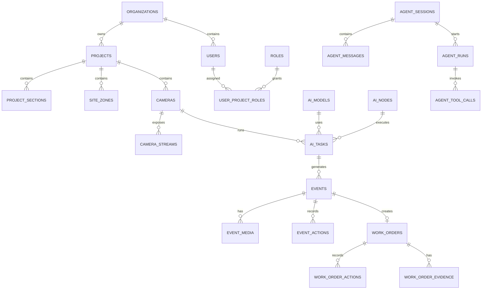

# BridgeAI-Site PostgreSQL 数据库设计 v1.0

> **产品名称：** BridgeAI-Site 智慧工地 AI Agent 平台  
> **文档类型：** PostgreSQL 数据库设计  
> **适用阶段：** 第一阶段 MVP  
> **编制单位：** 浙江悟联信息科技有限公司  
> **编制人：** 周仙通  
> **版本：** v1.0  
> **数据库基线：** PostgreSQL 16+  
> **扩展组件：** PostGIS、pgvector、pgcrypto  
> **设计原则：** 统一数据底座、空间数据原生支持、强审计、可扩展、可归档、面向 Agent 工具调用

---

## 1. 文档目的

本文件定义 BridgeAI-Site 第一阶段 MVP 的 PostgreSQL 数据模型、Schema 划分、核心表、字段约束、主外键关系、索引策略、空间数据、JSONB 配置、审计、归档和备份要求。

它是 Alembic 数据库迁移、SQLAlchemy ORM、REST API、Agent 工具、报表统计、GIS 查询和性能测试的直接依据。

---

## 2. 数据库设计目标

数据库需支持：

- 企业、项目、标段、施工区域；
- 用户、角色、权限和项目级授权；
- 摄像头、视频源、录像和设备状态；
- AI 模型、推理节点和识别任务；
- 告警事件、截图、事件录像和误报回流；
- 整改工单、证据、复核与销项；
- 报表、文件和异步生成任务；
- Agent 会话、运行、消息和工具调用审计；
- GIS 点、线、面数据；
- 知识文档和向量检索；
- 历史数据分区与归档；
- 后续人员、车辆、机械、无人机等业务扩展。

---

## 3. 总体设计原则

### 3.1 UUID 主键

核心业务表统一采用：

```sql
id uuid PRIMARY KEY DEFAULT gen_random_uuid()
```

边缘节点可离线生成主键，也便于数据迁移和多节点同步。

### 3.2 时间字段

统一使用 `timestamptz`：

```sql
created_at timestamptz NOT NULL DEFAULT now(),
updated_at timestamptz NOT NULL DEFAULT now()
```

需要软删除的主数据表增加：

```sql
deleted_at timestamptz
```

### 3.3 状态字段

第一阶段优先使用 `varchar(32)` + CHECK 约束 + 应用层枚举，不大量采用 PostgreSQL ENUM，以降低后续版本迁移成本。

### 3.4 JSONB

适用于模型参数、识别规则、设备扩展属性、原始推理结果、Agent 上下文和外部平台响应；不得用 JSONB 替代高频查询的核心业务字段。

### 3.5 空间字段

统一使用 WGS84：

- 点：`geometry(Point, 4326)`；
- 线：`geometry(LineString, 4326)`；
- 面：`geometry(Polygon, 4326)`；
- 多面：`geometry(MultiPolygon, 4326)`。

空间字段建立 GiST 索引。

---

## 4. Schema 划分

```text
core        企业、用户、角色、权限
site        项目、标段、区域、班组
media       摄像头、视频流、录像、文件
ai          模型、推理节点、识别任务、指标
event       AI/人工事件、媒体、误报反馈
workflow    整改工单、动作、证据、通知
report      日报、周报、月报和生成任务
agent       会话、消息、运行、工具调用
audit       操作审计、登录日志
knowledge   知识文档、切片和向量
```

初始化：

```sql
CREATE EXTENSION IF NOT EXISTS pgcrypto;
CREATE EXTENSION IF NOT EXISTS postgis;
CREATE EXTENSION IF NOT EXISTS vector;
CREATE EXTENSION IF NOT EXISTS pg_trgm;

CREATE SCHEMA IF NOT EXISTS core;
CREATE SCHEMA IF NOT EXISTS site;
CREATE SCHEMA IF NOT EXISTS media;
CREATE SCHEMA IF NOT EXISTS ai;
CREATE SCHEMA IF NOT EXISTS event;
CREATE SCHEMA IF NOT EXISTS workflow;
CREATE SCHEMA IF NOT EXISTS report;
CREATE SCHEMA IF NOT EXISTS agent;
CREATE SCHEMA IF NOT EXISTS audit;
CREATE SCHEMA IF NOT EXISTS knowledge;
```

---

## 5. 核心 ER 关系



---

# 6. core Schema

## 6.1 core.organizations

| 字段 | 类型 | 约束/说明 |
|---|---|---|
| id | uuid | 主键 |
| name | varchar(200) | 企业名称 |
| code | varchar(64) | 唯一编码 |
| status | varchar(32) | active/disabled |
| contact_name | varchar(100) | 联系人 |
| contact_phone | varchar(32) | 联系电话 |
| config | jsonb | 企业级配置 |
| created_at | timestamptz | 创建时间 |
| updated_at | timestamptz | 更新时间 |
| deleted_at | timestamptz | 软删除 |

## 6.2 core.users

| 字段 | 类型 | 说明 |
|---|---|---|
| id | uuid | 主键 |
| organization_id | uuid | 所属企业 |
| username | varchar(100) | 登录名 |
| password_hash | varchar(255) | 密码哈希 |
| display_name | varchar(100) | 姓名 |
| phone | varchar(32) | 手机号 |
| email | varchar(200) | 邮箱 |
| status | varchar(32) | active/locked/disabled |
| last_login_at | timestamptz | 最近登录 |
| password_changed_at | timestamptz | 密码修改时间 |
| created_at | timestamptz | 创建时间 |
| updated_at | timestamptz | 更新时间 |
| deleted_at | timestamptz | 软删除 |

唯一约束：`UNIQUE (organization_id, username)`。

## 6.3 core.roles

字段：`id`、`organization_id`、`name`、`code`、`description`、`is_system`、`created_at`、`updated_at`。

## 6.4 core.permissions

字段：`id`、`code`、`name`、`resource`、`action`、`description`。`code` 全局唯一。

## 6.5 core.role_permissions

复合主键：

```sql
PRIMARY KEY (role_id, permission_id)
```

## 6.6 core.user_project_roles

字段：`id`、`user_id`、`project_id`、`role_id`、`valid_from`、`valid_to`、`created_at`。

唯一约束：`UNIQUE(user_id, project_id, role_id)`。

---

# 7. site Schema

## 7.1 site.projects

| 字段 | 类型 | 说明 |
|---|---|---|
| id | uuid | 主键 |
| organization_id | uuid | 企业 |
| name | varchar(200) | 项目名称 |
| code | varchar(64) | 企业内唯一编码 |
| status | varchar(32) | planning/active/paused/completed |
| project_type | varchar(64) | 项目类型 |
| address | text | 地址 |
| boundary | geometry(MultiPolygon,4326) | 项目边界 |
| longitude | numeric(10,7) | 中心经度 |
| latitude | numeric(10,7) | 中心纬度 |
| start_date | date | 开工日期 |
| end_date | date | 计划完工日期 |
| owner_name | varchar(200) | 建设单位 |
| contractor_name | varchar(200) | 施工单位 |
| supervisor_name | varchar(200) | 监理单位 |
| config | jsonb | 项目配置 |
| created_at/updated_at/deleted_at | timestamptz | 生命周期字段 |

## 7.2 site.project_sections

项目标段。字段：`id`、`project_id`、`name`、`code`、`boundary`、`manager_user_id`、`status`、`created_at`、`updated_at`。

## 7.3 site.site_zones

施工区、危险区、限制区、AI ROI、AI 屏蔽区等。

| 字段 | 类型 |
|---|---|
| id | uuid |
| project_id | uuid |
| section_id | uuid |
| parent_id | uuid |
| name | varchar(200) |
| code | varchar(64) |
| zone_type | varchar(64) |
| risk_level | varchar(32) |
| geometry | geometry(MultiPolygon,4326) |
| status | varchar(32) |
| config | jsonb |
| created_at/updated_at | timestamptz |

## 7.4 site.teams

班组或责任单位。字段：`id`、`project_id`、`name`、`code`、`leader_user_id`、`contact_phone`、`status`、`created_at`、`updated_at`。

---

# 8. media Schema

## 8.1 media.cameras

| 字段 | 类型 | 说明 |
|---|---|---|
| id | uuid | 主键 |
| project_id | uuid | 项目 |
| section_id | uuid | 标段 |
| zone_id | uuid | 区域 |
| name | varchar(200) | 摄像头名称 |
| code | varchar(64) | 项目内唯一编码 |
| vendor | varchar(64) | 海康/大华/萤石等 |
| model | varchar(100) | 型号 |
| serial_number | varchar(128) | 序列号 |
| source_type | varchar(32) | rtsp/ezviz/gb28181 |
| source_config | jsonb | 加密后的连接配置 |
| location | geometry(Point,4326) | GIS 点位 |
| installation_height | numeric(8,2) | 安装高度 |
| direction | numeric(6,2) | 朝向角度 |
| status | varchar(32) | online/offline/maintenance |
| ai_status | varchar(32) | enabled/disabled/error |
| last_online_at | timestamptz | 最近在线时间 |
| created_at/updated_at/deleted_at | timestamptz | 生命周期字段 |

## 8.2 media.camera_streams

一个摄像头可配置主码流和子码流。字段包括：协议、加密源地址、播放代理地址、分辨率、FPS、码率、默认标志和状态。

## 8.3 media.camera_status_logs

摄像头心跳与状态时序表：`id bigserial`、`camera_id`、`status`、`fps`、`bitrate_kbps`、`latency_ms`、`reconnect_count`、`details jsonb`、`recorded_at`。建议按月分区。

## 8.4 media.media_files

统一文件索引：

- project_id；
- file_type；
- storage_provider；
- bucket_name；
- object_key；
- filename；
- content_type；
- size_bytes；
- checksum；
- duration_seconds；
- metadata；
- created_by；
- created_at；
- deleted_at。

## 8.5 media.recordings

字段：`camera_id`、`media_file_id`、`recording_type`、`started_at`、`ended_at`、`trigger_source`、`status`、`created_at`。

---

# 9. ai Schema

## 9.1 ai.ai_models

字段：

- organization_id；
- name/code；
- model_type；
- algorithm_category；
- version；
- framework；
- runtime；
- input_width/input_height；
- model_file_id；
- config JSONB；
- metrics JSONB；
- status；
- published_at；
- created_by；
- created_at/updated_at。

## 9.2 ai.ai_nodes

中心或边缘推理节点。字段：`node_type`、`hostname`、`ip_address inet`、`runtime`、`device_info jsonb`、`capacity jsonb`、`status`、`last_heartbeat_at`。

## 9.3 ai.ai_tasks

摄像头、模型和推理节点绑定关系。

| 字段 | 类型 |
|---|---|
| id | uuid |
| project_id | uuid |
| camera_id | uuid |
| model_id | uuid |
| ai_node_id | uuid |
| name | varchar(200) |
| status | varchar(32) |
| schedule | jsonb |
| inference_config | jsonb |
| rule_config | jsonb |
| roi_config | jsonb |
| cooldown_seconds | integer |
| frame_interval_ms | integer |
| enabled_from/enabled_to | timestamptz |
| created_by | uuid |
| created_at/updated_at | timestamptz |

## 9.4 ai.ai_task_metrics

小时或分钟级性能指标：平均 FPS、平均延迟、推理次数、事件数、错误数、CPU/GPU/内存占用。建议按月分区。

---

# 10. event Schema

## 10.1 event.events

| 字段 | 类型 | 说明 |
|---|---|---|
| id | uuid | 主键 |
| event_no | varchar(64) | 唯一业务编号 |
| project_id/section_id/zone_id | uuid | 工程位置 |
| camera_id | uuid | 来源摄像头 |
| ai_task_id | uuid | 来源任务 |
| event_type | varchar(64) | 事件类型 |
| source_type | varchar(32) | ai/manual/iot |
| risk_level | varchar(32) | 风险等级 |
| confidence | numeric(6,5) | 0～1 |
| title | varchar(255) | 标题 |
| description | text | 描述 |
| occurred_at | timestamptz | 发生时间 |
| detected_at | timestamptz | 检测时间 |
| status | varchar(32) | 当前状态 |
| location | geometry(Point,4326) | 事件位置 |
| tracking_id | varchar(128) | 跟踪 ID |
| dedup_key | varchar(255) | 去重键 |
| raw_result | jsonb | 原始结果 |
| confirmed_by/confirmed_at | uuid/timestamptz | 确认信息 |
| ignored_reason | text | 忽略原因 |
| created_at/updated_at/archived_at | timestamptz | 生命周期 |

置信度约束：

```sql
CHECK (confidence IS NULL OR (confidence >= 0 AND confidence <= 1))
```

## 10.2 event.event_media

事件与截图、录像、前后对比证据的关联。字段：`event_id`、`media_file_id`、`media_role`、`sort_order`、`created_at`。

## 10.3 event.event_actions

记录事件状态变化：动作类型、前状态、后状态、操作人、说明、扩展数据和时间。

## 10.4 event.false_positive_feedback

误报类型、原因、提交人、是否导出为训练样本及导出时间。

---

# 11. workflow Schema

## 11.1 workflow.work_orders

| 字段 | 类型 |
|---|---|
| id | uuid |
| work_order_no | varchar(64) |
| project_id | uuid |
| event_id | uuid |
| title/description | varchar/text |
| risk_level/priority | varchar(32) |
| status | varchar(32) |
| responsible_team_id | uuid |
| responsible_user_id | uuid |
| issued_by | uuid |
| issued_at/due_at | timestamptz |
| accepted_at/submitted_at | timestamptz |
| reviewed_at/closed_at | timestamptz |
| review_result | varchar(32) |
| review_comment | text |
| overdue | boolean |
| created_at/updated_at/archived_at | timestamptz |

## 11.2 workflow.work_order_actions

记录接单、提交、驳回、复核、销项等状态变化。

## 11.3 workflow.work_order_evidence

关联整改照片、视频和说明文件。

## 11.4 workflow.work_order_notifications

记录站内信、短信、邮件、企业微信等通知结果。

---

# 12. report Schema

## 12.1 report.reports

字段：`project_id`、`report_type`、`title`、`date_from`、`date_to`、`status`、`generation_mode`、`parameters jsonb`、`summary jsonb`、`media_file_id`、`generated_by`、`generated_at`、`created_at`。

## 12.2 report.report_tasks

异步生成任务：任务 ID、状态、进度、开始结束时间和错误信息。

---

# 13. agent Schema

## 13.1 agent.agent_sessions

项目、用户、标题、状态、上下文、开始结束时间。

## 13.2 agent.agent_messages

角色、正文、结构化内容、模型名称、Token 使用量和创建时间。

## 13.3 agent.agent_runs

一次完整执行：规划结果、最终输出、状态、耗时、错误、trace_id。

## 13.4 agent.agent_tool_calls

| 字段 | 说明 |
|---|---|
| run_id | 所属运行 |
| tool_name/tool_version | 工具标识 |
| input_args | 输入参数 JSONB |
| output_result | 输出 JSONB |
| status | 调用状态 |
| risk_level | 风险级别 |
| requires_confirmation | 是否需要确认 |
| confirmed_by/confirmed_at | 确认信息 |
| started_at/finished_at/duration_ms | 性能数据 |
| error_message | 错误信息 |

---

# 14. audit Schema

## 14.1 audit.audit_logs

按月分区。字段包括组织、项目、用户、动作、资源类型、资源 ID、request_id、trace_id、IP、User-Agent、变更前后数据、执行结果和错误信息。

## 14.2 audit.login_logs

登录用户、登录名、IP、User-Agent、成功/失败及失败原因。

---

# 15. knowledge Schema

## 15.1 knowledge.knowledge_documents

企业、项目、标题、文档类型、来源、文件 ID、状态、元数据、创建人和时间。

## 15.2 knowledge.knowledge_chunks

文档切片、切片序号、正文、向量和元数据。向量维度必须依据实际嵌入模型配置，例如：

```sql
embedding vector(1536)
```

---

# 16. 核心状态字典

## 16.1 event.events.status

```text
pending → confirmed/ignored → assigned → processing → reviewing → closed → archived
```

## 16.2 workflow.work_orders.status

```text
draft → issued → accepted → processing → submitted → rejected/approved → closed
```

## 16.3 ai.ai_tasks.status

```text
draft / enabled / disabled / deploying / running / error
```

## 16.4 report.reports.status

```text
pending / generating / completed / failed / expired
```

---

# 17. 索引策略

```sql
CREATE INDEX idx_events_project_time
ON event.events(project_id, occurred_at DESC);

CREATE INDEX idx_events_status_risk
ON event.events(status, risk_level);

CREATE INDEX idx_events_camera_type_time
ON event.events(camera_id, event_type, occurred_at DESC);

CREATE INDEX idx_events_dedup
ON event.events(camera_id, event_type, dedup_key, occurred_at);

CREATE INDEX idx_work_orders_project_status
ON workflow.work_orders(project_id, status);

CREATE INDEX idx_work_orders_due_at
ON workflow.work_orders(due_at)
WHERE status NOT IN ('closed', 'cancelled');

CREATE INDEX idx_cameras_project_status
ON media.cameras(project_id, status);

CREATE INDEX idx_ai_tasks_camera_status
ON ai.ai_tasks(camera_id, status);
```

空间索引：

```sql
CREATE INDEX idx_projects_boundary
ON site.projects USING GIST(boundary);

CREATE INDEX idx_site_zones_geometry
ON site.site_zones USING GIST(geometry);

CREATE INDEX idx_cameras_location
ON media.cameras USING GIST(location);

CREATE INDEX idx_events_location
ON event.events USING GIST(location);
```

JSONB 与模糊查询索引仅按实际查询需求创建：

```sql
CREATE INDEX idx_ai_tasks_rule_config
ON ai.ai_tasks USING GIN(rule_config);

CREATE INDEX idx_projects_name_trgm
ON site.projects USING GIN(name gin_trgm_ops);
```

---

# 18. 分区策略

第一阶段优先按月分区：

- `media.camera_status_logs`；
- `ai.ai_task_metrics`；
- `audit.audit_logs`；
- `audit.login_logs`。

当事件量达到千万级，再对 `event.events` 按发生时间进行月度或季度分区。

---

# 19. 数据完整性与外键

- 主数据默认 `ON DELETE RESTRICT`；
- 明细关联表可 `ON DELETE CASCADE`；
- 媒体文件不随业务记录物理级联删除；
- 使用软删除和后台清理任务；
- 时间范围、置信度、坐标和状态必须有 CHECK 或应用层验证；
- 删除企业、项目等高层实体前必须检查下级业务数据。

更新时间触发器：

```sql
CREATE OR REPLACE FUNCTION core.set_updated_at()
RETURNS trigger AS $$
BEGIN
    NEW.updated_at = now();
    RETURN NEW;
END;
$$ LANGUAGE plpgsql;
```

---

# 20. 业务编号

建议：

```text
EVT-20260723-000001
WO-20260723-000001
RPT-20260723-000001
```

业务编号用于展示与检索，UUID 用于内部主键。编号由数据库序列或业务编号服务原子生成。

---

# 21. 数据权限

所有业务查询至少包含：

- organization_id；
- project_id；
- user_project_roles；
- 角色权限；
- 数据范围。

第一阶段由 FastAPI 业务层统一实施数据权限；后续多租户 SaaS 可引入 PostgreSQL Row Level Security。

---

# 22. 加密与脱敏

必须保护：

- 摄像头密码与 RTSP 地址；
- 萤石云 AccessToken；
- API Key；
- 手机号与邮箱；
- 大模型密钥；
- MinIO 密钥。

连接密钥优先放入环境变量或密钥管理系统；数据库只保存加密值或密钥引用。日志不得输出完整 Token 和密码。

---

# 23. 数据保留与归档

| 数据类型 | 默认策略 |
|---|---|
| 普通事件 | 在线 180 天后归档 |
| 高风险事件 | 长期保存 |
| 工单及动作 | 长期保存 |
| 审计日志 | 至少 1 年 |
| 推理指标 | 90～180 天 |
| 摄像头状态 | 180 天 |
| 普通录像 | 90 天 |
| 高风险录像 | 1 年以上 |
| Agent 工具审计 | 至少 1 年 |

归档不等于删除，应保留索引信息和恢复机制。

---

# 24. 备份与恢复

- PostgreSQL 每日全量备份；
- 启用 WAL 归档和时间点恢复；
- 备份文件加密；
- MinIO/NAS 增量备份；
- 备份与生产环境物理隔离；
- 至少每季度执行一次恢复演练；
- 数据库迁移前创建可验证备份。

---

# 25. 核心 DDL 骨架

## 25.1 企业

```sql
CREATE TABLE core.organizations (
    id uuid PRIMARY KEY DEFAULT gen_random_uuid(),
    name varchar(200) NOT NULL,
    code varchar(64) NOT NULL UNIQUE,
    status varchar(32) NOT NULL DEFAULT 'active',
    contact_name varchar(100),
    contact_phone varchar(32),
    config jsonb NOT NULL DEFAULT '{}'::jsonb,
    created_at timestamptz NOT NULL DEFAULT now(),
    updated_at timestamptz NOT NULL DEFAULT now(),
    deleted_at timestamptz
);
```

## 25.2 项目

```sql
CREATE TABLE site.projects (
    id uuid PRIMARY KEY DEFAULT gen_random_uuid(),
    organization_id uuid NOT NULL REFERENCES core.organizations(id),
    name varchar(200) NOT NULL,
    code varchar(64) NOT NULL,
    status varchar(32) NOT NULL DEFAULT 'planning',
    project_type varchar(64),
    address text,
    boundary geometry(MultiPolygon, 4326),
    longitude numeric(10,7),
    latitude numeric(10,7),
    start_date date,
    end_date date,
    owner_name varchar(200),
    contractor_name varchar(200),
    supervisor_name varchar(200),
    config jsonb NOT NULL DEFAULT '{}'::jsonb,
    created_at timestamptz NOT NULL DEFAULT now(),
    updated_at timestamptz NOT NULL DEFAULT now(),
    deleted_at timestamptz,
    UNIQUE (organization_id, code)
);
```

## 25.3 摄像头

```sql
CREATE TABLE media.cameras (
    id uuid PRIMARY KEY DEFAULT gen_random_uuid(),
    project_id uuid NOT NULL REFERENCES site.projects(id),
    section_id uuid,
    zone_id uuid,
    name varchar(200) NOT NULL,
    code varchar(64) NOT NULL,
    vendor varchar(64),
    model varchar(100),
    serial_number varchar(128),
    source_type varchar(32) NOT NULL,
    source_config jsonb NOT NULL DEFAULT '{}'::jsonb,
    location geometry(Point, 4326),
    installation_height numeric(8,2),
    direction numeric(6,2),
    status varchar(32) NOT NULL DEFAULT 'offline',
    ai_status varchar(32) NOT NULL DEFAULT 'disabled',
    last_online_at timestamptz,
    created_at timestamptz NOT NULL DEFAULT now(),
    updated_at timestamptz NOT NULL DEFAULT now(),
    deleted_at timestamptz,
    UNIQUE (project_id, code)
);
```

## 25.4 AI 事件

```sql
CREATE TABLE event.events (
    id uuid PRIMARY KEY DEFAULT gen_random_uuid(),
    event_no varchar(64) NOT NULL UNIQUE,
    project_id uuid NOT NULL REFERENCES site.projects(id),
    section_id uuid,
    zone_id uuid,
    camera_id uuid REFERENCES media.cameras(id),
    ai_task_id uuid,
    event_type varchar(64) NOT NULL,
    source_type varchar(32) NOT NULL,
    risk_level varchar(32) NOT NULL,
    confidence numeric(6,5),
    title varchar(255) NOT NULL,
    description text,
    occurred_at timestamptz NOT NULL,
    detected_at timestamptz NOT NULL DEFAULT now(),
    status varchar(32) NOT NULL DEFAULT 'pending',
    location geometry(Point, 4326),
    tracking_id varchar(128),
    dedup_key varchar(255),
    raw_result jsonb NOT NULL DEFAULT '{}'::jsonb,
    confirmed_by uuid,
    confirmed_at timestamptz,
    ignored_reason text,
    created_at timestamptz NOT NULL DEFAULT now(),
    updated_at timestamptz NOT NULL DEFAULT now(),
    archived_at timestamptz,
    CHECK (confidence IS NULL OR (confidence >= 0 AND confidence <= 1))
);
```

## 25.5 整改工单

```sql
CREATE TABLE workflow.work_orders (
    id uuid PRIMARY KEY DEFAULT gen_random_uuid(),
    work_order_no varchar(64) NOT NULL UNIQUE,
    project_id uuid NOT NULL REFERENCES site.projects(id),
    event_id uuid REFERENCES event.events(id),
    title varchar(255) NOT NULL,
    description text,
    risk_level varchar(32) NOT NULL,
    priority varchar(32) NOT NULL DEFAULT 'normal',
    status varchar(32) NOT NULL DEFAULT 'draft',
    responsible_team_id uuid,
    responsible_user_id uuid,
    issued_by uuid,
    issued_at timestamptz,
    due_at timestamptz,
    accepted_at timestamptz,
    submitted_at timestamptz,
    reviewed_at timestamptz,
    closed_at timestamptz,
    review_result varchar(32),
    review_comment text,
    overdue boolean NOT NULL DEFAULT false,
    created_at timestamptz NOT NULL DEFAULT now(),
    updated_at timestamptz NOT NULL DEFAULT now(),
    archived_at timestamptz,
    CHECK (due_at IS NULL OR issued_at IS NULL OR due_at >= issued_at)
);
```

---

# 26. Alembic 迁移顺序

```text
001_extensions
002_schemas
003_core
004_site
005_media
006_ai
007_event
008_workflow
009_report
010_agent
011_audit
012_knowledge
013_indexes
014_seed_permissions
015_seed_dictionaries
```

每个迁移必须提供升级和降级逻辑，并在测试数据库完成执行验证。

---

# 27. 初始化数据

系统首次启动需初始化：

- 超级管理员；
- 系统角色；
- 权限编码；
- 风险等级；
- 事件类型与状态；
- 工单状态；
- 摄像头状态；
- AI 任务状态；
- 报表类型；
- 默认系统参数。

---

# 28. 性能与验收标准

## 28.1 结构验收

- 扩展和 Schema 创建成功；
- 核心表、主外键和唯一约束正确；
- UUID 默认值有效；
- 时间字段统一；
- PostGIS 查询正常；
- JSONB 可正常写入和检索；
- 索引被执行计划使用。

## 28.2 业务验收

- 创建企业、项目、区域和摄像头；
- 创建模型、推理节点和 AI 任务；
- 写入事件及其媒体证据；
- 建立整改工单并完成状态流转；
- 保存报表索引；
- 保存 Agent 会话、运行和工具调用；
- 记录操作审计和登录日志。

## 28.3 性能验收

在 10 万条事件的 MVP 数据量下：

- 项目 + 时间范围查询小于 2 秒；
- 状态 + 风险等级筛选小于 2 秒；
- 逾期工单查询小于 2 秒；
- GIS 范围查询稳定；
- 日报聚合查询满足页面交互要求；
- 批量写入不造成长时间锁表。

---

# 29. 与后续文档的关系

```text
PostgreSQL 数据库设计
    ↓
SQLAlchemy ORM 模型
    ↓
REST API 设计
    ↓
Agent 工具接口
    ↓
报表与统计 SQL
    ↓
性能测试与数据归档
```

---

# 30. 总结

BridgeAI-Site 第一阶段以 PostgreSQL 为统一数据底座，并通过 PostGIS、pgvector 和 JSONB 同时承载工程业务、GIS 空间、AI 推理、告警整改、Agent 运行、知识检索和审计数据。

该设计坚持：

1. 核心业务字段结构化；
2. 配置和原始结果使用 JSONB；
3. 视频文件与数据库索引分离；
4. Agent 通过业务 API 间接访问数据；
5. 高频日志和指标可分区；
6. 敏感连接信息加密；
7. 所有重要状态变化可审计；
8. 为多项目、边缘节点和无人机协同预留扩展边界。

数据库设计完成后，下一步可直接进入《BridgeAI-Site REST API 设计 v1.0》和 SQLAlchemy/Alembic 工程实现。

