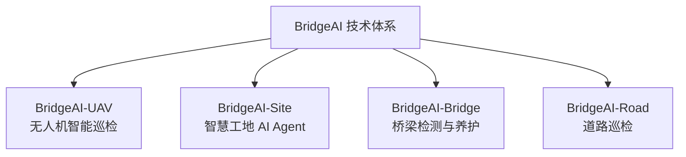
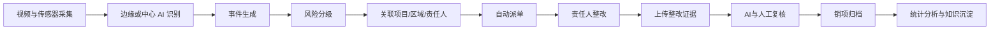
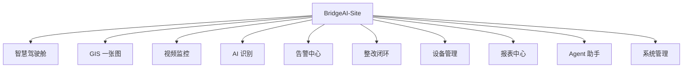
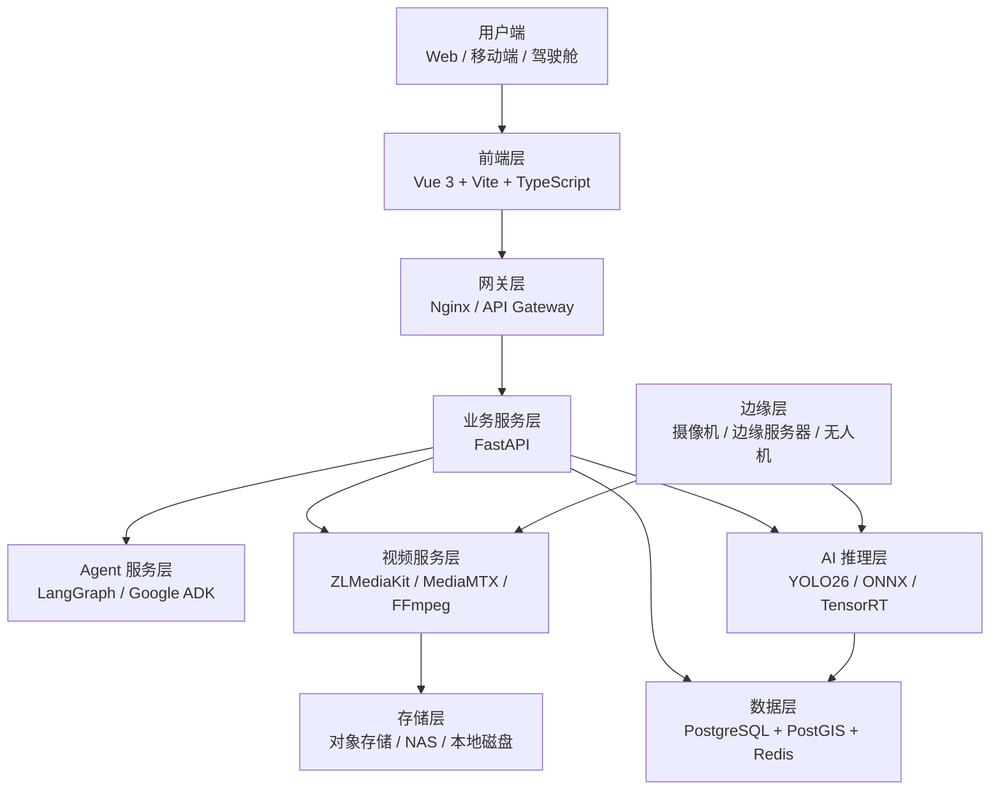
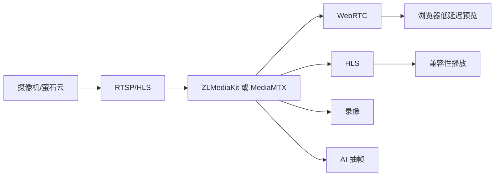
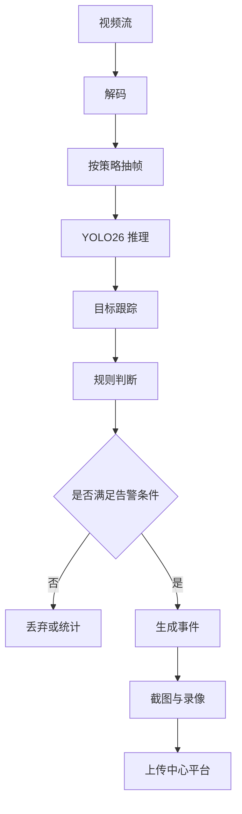
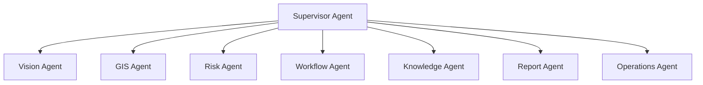
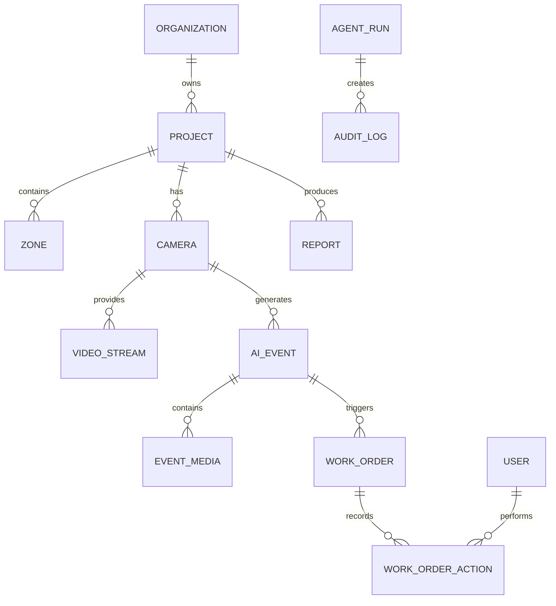
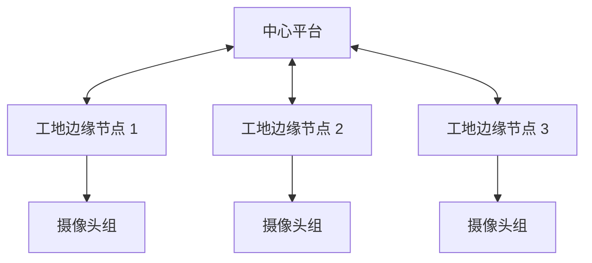

# BridgeAI-Site 智慧工地 AI Agent 平台总体设计方案 v1.0

> **编制单位：浙江悟联信息科技有限公司**  
> **编制人：周仙通**  
> **版本：v1.0**  
> **定位：智慧工地视频 AI、安全管理与多智能体协同平台总体设计方案**

---

# 1. 项目概述

## 1.1 建设背景

随着交通基础设施建设规模持续扩大，施工现场的视频监控、人员管理、机械设备、环境监测、质量管理和安全管理数据不断增加。传统智慧工地平台主要解决“数据上屏”和“业务留痕”问题，但在实际应用中仍普遍存在以下不足：

1. 摄像头数量多，但仍依赖人工盯屏；
2. AI 识别与整改流程相互割裂；
3. 告警数量多，但缺乏风险分级；
4. 多个系统之间数据不互通；
5. 项目管理人员需要人工汇总日报、周报和月报；
6. 平台能够展示问题，但不能主动分析、协同和执行。

BridgeAI-Site 的建设目标，是将传统智慧工地平台升级为面向施工安全、质量、进度和环境管理的 AI Agent 平台。

平台以视频 AI 为首期核心，以 GIS、视频监控、告警闭环、边缘推理、知识库和多 Agent 协同为基础，逐步形成“感知—识别—研判—派单—整改—复核—归档—分析”的全过程闭环。

## 1.2 产品定位

BridgeAI-Site 是 BridgeAI 技术体系中的智慧工地产品线，与 BridgeAI-UAV 并列构成核心业务方向。



BridgeAI-Site 的产品定位是：

> 面向交通建设、市政工程、桥梁隧道施工和大型基础设施项目，提供以视频 AI 为入口、以安全闭环为核心、以 AI Agent 为智能中枢的智慧工地平台。

## 1.3 建设目标

平台建设目标包括：

- 建立统一的 GIS 工地态势图；
- 集中接入现场视频资源；
- 支持 2×2 和 4×4 视频墙；
- 接入萤石云、RTSP、HLS 和 WebRTC 视频源；
- 提供未戴安全帽、烟火、区域入侵等 AI 能力；
- 自动生成事件截图和录像片段；
- 自动形成告警、派单、整改和复核闭环；
- 提供项目安全态势分析；
- 支持本地私有化部署；
- 支持 AI Agent 自然语言查询和自动报告；
- 为后续质量、进度、环保、机械和人员管理扩展提供统一底座。

# 2. 用户角色与业务对象

## 2.1 用户角色

| 用户角色 | 主要职责 | 主要功能 |
|---|---|---|
| 建设单位管理人员 | 查看项目整体风险 | 驾驶舱、统计分析、报表 |
| 项目经理 | 统筹现场安全与进度 | 告警、派单、趋势分析 |
| 安全负责人 | 处理安全隐患 | 告警审核、整改、复核 |
| 施工班组负责人 | 执行整改任务 | 移动端任务、证据上传 |
| 监理人员 | 监督整改质量 | 复核、签署、统计 |
| 系统管理员 | 管理平台资源 | 用户、权限、设备、模型 |
| AI 运维人员 | 维护模型和推理服务 | 模型版本、阈值、边缘节点 |
| 企业管理层 | 查看跨项目经营与风险 | 集团驾驶舱、项目排名 |

## 2.2 核心业务对象

平台应围绕以下对象建立统一数据模型：

- 企业；
- 项目；
- 标段；
- 施工区域；
- 摄像头；
- 边缘节点；
- AI 模型；
- AI 识别任务；
- 告警事件；
- 整改工单；
- 用户；
- 班组；
- 人员；
- 车辆；
- 机械；
- 录像；
- 报告；
- 规则；
- Agent 运行记录。

# 3. 总体业务架构

## 3.1 业务闭环



## 3.2 首期业务范围

第一期重点聚焦“视频安全管理”，形成可落地、可交付、可复制的 MVP。

首期功能包括：

1. GIS 一张图；
2. 视频监控；
3. 视频墙；
4. 萤石云接入；
5. AI 识别；
6. 告警中心；
7. 整改闭环；
8. 本地录像；
9. 驾驶舱；
10. AI Agent 助手；
11. 系统管理；
12. 基础报表。

## 3.3 后续扩展范围

第二阶段可扩展：

- 人员定位；
- 车辆管理；
- 机械设备；
- 环境监测；
- 扬尘噪声；
- 进度管理；
- 质量管理；
- BIM；
- 物料管理；
- 施工日志；
- 无人机巡检；
- 数字孪生。

# 4. 功能架构设计



## 4.1 智慧驾驶舱

建议包括：项目总览、摄像头在线率、今日告警数、未处理告警数、高风险告警数、整改闭环率、告警趋势、风险类型分布、高风险区域、摄像头地图、实时视频、最新事件、班组风险排名和设备运行状态。

## 4.2 GIS 一张图

GIS 模块应支持天地图矢量与卫星底图切换、摄像头点位、项目区域、施工分区、危险区域、电子围栏、告警点位、设备点位、人员和车辆轨迹，以及点位联动视频和告警详情。

建议技术选型：二维 GIS 使用 OpenLayers，三维 GIS 使用 Cesium，空间数据库采用 PostGIS。

## 4.3 视频监控

应支持单画面、2×2、4×4、自定义布局、全屏、抓图、本地录像、历史回放、云台控制、收藏、轮巡、码流切换、断流重连和在线状态监测。

## 4.4 AI 识别

首期建议上线六类算法：未戴安全帽、未穿反光背心、人员闯入危险区域、烟雾与明火、人员聚集、车辆违规停留。

AI 配置应支持摄像头绑定模型、识别区域、屏蔽区域、灵敏度、置信度阈值、检测频率、告警抑制时间、时段规则、重复事件合并和黑白名单。

## 4.5 告警中心

告警应包含事件编号、项目、摄像头、类型、风险等级、时间、截图、视频片段、AI 置信度、识别区域、责任班组、责任人、状态、处置时限、整改记录和复核记录。

状态建议为：

```text
待确认 → 已确认 → 已派单 → 整改中 → 待复核 → 已销项
```

## 4.6 整改闭环

支持自动派单、人工转派、整改时限、超时提醒、整改说明、图片或视频证据、复核意见、驳回重改、销项、逾期统计和班组评分。

## 4.7 设备管理

管理摄像头、NVR、边缘计算盒、推理服务器、环境传感器、网关、无人机和录像存储节点，并监测在线、离线、弱网、高延迟、无视频、推理异常、存储不足和温度过高等状态。

## 4.8 报表中心

支持安全日报、周报、月报、告警统计、整改闭环率、班组排名、摄像头在线率、设备故障和模型效果分析，并可导出 PDF、Word、Excel 和图片。

## 4.9 AI Agent 助手

支持自然语言查询今日高风险事件、超时整改、班组重复违规、重点巡查区域，并自动生成安全日报、周报和专题报告。

# 5. 技术架构设计



前端建议 Vue 3、Vite、TypeScript、Pinia、Element Plus、ECharts、OpenLayers、Cesium、WebSocket、HLS.js 和 WebRTC。

后端建议 FastAPI、Pydantic、SQLAlchemy、Alembic、PostgreSQL、PostGIS、Redis、Celery 或 Dramatiq、MinIO、FFmpeg 和 Docker Compose。

AI 建议采用 YOLO26、PyTorch、ONNX Runtime、TensorRT、OpenVINO、MLX、SAM 类分割模型、OCR、多模态模型、RAG，以及 LangGraph 或 Google ADK。

# 6. 视频接入与流媒体架构

## 6.1 视频来源

兼容萤石云、海康、大华、RTSP、HLS、WebRTC、GB28181、本地视频和无人机实时视频。

## 6.2 萤石云接入

通过后端统一管理设备列表、直播地址、回放地址、云台控制、抓图、设备状态和告警信息，AccessToken 不暴露给前端。

## 6.3 流媒体转换



录像分为全天录像、告警录像、手动录像和事件前后缓冲录像。告警录像建议保存事件前 10 秒和事件后 20 秒。

# 7. AI 推理架构

中心推理适用于 GPU 服务器和多路视频统一管理，边缘推理适用于网络不稳定、低时延告警和数据不出场场景。



为避免告警风暴，应支持同一目标去重、同一区域去重、时间窗口合并、连续帧确认、最短持续时间、冷却时间和人工误报标记。

# 8. AI Agent 架构



各 Agent 分别承担视觉分析、空间关联、风险分级、工单流转、知识检索、报告生成和设备运维。

# 9. 数据库核心设计

核心表建议包括：`organizations`、`projects`、`sections`、`zones`、`cameras`、`video_streams`、`edge_nodes`、`ai_models`、`ai_tasks`、`ai_events`、`event_media`、`work_orders`、`work_order_actions`、`users`、`teams`、`personnel`、`vehicles`、`devices`、`reports`、`agent_runs` 和 `audit_logs`。



# 10. 权限与安全设计

采用 RBAC，覆盖企业级、项目级、模块级、数据级和操作级权限。删除录像、发布正式报告、批量关闭工单、修改模型阈值和下发设备控制命令等操作需二次确认。

系统应记录登录、查询、导出、告警、工单、模型配置、Agent 调用、报告修改和设备控制日志。

# 11. 部署架构

开发环境基于 Mac Studio M3 Ultra、512GB 统一内存、PostgreSQL、Docker、MLX、本地大模型、FastAPI 和 Vue 3。

生产环境建议采用中心平台加边缘节点：



Docker 服务建议拆分为 Web、API、Agent、Worker、PostgreSQL、Redis、MinIO、Media、AI 和 Nginx。

# 12. 第一阶段开发计划

第一阶段目标是完成一个可演示、可试点、可接入真实摄像头的 MVP。

## 12.1 功能范围

- 登录和权限；
- 项目管理；
- 摄像头管理；
- GIS 地图；
- 单画面；
- 2×2 视频墙；
- 4×4 视频墙；
- 萤石云接入；
- AI 识别；
- 告警中心；
- 告警截图；
- 告警录像；
- 整改工单；
- 基础驾驶舱；
- 安全日报；
- Agent 查询。

## 12.2 研发里程碑

### M1：基础平台

完成项目脚手架、用户权限、PostgreSQL、项目管理、摄像头管理和基础前端框架。

### M2：视频平台

完成萤石云接入、视频预览、视频墙、录像和抓图。

### M3：AI 识别

完成 YOLO26 推理服务、安全帽、烟火和区域入侵识别，以及告警生成。

### M4：业务闭环

完成派单、整改、复核、销项和超时提醒。

### M5：Agent 与报表

完成 Agent 查询、自动日报、风险总结和驾驶舱。

# 13. 商业化交付模式

可采用项目制交付、标准化产品、算法增值服务和年度运维订阅四种模式。项目收费可由软件平台、视频接入、AI 算法、边缘服务器、实施服务和运维服务构成。

# 14. 差异化优势

1. 不只是视频监控，而是 AI 事件闭环；
2. 不只是算法识别，而是 Agent 自动研判；
3. 支持企业级和多项目扩展；
4. 支持边缘实时推理；
5. 支持多 Agent 和工具调用；
6. 可与 BridgeAI-UAV 联动；
7. 与桥梁检测、道路巡检和知识库共用技术底座；
8. 支持本地私有化部署；
9. 面向交通基础设施行业深度定制。

# 15. 下一步实施建议

1. 建立 BridgeAI-Site Git 仓库；
2. 初始化 FastAPI + Vue 3 + PostgreSQL 工程；
3. 建立数据库基础模型；
4. 完成摄像头管理和 GIS 地图；
5. 完成萤石云视频接入验证；
6. 完成 2×2 和 4×4 视频墙；
7. 接入首个 YOLO26 安全帽模型；
8. 完成告警截图和录像；
9. 实现整改闭环；
10. 建立第一版驾驶舱。

# 16. 总结

BridgeAI-Site 的首要目标不是堆叠智慧工地功能，而是抓住最具价值的核心业务：视频 AI 安全管理。

平台通过 GIS、视频监控、AI 推理、边缘计算、告警闭环和 AI Agent，将传统“人工盯屏”模式升级为“系统主动发现、自动研判、自动派单、整改复核和持续分析”的新模式。

BridgeAI-Site 与 BridgeAI-UAV 形成协同：BridgeAI-Site 负责固定场景、连续监控和施工管理；BridgeAI-UAV 负责移动巡检、复杂区域和应急任务；BridgeAI-Agent 负责统一调度、知识推理和报告生成。

最终形成一个面向交通基础设施建设阶段的完整 AI Agent 产品体系。
