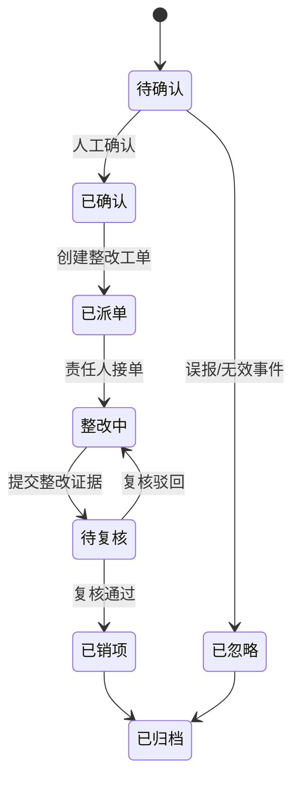

# BridgeAI-Site 第一阶段产品需求文档（PRD）v1.0

> **产品名称：** BridgeAI-Site 智慧工地 AI Agent 平台  
> **阶段定位：** 第一阶段 MVP  
> **编制单位：** 浙江悟联信息科技有限公司  
> **编制人：** 周仙通  
> **文档版本：** v1.0  
> **技术基线：** Vue 3 + FastAPI + PostgreSQL/PostGIS + Redis + FFmpeg/ZLMediaKit + YOLO26 + LangGraph/Google ADK  
> **部署原则：** 本地优先、私有化优先、边缘智能优先

---

# 1. 文档目的

本 PRD 用于统一 BridgeAI-Site 第一阶段 MVP 的产品边界、用户角色、业务流程、页面功能、状态模型、数据要求和验收标准。

本文件是以下工作的直接输入：

1. UI/UX 设计；
2. 系统架构设计；
3. PostgreSQL 数据库设计；
4. REST API 设计；
5. AI 算法服务设计；
6. Agent 工作流设计；
7. 测试用例设计；
8. 项目开发排期；
9. 试点项目交付；
10. 招投标与客户汇报。

# 2. 第一阶段目标

## 2.1 核心目标

第一阶段不追求覆盖完整智慧工地业务，而是优先打通“视频安全管理闭环”。


## 2.2 MVP 成功标准

第一阶段完成后，系统必须能够：

- 接入至少一种真实视频源；
- 在浏览器中稳定预览单路视频；
- 支持 2×2 和 4×4 视频墙；
- 在 GIS 地图中展示摄像头位置；
- 使用 YOLO26 对视频进行抽帧推理；
- 自动生成告警截图；
- 保存事件录像片段；
- 创建整改工单；
- 完成整改、复核和销项；
- 自动生成安全日报；
- 通过 Agent 查询当日告警和逾期任务；
- 保留完整操作审计记录。

# 3. 产品范围

## 3.1 第一阶段包含

| 模块 | 是否纳入 MVP | 说明 |
|---|---:|---|
| 登录与权限 | 是 | 支持企业、项目和角色权限 |
| 项目管理 | 是 | 项目、标段、施工区域 |
| GIS 一张图 | 是 | 天地图矢量/卫星切换 |
| 摄像头管理 | 是 | 设备信息、位置、状态 |
| 视频预览 | 是 | 单画面、2×2、4×4 |
| 视频录像 | 是 | 手动录像、事件录像 |
| AI 识别 | 是 | 首批安全算法 |
| 告警中心 | 是 | 告警确认、过滤、查询 |
| 整改闭环 | 是 | 派单、整改、复核、销项 |
| 驾驶舱 | 是 | 关键 KPI 与风险态势 |
| 报表中心 | 是 | 安全日报与基础统计 |
| Agent 助手 | 是 | 查询、总结、日报生成 |
| 设备运维 | 基础版 | 在线状态、断流、推理异常 |
| 移动端 | 轻量版 | H5 处理整改任务 |

## 3.2 第一阶段暂不包含

以下模块不纳入第一阶段正式验收范围：

- BIM 深度集成；
- 全量人员实名制；
- 工资专户；
- 物料进销存；
- 施工进度计划联动；
- 大型机械完整生命周期；
- 三维数字孪生；
- 多项目集团经营分析；
- 全自动无人机调度；
- 完整移动 App；
- 多租户 SaaS 商业计费。

# 4. 用户角色与权限

## 4.1 角色定义

| 角色 | 主要职责 |
|---|---|
| 平台超级管理员 | 管理企业、系统配置和全局资源 |
| 企业管理员 | 管理企业内项目、用户和权限 |
| 项目经理 | 查看项目全局、审批重要事件 |
| 安全负责人 | 告警确认、派单、复核 |
| 施工班组负责人 | 接收和处理整改任务 |
| 监理人员 | 查看、复核和监督 |
| AI 运维人员 | 管理模型、阈值和推理节点 |
| 访客/领导 | 只读查看驾驶舱和报表 |

## 4.2 权限矩阵

| 功能 | 超级管理员 | 企业管理员 | 项目经理 | 安全负责人 | 班组负责人 | 监理 | AI运维 | 访客 |
|---|---:|---:|---:|---:|---:|---:|---:|---:|
| 查看驾驶舱 | ✓ | ✓ | ✓ | ✓ | 部分 | ✓ | ✓ | ✓ |
| 管理项目 | ✓ | ✓ | 部分 | - | - | - | - | - |
| 管理摄像头 | ✓ | ✓ | ✓ | 查看 | - | 查看 | ✓ | - |
| 查看视频 | ✓ | ✓ | ✓ | ✓ | 授权范围 | ✓ | ✓ | 只读 |
| 配置 AI | ✓ | ✓ | 查看 | 部分 | - | 查看 | ✓ | - |
| 确认告警 | ✓ | ✓ | ✓ | ✓ | - | ✓ | - | - |
| 创建工单 | ✓ | ✓ | ✓ | ✓ | - | ✓ | - | - |
| 提交整改 | ✓ | ✓ | ✓ | ✓ | ✓ | - | - | - |
| 复核销项 | ✓ | ✓ | ✓ | ✓ | - | ✓ | - | - |
| 导出报表 | ✓ | ✓ | ✓ | ✓ | 部分 | ✓ | ✓ | 只读 |
| 查看审计日志 | ✓ | ✓ | 部分 | - | - | - | - | - |

# 5. 核心业务流程

## 5.1 视频 AI 告警流程



## 5.2 告警风险分级

| 风险等级 | 定义 | 示例 | 默认处置时限 |
|---|---|---|---|
| 一级/重大 | 可能导致严重伤亡或重大损失 | 明火、人员进入吊装核心区 | 立即 |
| 二级/较大 | 存在明显人身安全风险 | 高处作业未防护 | 30 分钟 |
| 三级/一般 | 违反安全管理要求 | 未戴安全帽 | 2 小时 |
| 四级/提示 | 需要关注但暂不构成直接风险 | 人员聚集、车辆停留 | 当日 |

## 5.3 重复事件抑制

系统必须支持：

- 同一摄像头、同一算法、同一区域的冷却时间；
- 连续多帧确认；
- 最短持续时间；
- 目标跟踪 ID 去重；
- 相似截图合并；
- 人工标注误报；
- 误报样本回流。

# 6. 信息架构与页面清单

```text
BridgeAI-Site
├── 登录
├── 首页驾驶舱
├── GIS 一张图
├── 视频监控
│   ├── 单路预览
│   ├── 2×2 视频墙
│   ├── 4×4 视频墙
│   └── 历史录像
├── AI 中心
│   ├── 模型管理
│   ├── 识别任务
│   ├── 区域配置
│   └── 运行监控
├── 告警中心
│   ├── 实时告警
│   ├── 历史事件
│   └── 误报管理
├── 整改中心
│   ├── 我的任务
│   ├── 待复核
│   └── 已归档
├── 设备管理
├── 报表中心
├── Agent 助手
└── 系统管理
```

# 7. 页面级需求

## 7.1 登录页

### 功能

- 用户名；
- 密码；
- 验证码；
- 记住登录状态；
- 忘记密码；
- 登录日志；
- 登录失败限制；
- 可选单点登录。

### 验收标准

- 连续错误登录达到阈值后触发临时锁定；
- 登录后根据角色加载菜单；
- 所有登录行为写入审计日志；
- Token 失效后自动跳转登录页。

## 7.2 首页驾驶舱

### 核心指标

- 项目数量；
- 摄像头总数；
- 摄像头在线率；
- 今日告警数；
- 高风险告警数；
- 待整改数；
- 逾期数；
- 整改闭环率；
- 本周风险趋势；
- 风险类型分布；
- 区域风险排名；
- 最新告警列表；
- 视频轮播；
- GIS 小地图。

### 交互要求

- 指标卡点击后跳转到筛选后的列表；
- 图表支持按今日、本周、本月切换；
- 最新事件可直接打开详情；
- 支持大屏全屏模式；
- 数据通过 WebSocket 或定时刷新。

## 7.3 GIS 一张图

### 基础功能

- 天地图矢量图；
- 天地图卫星图；
- 图层切换；
- 缩放；
- 测距；
- 测面积；
- 全图；
- 项目边界；
- 施工区域；
- 危险区域；
- 摄像头点位；
- 告警点位；
- 设备点位。

### 摄像头交互

点击摄像头后显示：

- 摄像头名称；
- 在线状态；
- 所属区域；
- 实时画面；
- 最近告警；
- 跳转视频监控；
- 跳转设备详情。

### 验收标准

- 摄像头位置与数据库坐标一致；
- 底图切换不丢失业务图层；
- 支持按状态、区域、类型筛选；
- 告警点位颜色与风险等级一致。

## 7.4 视频监控页

### 布局

- 左侧：项目、区域、摄像头树；
- 中间：视频播放区域；
- 右侧：视频信息、AI 状态、最近告警；
- 顶部：布局切换和全局操作。

### 播放器操作

- 播放/暂停；
- 静音；
- 音量；
- 抓图；
- 手动录像；
- 全屏；
- 码流切换；
- AI 叠加层开关；
- 云台控制；
- 历史回放；
- 断流重连。

### 视频墙

- 单画面；
- 2×2；
- 4×4；
- 双击单窗放大；
- 拖拽摄像头到窗口；
- 保存常用布局；
- 自动轮巡。

### 验收标准

- 真实视频源可连续播放；
- 断流后自动重试；
- 抓图生成文件和记录；
- 手动录像可查询和下载；
- 4×4 模式下页面不卡死。

## 7.5 AI 中心

### 模型管理

字段：

- 模型名称；
- 模型类型；
- 算法类别；
- 模型版本；
- 文件路径；
- 推理框架；
- 输入尺寸；
- 置信度阈值；
- 后处理配置；
- 状态；
- 创建时间；
- 发布人。

### 任务配置

- 选择摄像头；
- 选择模型；
- 识别区域；
- 屏蔽区域；
- 抽帧频率；
- 最短持续时间；
- 冷却时间；
- 启用时段；
- 风险等级；
- 是否自动派单。

### 运行监控

- 推理 FPS；
- 平均延迟；
- GPU/CPU 占用；
- 队列长度；
- 失败次数；
- 最后心跳；
- 当前模型版本。

## 7.6 告警中心

### 列表字段

- 事件编号；
- 事件类型；
- 风险等级；
- 项目；
- 区域；
- 摄像头；
- 发生时间；
- 置信度；
- 当前状态；
- 责任人；
- 剩余时限；
- 是否逾期。

### 筛选条件

- 时间；
- 项目；
- 区域；
- 摄像头；
- 事件类型；
- 风险等级；
- 状态；
- 责任人；
- 是否逾期。

### 事件详情

- 告警截图；
- 事件视频；
- AI 检测框；
- 发生位置；
- 规则命中信息；
- 历史操作；
- 关联工单；
- 相似事件；
- 确认、忽略、派单按钮。

## 7.7 整改中心

### 工单字段

- 工单编号；
- 来源事件；
- 问题描述；
- 风险等级；
- 整改要求；
- 责任单位；
- 责任人；
- 截止时间；
- 当前状态；
- 整改证据；
- 复核结论。

### 移动端操作

班组负责人可：

- 查看任务；
- 接单；
- 填写整改说明；
- 拍照或上传视频；
- 提交整改；
- 查看驳回原因。

复核人员可：

- 查看整改前后对比；
- 通过；
- 驳回；
- 填写意见；
- 销项。

## 7.8 报表中心

第一阶段必须支持：

- 安全日报；
- 告警统计表；
- 整改闭环统计；
- 逾期工单清单；
- 摄像头在线率；
- AI 模型运行统计。

日报结构：

1. 今日总体情况；
2. 高风险事件；
3. 主要风险区域；
4. 未完成整改；
5. 逾期任务；
6. 重复违规；
7. 明日巡查建议。

## 7.9 Agent 助手

### 首期能力

Agent 首期只开放低风险、可审计能力：

- 查询当日告警；
- 查询逾期工单；
- 统计风险分布；
- 生成日报；
- 总结重点风险；
- 查询摄像头状态；
- 查询某区域历史事件；
- 解释安全规范；
- 生成巡查建议。

### 首期限制

Agent 不直接执行以下操作：

- 删除数据；
- 自动销项；
- 修改模型；
- 修改阈值；
- 控制高风险设备；
- 对外发送正式报告。

涉及写操作时，必须由用户确认。

### Agent 工具

```text
query_events
query_work_orders
query_camera_status
query_zone_risk
generate_daily_report
search_safety_knowledge
create_work_order_draft
export_report
```

# 8. AI 算法首期范围

## 8.1 首批算法

| 算法 | 优先级 | 说明 |
|---|---:|---|
| 未戴安全帽 | P0 | 首个试点算法 |
| 未穿反光背心 | P0 | 与人员检测组合 |
| 危险区域入侵 | P0 | 依赖 ROI/电子围栏 |
| 烟雾与明火 | P0 | 高风险事件 |
| 人员聚集 | P1 | 规则类识别 |
| 车辆违规停留 | P1 | 依赖跟踪和时长 |

## 8.2 模型验收指标

首期模型不以单一 mAP 作为最终验收依据，还应评估：

- 现场事件召回率；
- 每路每小时误报数；
- 端到端告警延迟；
- 夜间效果；
- 遮挡场景；
- 小目标表现；
- 网络波动下事件完整性；
- 事件录像完整性。

# 9. 非功能需求

## 9.1 性能

- 常规页面首屏加载小于 3 秒；
- 视频列表查询小于 2 秒；
- 告警列表查询小于 2 秒；
- 单事件详情打开小于 2 秒；
- AI 告警端到端延迟目标小于 5 秒；
- 首期支持至少 16 路视频接入；
- 支持至少 4 路并行 AI 推理；
- 支持 30 天事件数据快速查询。

## 9.2 可用性

- 核心服务异常后自动恢复；
- 视频断流自动重连；
- AI 节点掉线产生运维告警；
- 任务失败支持重试；
- 关键数据有备份策略。

## 9.3 安全

- 密码加密存储；
- AccessToken 不暴露给前端；
- 视频地址按权限访问；
- 文件下载使用临时授权；
- 所有写操作记录审计日志；
- 重要操作二次确认；
- Agent 工具调用可追踪。

# 10. 数据保留策略

| 数据类型 | 默认保留时间 |
|---|---:|
| 普通告警截图 | 180 天 |
| 高风险事件截图 | 3 年 |
| 普通事件录像 | 90 天 |
| 高风险事件录像 | 1 年 |
| 工单与整改记录 | 长期 |
| 审计日志 | 1 年以上 |
| AI 推理日志 | 90 天 |
| 设备运行日志 | 180 天 |

保留时间应支持按项目配置。

# 11. 第一阶段研发拆分

## Sprint 1：工程基础

- 前后端脚手架；
- 登录；
- RBAC；
- 项目管理；
- PostgreSQL 初始化；
- 审计日志。

## Sprint 2：GIS 与设备

- 天地图；
- 项目边界；
- 摄像头管理；
- 摄像头点位；
- 设备状态。

## Sprint 3：视频能力

- 视频接入；
- 单路播放；
- 2×2；
- 4×4；
- 抓图；
- 录像；
- 历史回放。

## Sprint 4：AI 推理

- YOLO26 服务；
- 抽帧；
- 安全帽识别；
- 危险区域入侵；
- 事件生成；
- 截图与录像。

## Sprint 5：告警闭环

- 告警中心；
- 确认和忽略；
- 工单；
- 整改；
- 复核；
- 销项；
- 超时提醒。

## Sprint 6：驾驶舱与 Agent

- KPI；
- 风险图表；
- 安全日报；
- Agent 查询；
- Agent 日报生成；
- 试点演示。

# 12. 第一阶段验收清单

## 12.1 功能验收

- [ ] 用户可登录并按角色显示菜单；
- [ ] 可创建项目和施工区域；
- [ ] 可录入摄像头及经纬度；
- [ ] GIS 可显示摄像头；
- [ ] 可播放真实视频；
- [ ] 支持 2×2 和 4×4；
- [ ] 可手动截图和录像；
- [ ] YOLO26 可对视频进行识别；
- [ ] 可生成告警截图和录像；
- [ ] 可确认或忽略事件；
- [ ] 可创建整改工单；
- [ ] 可提交整改证据；
- [ ] 可复核和销项；
- [ ] 驾驶舱显示实时指标；
- [ ] 可生成安全日报；
- [ ] Agent 可查询今日告警；
- [ ] 所有关键操作有审计记录。

## 12.2 试点验收

建议选择一个真实工地完成：

- 4～8 路摄像头接入；
- 2 个施工区域；
- 2 类 AI 算法；
- 连续运行不少于 7 天；
- 完成至少 10 条真实或模拟告警；
- 完成至少 5 条整改闭环；
- 输出一份周报；
- 收集现场误报和漏报样本。

# 13. 第一阶段交付物

第一阶段最终应形成：

1. 《BridgeAI-Site 产品需求文档 PRD v1.0》；
2. 《BridgeAI-Site UI/UX 页面规范 v1.0》；
3. 《BridgeAI-Site 系统架构设计 v1.0》；
4. 《BridgeAI-Site PostgreSQL 数据库设计 v1.0》；
5. 《BridgeAI-Site REST API 设计 v1.0》；
6. 《BridgeAI-Site AI 算法设计 v1.0》；
7. 《BridgeAI-Site Agent 详细设计 v1.0》；
8. 第一阶段前后端代码；
9. Docker Compose 部署文件；
10. 测试报告；
11. 试点运行报告；
12. 用户使用手册。

# 14. 后续细化顺序

```text
PRD
  ↓
UI/UX 页面规范
  ↓
系统架构
  ↓
数据库设计
  ↓
API 设计
  ↓
AI 算法设计
  ↓
Agent 设计
  ↓
开发任务拆解
  ↓
编码与测试
```

# 15. 结论

BridgeAI-Site 第一阶段的核心目标，是建立一个真正可运行、可验证、可闭环的智慧工地视频 AI 产品，而不是单纯制作展示型驾驶舱。

第一阶段必须优先验证四个关键能力：

1. 真实视频稳定接入；
2. AI 识别在真实工地环境中的有效性；
3. 告警到整改销项的业务闭环；
4. Agent 对工程数据的查询、总结和报告能力。

完成上述能力后，BridgeAI-Site 将具备真实项目试点和商业演示基础，并可继续扩展到人员、车辆、机械、环保、质量、进度和无人机协同管理。
