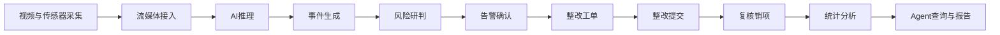
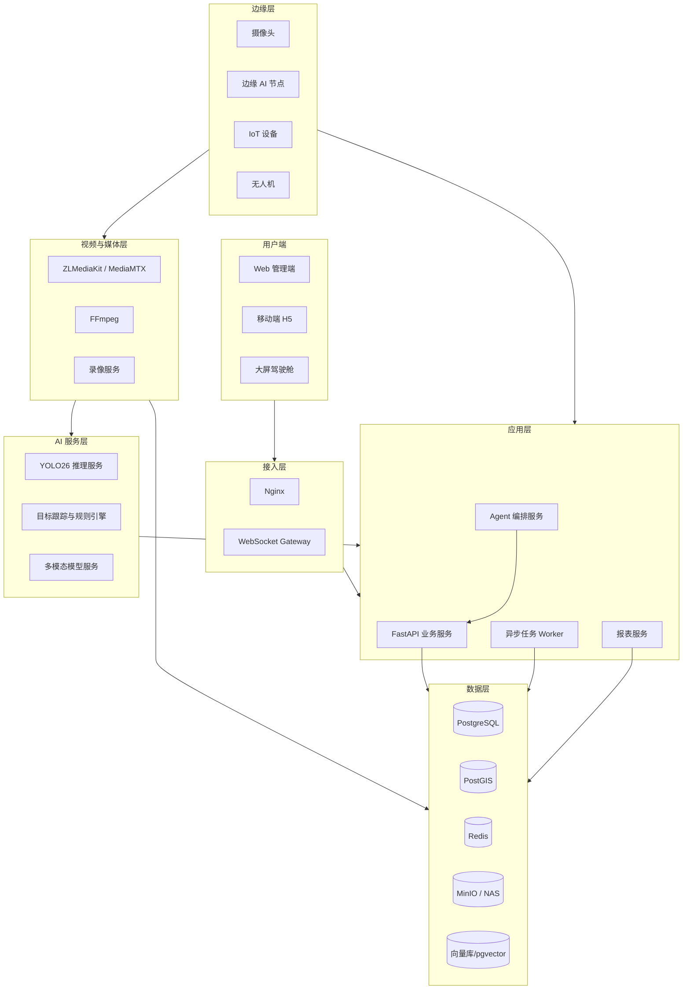
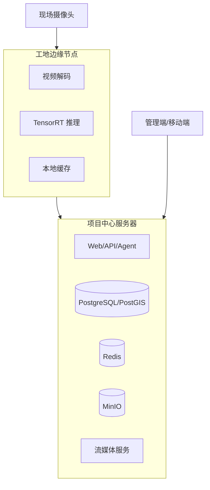
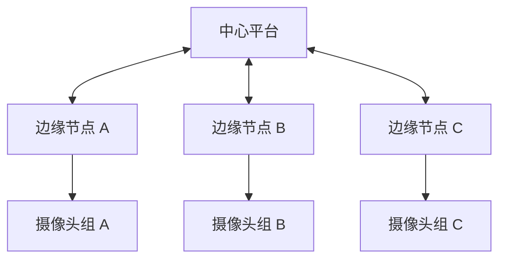
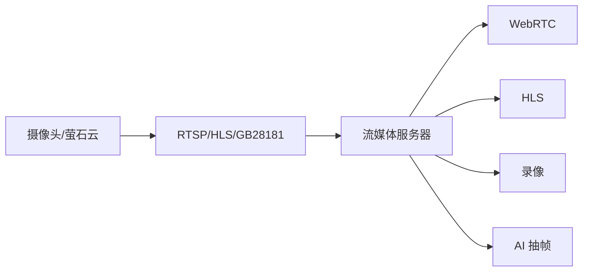
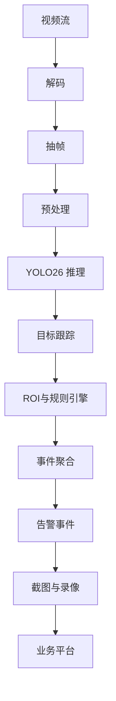
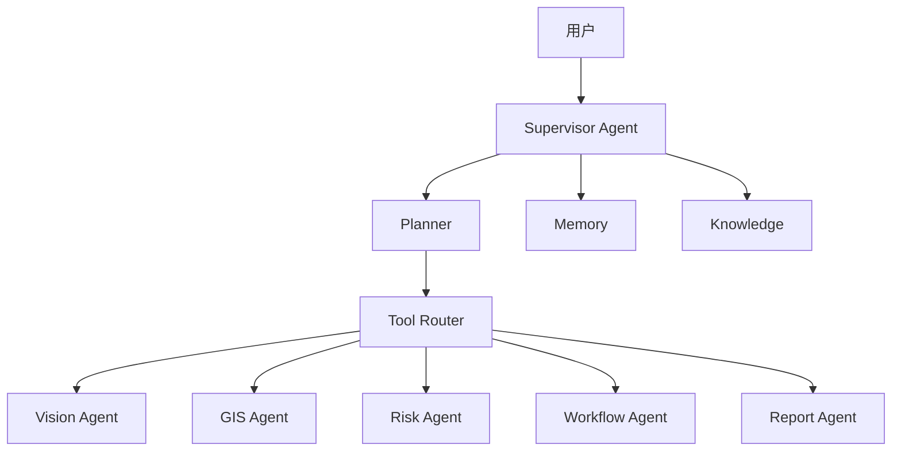

# BridgeAI-Site 系统架构设计 v1.0

> **产品名称：** BridgeAI-Site 智慧工地 AI Agent 平台  
> **文档类型：** 系统架构设计  
> **适用阶段：** 第一阶段 MVP  
> **编制单位：** 浙江悟联信息科技有限公司  
> **编制人：** 周仙通  
> **版本：** v1.0  
> **研发环境基线：** Mac Studio M3 Ultra + 512GB 统一内存 + PostgreSQL 本地部署  
> **生产部署原则：** 本地优先、私有化优先、边缘智能优先、云边端协同  
> **技术基线：** Vue 3 + FastAPI + PostgreSQL/PostGIS + Redis + MinIO + FFmpeg/ZLMediaKit + YOLO26 + ONNX/TensorRT/MLX + LangGraph/Google ADK

---

# 1. 文档目的

本文件用于定义 BridgeAI-Site 第一阶段 MVP 的总体系统架构、技术边界、服务拆分、数据流、部署方式、安全机制、可观测性与扩展策略。

本文件是以下文档和工作的上游依据：

1. PostgreSQL 数据库设计；
2. REST API 设计；
3. AI 算法服务设计；
4. Agent 详细设计；
5. Docker Compose 部署方案；
6. 边缘节点部署方案；
7. 测试方案；
8. 运维与监控方案；
9. 试点项目实施方案；
10. 后续微服务化演进。

---

# 2. 架构目标

## 2.1 业务目标

系统架构必须支撑以下核心闭环：



## 2.2 技术目标

系统需满足：

- 支持真实视频源接入；
- 支持单路、2×2、4×4 视频播放；
- 支持中心与边缘 AI 推理；
- 支持告警截图与事件录像；
- 支持 PostgreSQL/PostGIS 空间数据；
- 支持 Agent 调用业务工具；
- 支持私有化部署；
- 支持服务横向扩展；
- 支持关键操作审计；
- 支持后续无人机、人员、车辆、机械、环保和进度模块接入。

---

# 3. 架构原则

## 3.1 模块化优先

第一阶段采用“模块化单体 + 独立基础服务”模式。

原因：

- 开发速度快；
- 部署简单；
- 调试成本低；
- 适合 MVP；
- 避免过早微服务化；
- 为后续拆分保留边界。

建议第一阶段独立部署：

- Web 前端；
- API 服务；
- Agent 服务；
- AI 推理服务；
- Worker 服务；
- 流媒体服务；
- PostgreSQL；
- Redis；
- MinIO；
- Nginx。

---

## 3.2 业务与推理解耦

业务后端不直接承载视频解码和模型推理。

```text
业务 API
  ↓
推理任务接口
  ↓
AI 推理服务
  ↓
事件结果
  ↓
业务事件中心
```

这样可以独立扩展 GPU 推理节点。

---

## 3.3 视频与业务解耦

视频播放、转码、录像和 AI 抽帧由流媒体层负责，业务后端只维护：

- 摄像头元数据；
- 流地址；
- 播放授权；
- 录像索引；
- 事件媒体关系。

---

## 3.4 Agent 受控执行

Agent 不能直接绕过业务服务访问数据库进行高风险写操作。

推荐路径：

```text
用户请求
  ↓
Agent Planner
  ↓
工具调用
  ↓
业务 API
  ↓
权限校验
  ↓
审计记录
  ↓
执行结果
```

---

## 3.5 本地优先

研发与首期私有化部署优先基于本地环境：

- Mac Studio；
- PostgreSQL；
- MLX；
- 本地大模型；
- 本地对象存储；
- Docker；
- 局域网视频设备。

生产环境可切换到 NVIDIA GPU 边缘节点。

---

# 4. 总体逻辑架构



---

# 5. 物理部署架构

## 5.1 开发环境

开发环境建议：

```text
Mac Studio
├── bridgeai-site-web
├── bridgeai-site-api
├── bridgeai-site-agent
├── bridgeai-site-worker
├── PostgreSQL
├── Redis
├── MinIO
├── ZLMediaKit / MediaMTX
├── FFmpeg
├── MLX / PyTorch
└── 本地大模型
```

适用于：

- 产品研发；
- 单路或少量视频验证；
- Agent 开发；
- 数据库调试；
- UI 联调；
- 报表生成。

---

## 5.2 试点环境

建议部署为：



---

## 5.3 生产环境

生产环境建议采用中心平台 + 多边缘节点。



---

# 6. 服务划分

## 6.1 Web 前端服务

职责：

- 页面渲染；
- 用户交互；
- GIS；
- 视频播放；
- 告警处理；
- Agent 对话；
- 报表预览。

技术建议：

- Vue 3；
- Vite；
- TypeScript；
- Element Plus；
- Pinia；
- ECharts；
- OpenLayers；
- HLS.js；
- WebRTC。

---

## 6.2 API 业务服务

职责：

- 用户与权限；
- 项目；
- 区域；
- 摄像头；
- AI 任务配置；
- 告警；
- 工单；
- 报表；
- 审计；
- 文件授权；
- Agent 工具接口。

技术建议：

- FastAPI；
- Pydantic；
- SQLAlchemy；
- Alembic；
- JWT；
- RBAC。

---

## 6.3 Agent 编排服务

职责：

- 意图识别；
- 任务规划；
- 工具选择；
- 多 Agent 协同；
- 上下文管理；
- 用户确认；
- 输出整合；
- 运行审计。

建议 Agent：

- Supervisor Agent；
- Vision Agent；
- GIS Agent；
- Risk Agent；
- Workflow Agent；
- Knowledge Agent；
- Report Agent；
- Operations Agent。

---

## 6.4 Worker 异步服务

职责：

- 报表生成；
- 录像剪辑；
- 截图处理；
- 告警通知；
- 数据同步；
- 批量统计；
- 日报生成；
- 文件归档；
- 重试任务。

技术建议：

- Celery 或 Dramatiq；
- Redis；
- 定时任务调度器。

---

## 6.5 流媒体服务

职责：

- RTSP 拉流；
- HLS 输出；
- WebRTC 输出；
- 流转发；
- 录像；
- 视频状态检测；
- 断流重连；
- AI 抽帧源提供。

建议：

- ZLMediaKit；
- MediaMTX；
- FFmpeg。

---

## 6.6 AI 推理服务

职责：

- 视频解码后的帧输入；
- YOLO26 推理；
- 目标跟踪；
- ROI 规则；
- 事件判定；
- 置信度处理；
- 结果回调；
- 推理指标上报。

运行后端：

- PyTorch；
- ONNX Runtime；
- TensorRT；
- MLX。

---

## 6.7 报表服务

职责：

- 日报；
- 周报；
- 月报；
- 告警统计；
- 整改统计；
- PDF；
- Word；
- Excel。

---

# 7. 视频架构

## 7.1 视频接入链路



---

## 7.2 播放策略

优先级建议：

1. WebRTC：低延迟；
2. HLS：兼容性；
3. FLV：兼容某些旧浏览器场景。

---

## 7.3 录像架构

录像类型：

- 全天录像；
- 手动录像；
- 事件录像；
- 临时缓存。

事件录像策略：

```text
环形缓存
  ↓
AI 事件触发
  ↓
截取事件前 10 秒
  ↓
继续录制事件后 20 秒
  ↓
生成事件视频
  ↓
上传 MinIO/NAS
  ↓
写入 event_media
```

---

## 7.4 视频状态监测

应采集：

- 在线；
- 离线；
- 首帧时间；
- 帧率；
- 码率；
- 延迟；
- 最近心跳；
- 重连次数；
- 录像状态。

---

# 8. AI 推理架构

## 8.1 推理流水线



---

## 8.2 规则引擎

规则可包括：

- 类别匹配；
- 置信度阈值；
- ROI；
- 屏蔽区；
- 持续时长；
- 目标数量；
- 目标停留时间；
- 工作时段；
- 冷却时间；
- 目标跟踪 ID；
- 复合条件。

---

## 8.3 中心与边缘推理

### 中心推理

适用于：

- 稳定网络；
- 统一 GPU；
- 多模型；
- 集中管理。

### 边缘推理

适用于：

- 弱网；
- 低时延；
- 数据不出场；
- 工地现场。

---

## 8.4 模型发布流程

```text
模型训练
  ↓
验证
  ↓
导出 ONNX
  ↓
转换 TensorRT/其他引擎
  ↓
模型注册
  ↓
灰度发布
  ↓
运行监控
  ↓
回滚
```

---

# 9. Agent 架构

## 9.1 Agent 分层



---

## 9.2 工具接口

Agent 不直接访问数据库表，而调用业务工具：

```text
query_events
query_work_orders
query_camera_status
query_zone_risk
search_safety_knowledge
generate_daily_report
create_work_order_draft
export_report
```

---

## 9.3 写操作控制

写操作分级：

| 级别 | 示例 | 规则 |
|---|---|---|
| 低风险 | 查询、统计 | 自动执行 |
| 中风险 | 创建工单草稿 | 用户确认 |
| 高风险 | 正式派单、销项 | 强制人工审批 |
| 禁止 | 删除审计记录 | Agent 不可执行 |

---

## 9.4 Agent 审计

记录：

- 用户输入；
- Agent 计划；
- 工具调用；
- 工具参数；
- 返回结果；
- 模型输出；
- 用户确认；
- 最终结果；
- 失败原因；
- 耗时。

---

# 10. 数据架构

## 10.1 数据分类

### 主数据

- 企业；
- 项目；
- 标段；
- 区域；
- 摄像头；
- 用户；
- 角色；
- 班组。

### 业务数据

- AI 任务；
- AI 事件；
- 告警；
- 工单；
- 整改记录；
- 复核记录；
- 报表。

### 时序与运行数据

- 摄像头心跳；
- 推理指标；
- 服务状态；
- 设备告警；
- Worker 任务状态。

### 媒体数据

- 截图；
- 事件录像；
- 手动录像；
- 报表文件。

### 知识数据

- 安全规范；
- 企业制度；
- 案例；
- 处置建议；
- 向量索引。

---

## 10.2 PostgreSQL 使用方式

PostgreSQL 负责：

- 业务主数据；
- 告警与工单；
- 审计；
- 报表索引；
- Agent 运行记录；
- JSONB 配置；
- pgvector；
- PostGIS。

---

## 10.3 Redis 使用方式

Redis 负责：

- 缓存；
- Session；
- 分布式锁；
- 消息队列；
- Worker Broker；
- 短期状态；
- 限流；
- WebSocket 在线状态。

---

## 10.4 MinIO/NAS 使用方式

存储：

- 告警截图；
- 事件录像；
- 手动录像；
- 模型文件；
- 报表；
- 用户上传证据；
- 临时文件。

---

# 11. API 架构

## 11.1 API 风格

- REST 为主；
- WebSocket 用于实时事件；
- WebRTC/HLS 用于视频；
- 内部服务可使用 HTTP/gRPC；
- 所有接口版本化。

示例：

```text
/api/v1/auth
/api/v1/projects
/api/v1/cameras
/api/v1/events
/api/v1/work-orders
/api/v1/ai-tasks
/api/v1/reports
/api/v1/agent
```

---

## 11.2 API 网关职责

- TLS；
- 认证；
- 限流；
- CORS；
- 路由；
- 日志；
- 请求大小控制；
- 静态文件；
- 视频授权转发。

---

# 12. 实时消息架构

## 12.1 WebSocket 场景

- 实时告警；
- 摄像头状态；
- 工单状态；
- AI 推理状态；
- Agent 流式输出；
- 后台任务进度。

---

## 12.2 事件主题

建议：

```text
event.created
event.updated
camera.online
camera.offline
work_order.updated
ai_task.failed
report.generated
agent.tool_called
```

---

# 13. 安全架构

## 13.1 身份认证

建议：

- JWT；
- Refresh Token；
- 可选单点登录；
- 多因素认证预留；
- 登录失败锁定；
- 密码强度策略。

---

## 13.2 权限控制

采用：

- RBAC；
- 项目级权限；
- 数据级权限；
- 操作级权限；
- Agent 工具权限。

---

## 13.3 视频安全

- 播放地址不直接暴露；
- 使用临时 Token；
- 防盗链；
- 超时失效；
- 下载权限；
- 录像水印预留。

---

## 13.4 数据安全

- TLS；
- 敏感字段加密；
- 数据库备份；
- 对象存储权限；
- 操作审计；
- Agent 调用审计。

---

# 14. 可观测性架构

## 14.1 日志

日志类型：

- API 日志；
- 错误日志；
- AI 推理日志；
- 视频日志；
- Agent 日志；
- Worker 日志；
- 审计日志。

---

## 14.2 指标

建议采集：

- API QPS；
- API 延迟；
- 错误率；
- 视频在线率；
- 推理 FPS；
- 推理延迟；
- GPU/CPU；
- 队列长度；
- Worker 成功率；
- Agent 工具调用成功率；
- 报表生成耗时。

---

## 14.3 链路追踪

关键链路：

```text
视频事件
→ AI 推理
→ 规则判断
→ 业务事件
→ 工单
→ 消息推送
```

应保留统一 trace_id。

---

# 15. 高可用与容错

## 15.1 服务容错

- API 健康检查；
- 自动重启；
- Worker 重试；
- 视频自动重连；
- AI 节点心跳；
- Agent 工具超时；
- 数据库连接池；
- Redis 异常降级。

---

## 15.2 边缘离线策略

边缘节点断网时：

1. 本地继续推理；
2. 本地缓存事件；
3. 本地保存截图；
4. 网络恢复后补传；
5. 防止重复事件；
6. 记录同步状态。

---

## 15.3 数据备份

建议：

- PostgreSQL 每日备份；
- 关键配置版本化；
- MinIO/NAS 增量备份；
- 高风险事件长期保存；
- 恢复演练。

---

# 16. 性能与容量规划

## 16.1 第一阶段目标

- 16 路视频接入；
- 4 路并行 AI 推理；
- 100 个注册用户；
- 20 个并发用户；
- 10 万条事件数据；
- 30 天快速查询；
- 单页响应小于 2 秒；
- 端到端告警小于 5 秒。

---

## 16.2 容量估算

主要容量来源：

- 录像；
- 截图；
- 推理日志；
- 设备心跳；
- AI 事件；
- 审计日志。

录像容量应单独估算，不应与数据库存储混合。

---

# 17. Docker 服务设计

建议服务：

```text
bridgeai-site-web
bridgeai-site-api
bridgeai-site-agent
bridgeai-site-worker
bridgeai-site-ai
bridgeai-site-media
bridgeai-site-postgres
bridgeai-site-redis
bridgeai-site-minio
bridgeai-site-nginx
```

---

## 17.1 网络划分

```text
frontend_net
backend_net
data_net
media_net
```

数据库与 Redis 不应直接暴露公网。

---

## 17.2 数据卷

```text
postgres_data
redis_data
minio_data
media_recordings
model_store
logs
```

---

# 18. 版本与配置管理

## 18.1 配置分类

- 环境配置；
- 数据库配置；
- 视频配置；
- AI 参数；
- Agent 参数；
- 存储配置；
- 安全配置；
- 日志配置。

---

## 18.2 配置原则

- 环境变量；
- 不提交密钥；
- 配置分环境；
- 模型参数版本化；
- 支持回滚；
- 关键变更审计。

---

# 19. 扩展路线

## 19.1 第二阶段扩展

- 人员实名制；
- 车辆；
- 机械；
- 环境监测；
- 进度；
- 质量；
- BIM；
- 无人机。

---

## 19.2 架构演进

第一阶段：

```text
模块化单体 + 独立基础服务
```

第二阶段：

```text
按业务域拆分服务
```

第三阶段：

```text
多项目、多租户、跨区域边缘节点
```

---

# 20. 关键技术决策

## 20.1 为什么使用 FastAPI

- Python AI 生态兼容；
- 异步支持；
- 开发效率高；
- OpenAPI 自动生成；
- 与 Agent 和推理服务协同方便。

---

## 20.2 为什么使用 PostgreSQL/PostGIS

- 业务数据可靠；
- 空间数据支持；
- JSONB；
- pgvector；
- 统一数据底座；
- 本地部署成熟。

---

## 20.3 为什么采用 ZLMediaKit/MediaMTX

- 视频协议兼容；
- 转封装；
- WebRTC/HLS；
- 录像；
- 部署灵活。

---

## 20.4 为什么采用 YOLO26 多后端

- 研发可使用 PyTorch/MLX；
- 中心可使用 ONNX Runtime；
- 边缘可使用 TensorRT；
- 统一模型版本管理。

---

## 20.5 为什么 Agent 通过工具访问业务

- 权限可控；
- 结果可审计；
- 避免直接写数据库；
- 可替换底层实现；
- 降低大模型风险。

---

# 21. 架构验收标准

## 21.1 功能架构验收

- 服务边界明确；
- API 与前端职责清晰；
- 视频与业务解耦；
- AI 与业务解耦；
- Agent 工具调用受控；
- 数据存储职责清晰。

---

## 21.2 部署验收

- Docker Compose 可启动；
- 服务健康检查通过；
- 数据卷持久化；
- Nginx 路由正常；
- PostgreSQL/Redis 不暴露公网；
- 日志可查询；
- 服务可自动重启。

---

## 21.3 视频架构验收

- RTSP/HLS 可接入；
- WebRTC/HLS 可播放；
- 断流可重连；
- 录像可保存；
- 事件录像可生成；
- 播放地址受控。

---

## 21.4 AI 架构验收

- 模型可注册；
- 推理服务可独立部署；
- 推理结果可回调；
- 规则引擎可配置；
- 事件可去重；
- 推理指标可监控。

---

## 21.5 Agent 架构验收

- 工具接口清晰；
- 查询类操作可执行；
- 写操作需要确认；
- 调用过程可追踪；
- 失败可回退；
- 结果有数据来源。

---

# 22. 与后续文档关系

```text
系统架构设计
    ↓
PostgreSQL 数据库设计
    ↓
REST API 设计
    ↓
AI 算法设计
    ↓
Agent 详细设计
    ↓
部署方案
    ↓
测试方案
```

---

# 23. 总结

BridgeAI-Site 第一阶段采用“模块化单体 + 独立视频、AI、Agent 和数据服务”的架构模式，兼顾开发效率、工程稳定性和后续扩展能力。

系统核心架构思想包括：

1. 视频、AI 和业务解耦；
2. 中心与边缘协同；
3. PostgreSQL/PostGIS 作为统一数据底座；
4. Agent 通过受控工具访问业务；
5. 所有关键链路可审计、可监控、可回放；
6. 优先支持私有化部署；
7. 为无人机、人员、车辆、机械和质量进度扩展预留接口。

本架构完成后，BridgeAI-Site 已具备进入数据库设计、API 设计和开发实施阶段的技术基础。
