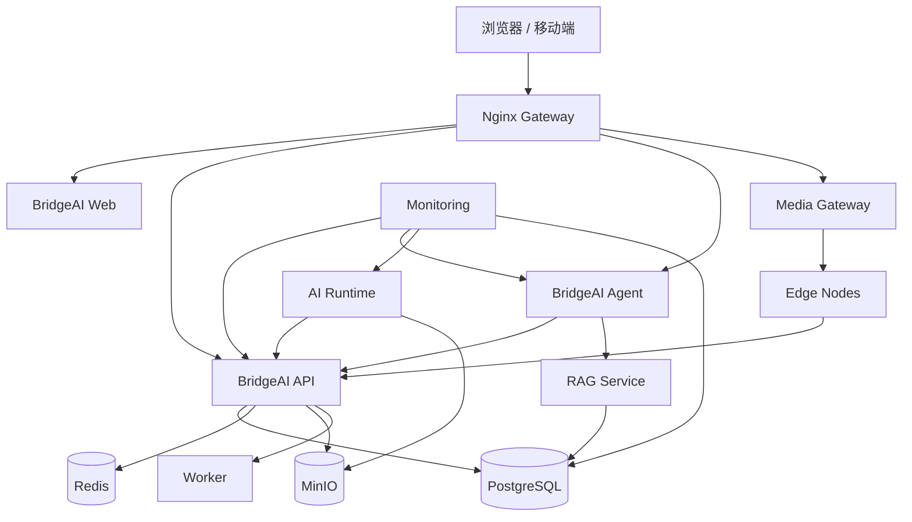

# BridgeAI-Site 部署与运维设计 v1.0

> **产品名称：** BridgeAI-Site 智慧工地 AI Agent 平台  
> **文档类型：** 企业级部署、运行维护与交付设计  
> **编制单位：** 浙江悟联信息科技有限公司  
> **编制人：** 周仙通  
> **版本：** v1.0  
> **适用范围：** 开发、测试、试点、生产、边缘节点及灾备环境  
> **默认研发环境：** Mac Studio，Apple M3 Ultra，512GB 统一内存，8TB SSD  
> **基础设施基线：** Docker Compose + Nginx + FastAPI + PostgreSQL + PostGIS + pgvector + Redis + MinIO  
> **智能能力基线：** BridgeAI Vision Engine + BridgeAI Agent Runtime  
> **边缘部署基线：** NVIDIA TensorRT / DJI Manifold 3 / ONNX Runtime / MLX  
> **运维目标：** 可部署、可观测、可恢复、可升级、可回滚、可审计

---

# 1. 文档目的

本文件用于定义 BridgeAI-Site 从本地开发、测试验证、现场试点到正式生产运行的完整部署和运维体系。

文档重点覆盖：

1. 环境与拓扑规划；
2. Docker Compose 标准部署；
3. Nginx 网关；
4. PostgreSQL、PostGIS 与 pgvector；
5. Redis；
6. MinIO；
7. 视频流媒体；
8. AI Runtime；
9. Agent Runtime；
10. RAG 知识库；
11. 日志、监控、告警和链路追踪；
12. 备份、恢复和灾备；
13. CI/CD、灰度发布和回滚；
14. 工地边缘节点；
15. DJI Manifold 3；
16. 运维 SOP；
17. 故障手册；
18. 运维验收。

本文件既是研发人员的部署依据，也是项目交付、现场实施、日常运维和故障响应的标准手册。

---

# 2. 系统部署目标

BridgeAI-Site 部署体系需要满足以下目标：

- 支持 Mac Studio 本地研发；
- 支持单机 Docker Compose 试点；
- 支持多机生产部署；
- 支持中心与边缘协同；
- 支持视频、AI、Agent、GIS、工单和报表业务；
- 支持断网运行和恢复补传；
- 支持模型、Prompt、规则和配置版本管理；
- 支持一键回滚；
- 支持完整日志和审计；
- 支持后续迁移到 Kubernetes。

---

# 3. 部署设计原则

## 3.1 私有化优先

涉及工地视频、事件、人员、设备和企业知识时，应优先部署在企业或项目私有网络中。

## 3.2 容器化

除明确要求宿主机运行的 GPU、视频驱动或 DJI DPK 组件外，核心服务均应容器化。

## 3.3 服务解耦

以下服务独立部署：

- Web；
- API；
- Agent；
- AI Runtime；
- Worker；
- Media；
- PostgreSQL；
- Redis；
- MinIO；
- Nginx；
- 监控与日志。

## 3.4 无状态应用

Web、API、Agent Gateway 和普通 Worker 应尽量无状态，状态存入 PostgreSQL、Redis 或对象存储。

## 3.5 数据持久化

所有关键数据必须使用宿主机卷、命名卷或独立存储。

## 3.6 最小暴露

PostgreSQL、Redis、MinIO 内部端口和内部 AI 服务默认不暴露公网。

## 3.7 可观测

每个服务必须提供：

- 健康检查；
- 指标；
- 日志；
- Trace；
- 版本信息；
- 依赖状态。

## 3.8 可恢复

任何关键服务部署和升级前，必须具备：

- 备份；
- 回滚；
- 恢复；
- 验证步骤。

---

# 4. 环境分层

## 4.1 本地开发环境

默认硬件：

- Mac Studio；
- Apple M3 Ultra；
- 512GB 统一内存；
- 8TB SSD。

建议软件：

```text
macOS
Homebrew
Docker Desktop 或 OrbStack
Python 3.12
uv
Node.js LTS
pnpm
PostgreSQL
Redis
MinIO
FFmpeg
MLX
Ollama
Git
```

用途：

- 后端和前端开发；
- PostgreSQL 数据设计；
- Agent 调试；
- MLX 推理；
- API 联调；
- RAG 构建；
- 容器部署验证；
- 模型导出前测试。

## 4.2 集成测试环境

建议：

```text
Ubuntu Server 24.04 LTS
8～16 CPU
32～64GB RAM
500GB SSD
Docker Engine
Docker Compose
```

需要 AI 测试时增加 NVIDIA GPU。

## 4.3 试点环境

典型单机试点：

```text
16～32 CPU
64～128GB RAM
1～2TB NVMe
NVIDIA GPU 16GB+
Ubuntu Server
```

试点可在同一主机运行全部服务。

## 4.4 生产环境

建议至少拆分为：

1. 网关与业务应用节点；
2. 数据库节点；
3. 对象存储节点；
4. AI 推理节点；
5. Agent 与 RAG 节点；
6. 监控日志节点；
7. 边缘节点。

---

# 5. 逻辑部署架构



---

# 6. 服务清单

| 服务 | 主要职责 |
|---|---|
| bridgeai-web | Vue/React 前端 |
| bridgeai-api | FastAPI 业务接口 |
| bridgeai-agent | Supervisor 与专业 Agent |
| bridgeai-ai-runtime | BVE 推理服务 |
| bridgeai-worker | 异步任务、报表、媒体处理 |
| bridgeai-media | 视频转流与播放 |
| postgres | 业务数据、GIS、向量数据 |
| redis | 缓存、队列、Session、短期记忆 |
| minio | 截图、录像、模型、报表、附件 |
| nginx | HTTPS、反向代理、WebSocket |
| prometheus | 指标采集 |
| grafana | 监控驾驶舱 |
| loki | 日志聚合 |
| promtail | 日志采集 |
| otel-collector | OpenTelemetry |
| node-exporter | 宿主机指标 |
| gpu-exporter | NVIDIA GPU 指标 |

---

# 7. 目录结构

建议生产部署目录：

```text
/opt/bridgeai-site/
├── compose/
│   ├── docker-compose.yml
│   ├── docker-compose.monitoring.yml
│   └── .env
├── nginx/
│   ├── nginx.conf
│   ├── conf.d/
│   └── certs/
├── postgres/
│   ├── init/
│   ├── backup/
│   └── archive/
├── redis/
├── minio/
├── models/
├── prompts/
├── rules/
├── media/
├── logs/
├── monitoring/
│   ├── prometheus/
│   ├── grafana/
│   ├── loki/
│   └── otel/
├── scripts/
└── releases/
```

权限建议：

```bash
sudo chown -R bridgeai:bridgeai /opt/bridgeai-site
sudo chmod -R 750 /opt/bridgeai-site
```

---

# 8. 环境变量设计

示例 `.env`：

```dotenv
COMPOSE_PROJECT_NAME=bridgeai-site
APP_ENV=production
APP_VERSION=1.0.0
TZ=Asia/Shanghai

POSTGRES_DB=bridgeai_site
POSTGRES_USER=bridgeai
POSTGRES_PASSWORD=CHANGE_ME
POSTGRES_HOST=postgres
POSTGRES_PORT=5432

REDIS_HOST=redis
REDIS_PORT=6379
REDIS_PASSWORD=CHANGE_ME

MINIO_ENDPOINT=minio:9000
MINIO_ACCESS_KEY=CHANGE_ME
MINIO_SECRET_KEY=CHANGE_ME
MINIO_BUCKET_MEDIA=bridgeai-media
MINIO_BUCKET_MODELS=bridgeai-models
MINIO_BUCKET_REPORTS=bridgeai-reports

JWT_SECRET=CHANGE_ME
API_BASE_URL=http://bridgeai-api:8000
AGENT_BASE_URL=http://bridgeai-agent:8100
AI_RUNTIME_URL=http://bridgeai-ai-runtime:8200

LOG_LEVEL=INFO
OTEL_EXPORTER_OTLP_ENDPOINT=http://otel-collector:4317
```

要求：

- `.env` 不提交 Git；
- 生产密码不能使用示例值；
- 密钥变更应有记录；
- 环境变量模板使用 `.env.example`；
- 敏感字段通过 Secrets 系统管理。

---

# 9. Docker Compose 生产基线

```yaml
services:
  postgres:
    image: postgis/postgis:16-3.4
    restart: unless-stopped
    env_file: .env
    environment:
      POSTGRES_DB: ${POSTGRES_DB}
      POSTGRES_USER: ${POSTGRES_USER}
      POSTGRES_PASSWORD: ${POSTGRES_PASSWORD}
    volumes:
      - postgres_data:/var/lib/postgresql/data
      - ./postgres/init:/docker-entrypoint-initdb.d:ro
      - ./postgres/backup:/backup
    healthcheck:
      test: ["CMD-SHELL", "pg_isready -U ${POSTGRES_USER} -d ${POSTGRES_DB}"]
      interval: 10s
      timeout: 5s
      retries: 10
    networks: [backend]

  redis:
    image: redis:7.4-alpine
    restart: unless-stopped
    command:
      - redis-server
      - --appendonly
      - "yes"
      - --requirepass
      - ${REDIS_PASSWORD}
    volumes:
      - redis_data:/data
    healthcheck:
      test: ["CMD", "redis-cli", "-a", "${REDIS_PASSWORD}", "PING"]
      interval: 10s
      timeout: 5s
      retries: 10
    networks: [backend]

  minio:
    image: minio/minio:latest
    restart: unless-stopped
    command: server /data --console-address ":9001"
    env_file: .env
    environment:
      MINIO_ROOT_USER: ${MINIO_ACCESS_KEY}
      MINIO_ROOT_PASSWORD: ${MINIO_SECRET_KEY}
    volumes:
      - minio_data:/data
    healthcheck:
      test: ["CMD", "curl", "-f", "http://localhost:9000/minio/health/live"]
      interval: 10s
      timeout: 5s
      retries: 10
    networks: [backend]

  bridgeai-api:
    image: ghcr.io/example/bridgeai-api:${APP_VERSION}
    restart: unless-stopped
    env_file: .env
    depends_on:
      postgres:
        condition: service_healthy
      redis:
        condition: service_healthy
      minio:
        condition: service_healthy
    expose: ["8000"]
    healthcheck:
      test: ["CMD", "curl", "-f", "http://localhost:8000/health"]
      interval: 15s
      timeout: 5s
      retries: 5
    networks: [backend]

  bridgeai-agent:
    image: ghcr.io/example/bridgeai-agent:${APP_VERSION}
    restart: unless-stopped
    env_file: .env
    depends_on:
      bridgeai-api:
        condition: service_healthy
    expose: ["8100"]
    healthcheck:
      test: ["CMD", "curl", "-f", "http://localhost:8100/health"]
      interval: 15s
      timeout: 5s
      retries: 5
    networks: [backend]

  bridgeai-ai-runtime:
    image: ghcr.io/example/bridgeai-ai-runtime:${APP_VERSION}
    restart: unless-stopped
    env_file: .env
    volumes:
      - ./models:/models:ro
      - ./rules:/rules:ro
    expose: ["8200"]
    healthcheck:
      test: ["CMD", "curl", "-f", "http://localhost:8200/health"]
      interval: 15s
      timeout: 5s
      retries: 5
    networks: [backend]

  bridgeai-worker:
    image: ghcr.io/example/bridgeai-worker:${APP_VERSION}
    restart: unless-stopped
    env_file: .env
    depends_on:
      redis:
        condition: service_healthy
      postgres:
        condition: service_healthy
    networks: [backend]

  bridgeai-web:
    image: ghcr.io/example/bridgeai-web:${APP_VERSION}
    restart: unless-stopped
    expose: ["80"]
    networks: [frontend]

  nginx:
    image: nginx:1.27-alpine
    restart: unless-stopped
    ports:
      - "80:80"
      - "443:443"
    volumes:
      - ./nginx/nginx.conf:/etc/nginx/nginx.conf:ro
      - ./nginx/conf.d:/etc/nginx/conf.d:ro
      - ./nginx/certs:/etc/nginx/certs:ro
    depends_on:
      - bridgeai-web
      - bridgeai-api
      - bridgeai-agent
    networks: [frontend, backend]

networks:
  frontend:
  backend:
    internal: true

volumes:
  postgres_data:
  redis_data:
  minio_data:
```

说明：

- 生产环境应固定镜像版本，不建议使用 `latest`；
- GPU 节点需增加 NVIDIA Runtime 配置；
- 对象存储、数据库和监控可拆分到独立主机；
- 健康检查不可仅检查端口，应检查业务依赖。

---

# 10. Nginx 网关设计

## 10.1 主要职责

- HTTPS；
- 域名；
- 静态资源；
- API 反向代理；
- Agent 流式输出；
- WebSocket；
- 视频代理；
- 限流；
- 安全响应头；
- 访问日志。

## 10.2 配置示例

```nginx
upstream bridgeai_api {
    server bridgeai-api:8000;
    keepalive 64;
}

upstream bridgeai_agent {
    server bridgeai-agent:8100;
    keepalive 32;
}

server {
    listen 80;
    server_name site.example.com;
    return 301 https://$host$request_uri;
}

server {
    listen 443 ssl http2;
    server_name site.example.com;

    ssl_certificate     /etc/nginx/certs/fullchain.pem;
    ssl_certificate_key /etc/nginx/certs/privkey.pem;

    client_max_body_size 2g;

    location / {
        proxy_pass http://bridgeai-web;
    }

    location /api/ {
        proxy_pass http://bridgeai_api;
        proxy_set_header Host $host;
        proxy_set_header X-Real-IP $remote_addr;
        proxy_set_header X-Request-ID $request_id;
        proxy_set_header X-Forwarded-Proto $scheme;
    }

    location /agent/ {
        proxy_pass http://bridgeai_agent;
        proxy_http_version 1.1;
        proxy_buffering off;
        proxy_read_timeout 300s;
        proxy_set_header Connection "";
        proxy_set_header X-Request-ID $request_id;
    }

    location /ws/ {
        proxy_pass http://bridgeai_api;
        proxy_http_version 1.1;
        proxy_set_header Upgrade $http_upgrade;
        proxy_set_header Connection "upgrade";
        proxy_read_timeout 3600s;
    }
}
```

---

# 11. HTTPS 与证书

推荐方式：

- 公网：ACME/Let's Encrypt；
- 内网：企业 CA；
- 政企专网：指定证书体系。

证书运维要求：

- 记录到期时间；
- 到期前 30 天告警；
- 私钥权限 `600`；
- 禁止上传代码仓库；
- 证书更新后执行 Nginx reload；
- 保留上一版证书用于应急回退。

---

# 12. PostgreSQL 设计

## 12.1 扩展

```sql
CREATE EXTENSION IF NOT EXISTS postgis;
CREATE EXTENSION IF NOT EXISTS vector;
CREATE EXTENSION IF NOT EXISTS pg_trgm;
CREATE EXTENSION IF NOT EXISTS btree_gist;
```

## 12.2 参数建议

生产起始值应根据内存和负载调优：

```conf
shared_buffers = 25% RAM
effective_cache_size = 60% RAM
work_mem = 16MB
maintenance_work_mem = 1GB
wal_compression = on
max_wal_size = 8GB
checkpoint_timeout = 15min
autovacuum = on
track_io_timing = on
shared_preload_libraries = 'pg_stat_statements'
```

Mac Studio 本地开发不建议盲目给数据库分配过大内存，应保留 AI、Agent 和 Docker 的统一内存空间。

## 12.3 连接池

建议：

- API 使用 SQLAlchemy Pool；
- 生产可部署 PgBouncer；
- 普通事务连接池模式；
- Agent 和报表大查询分池；
- 设置连接超时和语句超时。

## 12.4 表分区

建议对以下表按月分区：

- AI 事件；
- 推理日志；
- 摄像头状态历史；
- Agent Tool Call；
- 审计日志；
- 系统指标。

## 12.5 维护

每日：

```sql
ANALYZE;
```

自动 Vacuum 保持开启。

定期检查：

- 死元组；
- 长事务；
- 锁等待；
- 无效索引；
- 表膨胀；
- 慢 SQL。

## 12.6 慢查询

启用：

```conf
log_min_duration_statement = 1000
```

生产中根据负载设置 500～2000ms。

---

# 13. PostgreSQL 备份

## 13.1 逻辑备份

```bash
pg_dump -Fc \
  -h postgres \
  -U bridgeai \
  -d bridgeai_site \
  -f /backup/bridgeai_site_$(date +%F_%H%M).dump
```

## 13.2 恢复

```bash
createdb bridgeai_site_restore
pg_restore \
  -U bridgeai \
  -d bridgeai_site_restore \
  --clean \
  --if-exists \
  backup.dump
```

## 13.3 PITR

正式生产建议：

- 开启归档；
- 保存 WAL；
- 定期基础备份；
- 支持时间点恢复。

## 13.4 备份校验

备份成功不等于可恢复。

每月至少执行一次：

```text
备份
→ 新实例恢复
→ 数据量核对
→ 关键表核对
→ API 冒烟测试
→ 记录结果
```

---

# 14. Redis 运维

## 14.1 用途

- 用户 Session；
- API 缓存；
- Agent 短期记忆；
- 任务队列；
- 分布式锁；
- Pub/Sub；
- 限流。

## 14.2 持久化

建议开启：

```text
AOF
+
RDB
```

## 14.3 内存策略

缓存实例可使用：

```text
allkeys-lru
```

任务队列和 Agent 状态不应与纯缓存共用同一淘汰策略。

## 14.4 监控

重点：

- used_memory；
- evicted_keys；
- hit_rate；
- blocked_clients；
- connected_clients；
- replication_lag；
- command_latency。

---

# 15. MinIO 对象存储

## 15.1 Bucket 设计

```text
bridgeai-media
bridgeai-events
bridgeai-models
bridgeai-reports
bridgeai-documents
bridgeai-backups
```

## 15.2 对象路径

```text
events/{project_id}/{yyyy}/{mm}/{dd}/{event_id}/snapshot.jpg
events/{project_id}/{yyyy}/{mm}/{dd}/{event_id}/clip.mp4
models/{model_name}/{version}/model.engine
reports/{project_id}/{yyyy}/{mm}/{report_id}.pdf
```

## 15.3 生命周期

建议：

| 数据 | 热存储 | 归档/删除 |
|---|---:|---:|
| 普通事件截图 | 180 天 | 项目策略 |
| 高风险证据 | 1 年以上 | 长期 |
| 事件录像 | 90～365 天 | 项目策略 |
| 临时导出 | 7 天 | 自动删除 |
| 模型 | 长期 | 不自动删除 |
| 报表 | 长期 | 不自动删除 |

## 15.4 安全

- Bucket 默认私有；
- 使用短时签名 URL；
- 管理端口仅内网；
- 定期轮换密钥；
- 下载记录审计；
- 高风险证据防删除。

---

# 16. 视频流媒体部署

## 16.1 支持协议

- RTSP；
- HLS；
- WebRTC；
- GB28181 转流；
- 萤石云接入；
- 本地文件回放。

## 16.2 推荐架构

```text
摄像头/萤石云
→ Media Gateway
→ AI Runtime
→ WebRTC/HLS
→ 浏览器
```

## 16.3 运维指标

- 拉流成功率；
- 首帧时间；
- 卡顿率；
- 丢帧；
- 音视频同步；
- 码率；
- 解码错误；
- 重连次数。

## 16.4 断流恢复

建议：

```text
首次失败：1秒后重试
连续失败：指数退避
超过阈值：标记离线
恢复成功：更新状态并记录恢复时间
```

---

# 17. AI Runtime 部署

## 17.1 后端

支持：

- PyTorch；
- ONNX Runtime；
- TensorRT；
- MLX。

## 17.2 模型目录

```text
/models/
├── ppe/
│   └── v1.0.0/
├── fire_smoke/
│   └── v1.2.0/
└── vehicle/
    └── v1.0.0/
```

每个模型版本包含：

```text
model file
metadata.json
labels.yaml
preprocess.yaml
runtime.yaml
checksum.sha256
```

## 17.3 启动流程

```text
读取模型注册信息
→ 校验 checksum
→ 校验 Runtime 兼容性
→ 加载模型
→ Warmup
→ 自检
→ 注册节点
→ 接收任务
```

## 17.4 模型 Warmup

至少执行：

- 固定尺寸；
- 最大 Batch；
- 多次推理；
- 显存稳定性；
- 输出 Schema 校验。

## 17.5 GPU 调度

任务分配考虑：

- GPU 型号；
- 显存；
- 当前利用率；
- 模型驻留；
- 视频数量；
- 目标 FPS；
- 优先级。

## 17.6 OOM 处理

```text
发现 OOM
→ 暂停接收新任务
→ 清理缓存
→ 降低 Batch/FPS
→ 重启 Worker
→ 恢复高优先级任务
→ 记录故障
```

## 17.7 AI 指标

```text
bridgeai_ai_inference_latency_seconds
bridgeai_ai_frames_total
bridgeai_ai_dropped_frames_total
bridgeai_ai_events_total
bridgeai_ai_queue_size
bridgeai_ai_model_load_seconds
bridgeai_ai_model_errors_total
bridgeai_ai_streams_active
```

---

# 18. Apple Silicon 与 MLX

Mac Studio 研发建议：

- 原生 arm64 镜像；
- 避免不必要的 x86 模拟；
- 使用 MLX 做本地模型实验；
- FFmpeg 使用 VideoToolbox；
- 关注统一内存占用；
- 大模型、视频和数据库并行时设置资源上限；
- 长时间推理需要温度和系统稳定性观察。

容器中无法直接等价利用所有 Metal/MLX 能力时，可将 MLX Runtime 作为宿主机服务，通过本地 API 与容器系统连接。

---

# 19. NVIDIA TensorRT

## 19.1 固定链路

```text
训练 .pt
→ Windows WSL 导出 ONNX
→ SSH 到目标边缘设备
→ 设备侧转换 TensorRT Engine
→ 部署验证
```

## 19.2 兼容性

Engine 元数据必须记录：

- GPU；
- Compute Capability；
- TensorRT；
- CUDA；
- 输入尺寸；
- 精度；
- 动态 Shape；
- 构建时间；
- checksum。

不同设备或 TensorRT 版本的 Engine 不应直接混用。

---

# 20. Agent Runtime 部署

## 20.1 组件

- Agent API；
- Supervisor；
- Planner；
- Router；
- 专业 Agent；
- Tool Registry；
- Memory；
- RAG；
- Policy；
- Audit；
- Evaluation。

## 20.2 健康检查

`/health` 至少检查：

- 进程；
- PostgreSQL；
- Redis；
- Business API；
- 模型服务；
- RAG；
- Tool Registry。

应区分：

```text
liveness
readiness
dependency health
```

## 20.3 Agent 指标

```text
bridgeai_agent_runs_total
bridgeai_agent_run_latency_seconds
bridgeai_agent_tool_calls_total
bridgeai_agent_tool_failures_total
bridgeai_agent_confirmations_total
bridgeai_agent_tokens_total
bridgeai_agent_rag_hits_total
bridgeai_agent_no_answer_total
bridgeai_agent_loop_limit_total
```

## 20.4 检查点

长任务保存：

- 当前步骤；
- 已完成工具；
- 中间结果；
- 待确认项；
- Trace ID；
- 幂等键。

---

# 21. RAG 部署

## 21.1 组件

- 文档上传；
- 文档解析 Worker；
- Chunk；
- Embedding；
- pgvector；
- 关键词索引；
- Reranker；
- 引用生成。

## 21.2 运维

监控：

- 待处理文档数；
- 解析失败；
- Embedding 延迟；
- 索引版本；
- 检索命中率；
- 无引用回答；
- 文档权限异常。

## 21.3 索引升级

```text
创建新索引版本
→ 后台构建
→ 抽样验证
→ 灰度切换
→ 全量切换
→ 保留旧索引
```

---

# 22. 日志规范

## 22.1 结构化日志

统一 JSON：

```json
{
  "timestamp": "2026-07-23T10:00:00+08:00",
  "level": "INFO",
  "service": "bridgeai-agent",
  "trace_id": "trace_xxx",
  "request_id": "req_xxx",
  "project_id": "uuid",
  "event": "tool_succeeded",
  "message": "query_events completed",
  "duration_ms": 120
}
```

## 22.2 禁止日志内容

不得记录：

- 密码；
- JWT；
- MinIO Secret；
- 摄像头密码；
- 完整 RTSP 凭据；
- 大段原始个人敏感信息。

## 22.3 日志级别

- DEBUG：开发；
- INFO：正常业务；
- WARNING：可恢复异常；
- ERROR：业务失败；
- CRITICAL：系统不可用。

---

# 23. Loki 日志中心

推荐：

```text
Docker logs / files
→ Promtail
→ Loki
→ Grafana
```

标签建议：

- service；
- environment；
- host；
- project；
- level。

不应把高基数字段如 `trace_id` 全部作为 Loki 标签，可保留在日志正文中查询。

---

# 24. OpenTelemetry

## 24.1 Trace 链路

```text
Browser
→ Nginx
→ API
→ Agent
→ Tool
→ Business API
→ PostgreSQL
```

## 24.2 统一字段

- trace_id；
- span_id；
- request_id；
- user_id；
- project_id；
- service；
- operation。

## 24.3 采样

- 错误请求：100%；
- 高风险写操作：100%；
- 普通查询：按比例；
- AI 长链路：重点采样。

---

# 25. Prometheus 监控

## 25.1 系统

- CPU；
- 内存；
- 磁盘；
- 网络；
- Load；
- 文件句柄；
- 容器重启。

## 25.2 API

- QPS；
- P50/P95/P99；
- 4xx/5xx；
- 并发；
- DB Pool；
- 队列。

## 25.3 PostgreSQL

- 活跃连接；
- 事务；
- 锁；
- Cache Hit；
- WAL；
- Replication Lag；
- Vacuum；
- 慢 SQL。

## 25.4 Redis

- 内存；
- 命中率；
- 驱逐；
- 阻塞客户端；
- 延迟。

## 25.5 MinIO

- 存储容量；
- 请求失败；
- 延迟；
- 磁盘状态；
- Bucket 用量。

## 25.6 AI

- FPS；
- 延迟；
- GPU；
- 显存；
- Queue；
- 丢帧；
- 事件数；
- 模型加载失败。

## 25.7 Agent

- Run；
- Tool；
- Token；
- RAG；
- Confirmation；
- Failure；
- Loop Limit。

---

# 26. Grafana 驾驶舱

建议至少建立：

## 26.1 系统总览

- 服务健康；
- CPU、内存、磁盘；
- API 成功率；
- 摄像头在线率；
- AI 任务数；
- Agent 成功率；
- 未处理告警。

## 26.2 AI Runtime

- GPU；
- 模型；
- FPS；
- 推理延迟；
- 视频队列；
- OOM；
- 事件吞吐。

## 26.3 Agent

- Agent Run；
- P95 延迟；
- Tool 成功率；
- RAG 命中；
- Token；
- 确认率；
- 失败原因。

## 26.4 PostgreSQL

- 连接；
- 慢 SQL；
- Lock；
- Cache Hit；
- WAL；
- 表膨胀。

## 26.5 业务运维

- 摄像头；
- AI 任务；
- 事件；
- 工单；
- 报表；
- 边缘节点。

---

# 27. 告警设计

## 27.1 分级

```text
P1：核心系统不可用或重大数据风险
P2：关键功能降级
P3：一般异常
P4：提示与容量趋势
```

## 27.2 示例

| 告警 | 等级 |
|---|---:|
| PostgreSQL 不可用 | P1 |
| MinIO 不可用 | P1 |
| 多个 AI 节点离线 | P1 |
| 单节点 GPU OOM | P2 |
| 摄像头连续离线 | P2 |
| Agent Tool 失败率升高 | P2 |
| 磁盘使用率 > 85% | P2 |
| 证书 30 天内到期 | P3 |
| 备份未完成 | P1/P2 |

## 27.3 抑制与聚合

同类告警应聚合，避免告警风暴。

---

# 28. 备份策略

## 28.1 RPO/RTO 建议

| 数据 | RPO | RTO |
|---|---:|---:|
| PostgreSQL | 15 分钟～24 小时 | 1～4 小时 |
| MinIO 高风险证据 | 24 小时 | 4～8 小时 |
| 模型与 Prompt | 每次变更 | 1 小时 |
| 配置 | 每次变更 | 1 小时 |
| Redis | 可按用途 | 0.5～2 小时 |

## 28.2 3-2-1 原则

- 3 份数据；
- 2 种介质；
- 1 份异地。

## 28.3 加密

备份文件应：

- 传输加密；
- 存储加密；
- 权限受控；
- 定期校验。

---

# 29. 灾难恢复

恢复顺序：

```text
基础网络
→ PostgreSQL
→ MinIO
→ Redis
→ API
→ Agent/RAG
→ AI Runtime
→ Media
→ Web
→ 业务校验
```

恢复后必须执行：

- 数据完整性；
- 登录；
- 项目查询；
- 摄像头；
- AI 任务；
- Agent；
- 工单；
- 报表；
- 审计。

---

# 30. CI/CD

推荐流程：

```text
Git Push
→ Lint
→ Unit Test
→ Security Scan
→ Build Image
→ Integration Test
→ Push Registry
→ Deploy Test
→ Smoke Test
→ Manual Approval
→ Deploy Production
→ Health Check
```

## 30.1 镜像标签

```text
1.0.0
1.0.1
1.1.0-rc1
git-commit-sha
```

禁止生产长期使用 `latest`。

## 30.2 数据库迁移

发布顺序：

```text
备份
→ 兼容性检查
→ Alembic Upgrade
→ 应用发布
→ 验证
```

破坏性迁移必须采用 Expand/Contract。

---

# 31. 灰度发布

支持按：

- 项目；
- 用户；
- 摄像头；
- AI 节点；
- 模型；
- Agent Prompt；
- 百分比。

灰度观察：

- 错误率；
- 延迟；
- 业务指标；
- Agent 质量；
- AI 误报；
- 用户反馈。

---

# 32. 回滚

## 32.1 应用回滚

```text
切换旧镜像
→ 重启
→ 健康检查
→ 冒烟测试
```

## 32.2 模型回滚

```text
停止新任务
→ 切换稳定模型
→ Warmup
→ 恢复任务
→ 比较指标
```

## 32.3 Prompt 回滚

Prompt 发布必须支持版本切换和运行结果对比。

## 32.4 数据库回滚

不建议直接反向执行复杂 Schema。优先：

- 兼容旧代码；
- 数据修复脚本；
- 从备份恢复；
- 切换恢复库。

---

# 33. Secrets 管理

生产建议使用：

- Docker Secrets；
- Vault；
- Kubernetes Secrets；
- 企业密码平台。

要求：

- 不硬编码；
- 不写日志；
- 最小权限；
- 定期轮换；
- 离职及时回收；
- 变更有审计。

---

# 34. 边缘节点架构

```text
摄像头
→ Edge Media
→ TensorRT Runtime
→ Rule/Event
→ Local Cache
→ Center Sync
```

边缘节点应支持：

- 本地推理；
- 本地事件；
- 本地证据；
- 网络检测；
- 断网缓存；
- 补传；
- 远程升级；
- 远程日志。

---

# 35. DJI Manifold 3 部署

## 35.1 固定流程

```text
开发机训练 YOLO26 .pt
→ Windows WSL 导出 ONNX
→ SSH 登录 Manifold 3
→ 设备侧转 TensorRT
→ 打包 DPK
→ 安装
→ 现场验证
```

## 35.2 运维对象

- DPK 版本；
- TensorRT Engine；
- 推理配置；
- 飞控逻辑；
- GPS-Denied 模块；
- 日志；
- 录像；
- 网络；
- 设备资源。

## 35.3 发布

每次发布记录：

- DPK 版本；
- Git Commit；
- 模型版本；
- Engine checksum；
- TensorRT/CUDA；
- 安装时间；
- 设备；
- 试飞结果；
- 回滚包。

## 35.4 远程诊断

建议通过：

- SSH；
- Tailscale；
- 日志上传；
- 设备心跳；
- 资源指标；
- 版本上报。

## 35.5 现场验证

包括：

- 模型加载；
- 视频输入；
- 实时框；
- FPS；
- 温度；
- 飞控接管；
- 无 GPS；
- 高度保持；
- 相对坐标航线；
- 断网；
- 回滚。

---

# 36. 运维巡检

## 36.1 每日

- 服务健康；
- 备份；
- 摄像头在线；
- AI 任务；
- Agent 失败；
- 磁盘；
- 高风险告警。

## 36.2 每周

- 慢 SQL；
- GPU；
- 误报；
- 工单积压；
- 日志错误；
- 证书；
- 边缘节点；
- 备份恢复抽查。

## 36.3 每月

- 容量趋势；
- 安全补丁；
- 灾备演练；
- 模型效果；
- Prompt 评测；
- 权限审计；
- 数据保留；
- 运维报告。

---

# 37. 故障响应流程

```text
发现
→ 分级
→ 通知
→ 隔离
→ 定位
→ 恢复
→ 验证
→ 复盘
→ 预防
```

必须记录：

- 开始时间；
- 影响；
- 根因；
- 操作；
- 恢复时间；
- 数据损失；
- 改进项。

---

# 38. 故障手册

## 38.1 PostgreSQL 不可用

检查：

```bash
docker compose ps postgres
docker compose logs --tail=200 postgres
df -h
```

处理：

- 检查磁盘；
- 检查连接数；
- 检查数据目录权限；
- 重启；
- 必要时恢复备份。

## 38.2 Redis 不可用

- 检查密码；
- 检查内存；
- 检查 AOF；
- 恢复后检查队列一致性。

## 38.3 MinIO 不可用

- 检查磁盘；
- 检查 Bucket；
- 检查密钥；
- 检查对象一致性；
- 检查签名 URL 时间。

## 38.4 GPU OOM

- 降低 Batch；
- 降低 FPS；
- 减少视频；
- 切换备用 GPU；
- 重启 Worker；
- 检查内存泄漏。

## 38.5 TensorRT 加载失败

- 检查 Engine；
- 检查 TensorRT；
- 检查 GPU；
- 检查输入 Shape；
- 在目标设备重新构建。

## 38.6 Agent 循环

- 停止 Run；
- 检查 max_steps；
- 检查 Tool 返回；
- 检查 Planner Prompt；
- 回滚 Prompt；
- 加入重复调用检测。

## 38.7 摄像头断流

- 网络；
- 凭据；
- RTSP；
- 萤石云 Token；
- 转流服务；
- 摄像头重启；
- 码率。

## 38.8 磁盘满

```text
停止非关键录像
→ 清理临时文件
→ 执行生命周期
→ 扩容
→ 恢复服务
```

---

# 39. 标准运维命令

```bash
docker compose ps
docker compose logs -f bridgeai-api
docker compose restart bridgeai-agent
docker compose pull
docker compose up -d
docker system df
docker stats
```

健康检查：

```bash
curl -f http://localhost/api/v1/health
curl -f http://localhost/agent/health
```

---

# 40. 上线前检查清单

## 基础设施

- DNS；
- HTTPS；
- NTP；
- 防火墙；
- 磁盘；
- GPU；
- Docker；
- 目录权限。

## 数据

- PostgreSQL；
- 扩展；
- 迁移；
- 管理员；
- MinIO Bucket；
- Redis。

## 应用

- Web；
- API；
- Agent；
- AI；
- Worker；
- Media。

## 安全

- 默认密码已修改；
- Secrets；
- RBAC；
- 审计；
- 备份；
- 日志脱敏。

---

# 41. 运维验收

## 41.1 部署验收

- 单命令启动；
- 所有容器健康；
- 重启后自动恢复；
- 数据持久化；
- HTTPS 正常；
- WebSocket 正常；
- 视频正常；
- AI 正常；
- Agent 正常。

## 41.2 故障验收

模拟：

- API 重启；
- Agent 重启；
- AI 重启；
- 摄像头断流；
- Redis 重启；
- PostgreSQL 恢复；
- 断网补传；
- GPU OOM；
- 模型回滚。

## 41.3 备份验收

- 备份自动执行；
- 失败告警；
- 文件校验；
- 恢复成功；
- 恢复后业务通过。

## 41.4 监控验收

- 指标完整；
- Dashboard；
- 告警；
- 日志；
- Trace；
- 通知。

---

# 42. Kubernetes 迁移预留

Docker Compose 到 Kubernetes 的映射：

| Compose | Kubernetes |
|---|---|
| service | Deployment/StatefulSet |
| network | Service/NetworkPolicy |
| volume | PVC |
| env | ConfigMap/Secret |
| healthcheck | Liveness/Readiness |
| restart | Controller |
| nginx | Ingress |
| scaling | HPA |

生产规模扩大后，可逐步迁移：

1. Web/API/Agent；
2. Worker；
3. AI Runtime；
4. 监控；
5. 数据组件。

数据库和 MinIO 是否进入 K8s 应独立评估。

---

# 43. 发布交付物

每次正式交付应包含：

- 镜像清单；
- Compose 文件；
- `.env.example`；
- Nginx 配置；
- SQL Migration；
- 模型；
- Prompt；
- 规则；
- Dashboard；
- 告警规则；
- 备份脚本；
- 恢复脚本；
- 发布说明；
- 回滚说明；
- 验收报告。

---

# 44. 运维责任矩阵

| 事项 | 研发 | 实施 | 运维 | 算法 | 项目方 |
|---|---|---|---|---|---|
| 应用发布 | 主责 | 协助 | 执行 | 配合 | 知会 |
| 数据库 | 设计 | 配置 | 主责 | - | - |
| 摄像头 | 配合 | 主责 | 主责 | - | 配合 |
| 模型 | 配合 | 部署 | 监控 | 主责 | 验证 |
| Agent | 主责 | 配置 | 监控 | 配合 | 验证 |
| 备份 | 设计 | 配置 | 主责 | - | 审核 |
| 故障 | 支持 | 支持 | 主责 | 支持 | 配合 |

---

# 45. 生产运行红线

以下情况禁止直接上线：

- 无数据库备份；
- 无回滚镜像；
- 使用默认密码；
- 数据库公网暴露；
- Engine 未在目标设备验证；
- Prompt 未评测；
- 高风险 Agent 写操作无确认；
- 无日志和监控；
- 无磁盘告警；
- 未完成现场断网测试。

---

# 46. 总结

BridgeAI-Site 采用“中心平台 + 边缘节点 + 统一运维”的部署体系。

第一阶段以 Docker Compose 作为标准交付方式，以 PostgreSQL、Redis、MinIO 为数据底座，以 Nginx、FastAPI、AI Runtime 和 Agent Runtime 为核心应用，通过 Prometheus、Grafana、Loki 和 OpenTelemetry 建立完整可观测体系。

在现场侧，系统支持 NVIDIA TensorRT 工控节点和 DJI Manifold 3，兼顾固定摄像头、无人机和 GPS-Denied 场景。通过模型版本、DPK 版本、Prompt 版本、规则版本、配置版本和完整审计记录，保证每次升级均可验证、可追踪、可回滚。

本文件完成后，BridgeAI-Site 已具备从研发、部署、上线、监控、备份、故障恢复到持续升级的企业级运维标准，可直接作为软件实施、项目交付、运维培训、验收和出版级技术文档的基础。
